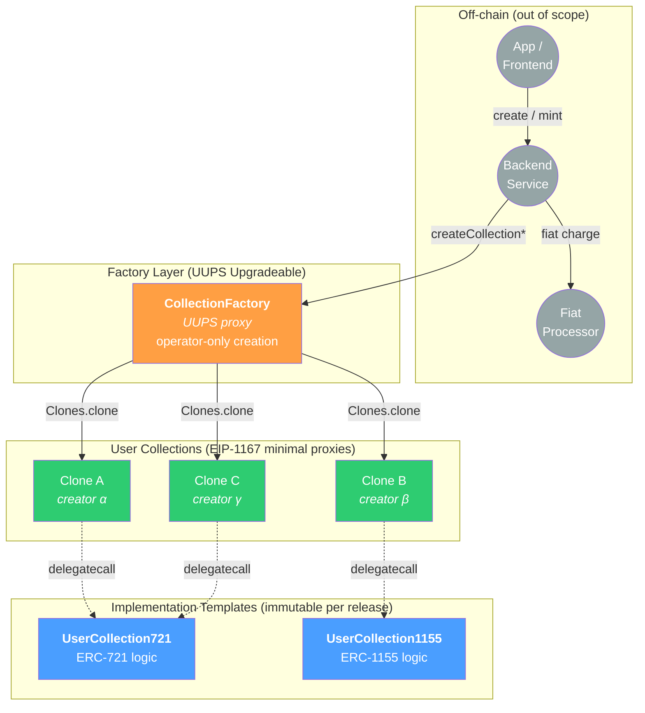
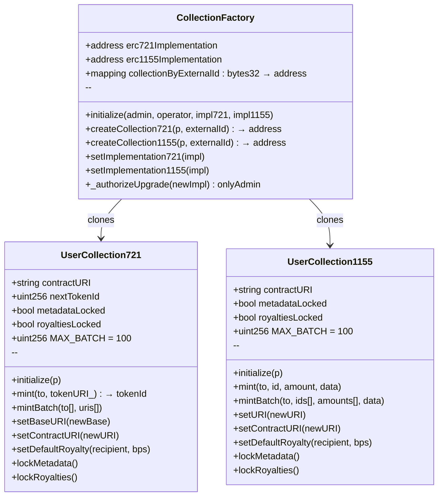
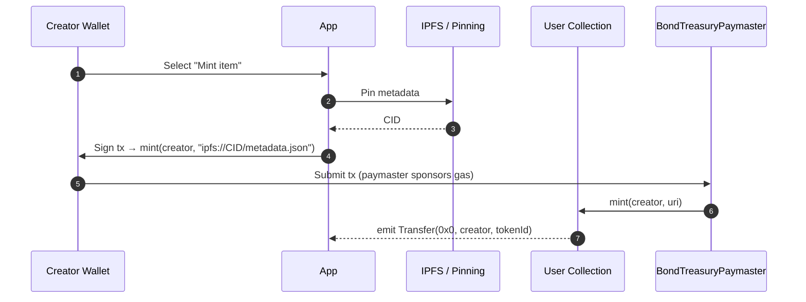
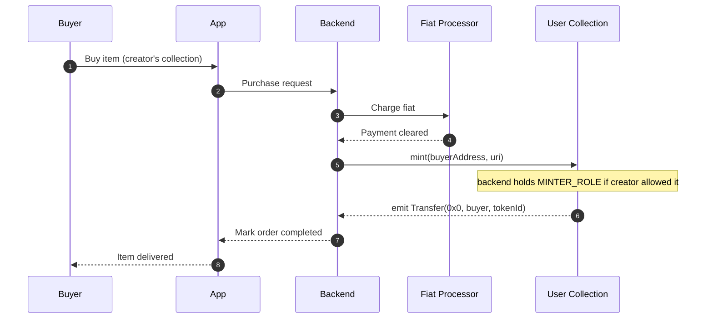

<div class="title-page">

# Nodle User Collections

## Technical Specification

**Operator-Triggered NFT Collection Factory with Per-Collection Clone Isolation**

Version 1.0 — April 2026

</div>

<div class="page-break"></div>

## Table of Contents

1. [Introduction & Architecture](#1-introduction--architecture)
2. [Roles & Access Control](#2-roles--access-control)
3. [Contract Interfaces](#3-contract-interfaces)
4. [Collection Creation Flow](#4-collection-creation-flow)
5. [Item Minting Flows](#5-item-minting-flows)
6. [Storage Layout](#6-storage-layout)
7. [Security Model](#7-security-model)
8. [Testing Strategy](#8-testing-strategy)
9. [Deployment & Operations](#9-deployment--operations)
10. [File Layout](#10-file-layout)
11. [Open Considerations](#11-open-considerations)

<div class="page-break"></div>

## 1. Introduction & Architecture

### 1.1 System Overview

The User Collections system lets users create their own ERC-721 or ERC-1155 NFT collections on the Nodle zkSync L2. Creation is paid in fiat off-chain; the on-chain deployment is triggered by a trusted backend after the fiat payment clears. Each collection is a fully-isolated minimal proxy clone with its own address, owner, and metadata.

The on-chain layer provides:

- A single upgradeable factory that deploys cheap clones of fixed-behavior implementation contracts.
- Two implementation templates (ERC-721 and ERC-1155), both inheriting OpenZeppelin's audited upgradeable primitives.
- Role-scoped permissions: a backend operator can trigger creation and mint into any collection, while creators retain ownership and minting rights on their own collection.
- Reconciliation hooks (`externalId` events and lookup map) so the off-chain payment ledger can deterministically locate the on-chain artifact for every order.

### 1.2 Architecture



### 1.3 Core Components

| Contract              | Role                                                           | Pattern                  | Upgradeability                            |
| :-------------------- | :------------------------------------------------------------- | :----------------------- | :---------------------------------------- |
| `CollectionFactory`   | Operator-triggered factory; emits creation events              | UUPS proxy               | Admin-upgradeable                         |
| `UserCollection721`   | ERC-721 implementation cloned per creator                      | EIP-1167 clone target    | Immutable per clone                       |
| `UserCollection1155`  | ERC-1155 implementation cloned per creator                     | EIP-1167 clone target    | Immutable per clone                       |

The factory is upgradeable so new implementation templates and bug fixes can be shipped without disrupting existing creators. Already-deployed clones cannot be upgraded — buyers and creators retain a permanent guarantee about each collection's behavior.

### 1.4 Design Decisions

| # | Decision                       | Choice                                                                                                                                                          |
| :- | :----------------------------- | :-------------------------------------------------------------------------------------------------------------------------------------------------------------- |
| 1 | Token standards                | Both ERC-721 and ERC-1155, selected per-collection                                                                                                              |
| 2 | Deployment model               | EIP-1167 minimal proxy clones for both standards                                                                                                                |
| 3 | Payment model                  | Fiat, off-chain; on-chain creation is purely authorization-gated                                                                                                |
| 4 | Authorization                  | Operator-deployed: backend holds `OPERATOR_ROLE`, creator never signs creation                                                                                  |
| 5 | Item minting rights            | Creator and operator both hold `MINTER_ROLE` on every clone                                                                                                     |
| 6 | Per-collection mutability      | `baseURI`/`uri`, `contractURI`, royalties are owner-mutable until owner locks them one-way                                                                      |
| 7 | Upgradeability                 | Factory: UUPS-upgradeable. Clones: immutable; admin can swap implementation pointer for *future* clones only                                                    |
| 8 | Inheritance                    | Direct from OpenZeppelin `*Upgradeable` contracts. No reuse of `BaseContentSign` (constructor-based, non-upgradeable, structurally incompatible with clones)    |
| 9 | External-ID dedup              | On-chain map `bytes32 externalId → address collection`; reverts on reuse                                                                                        |
| 10 | Per-creator on-chain limit    | None (backend rate-limits if needed)                                                                                                                            |

### 1.5 Non-Goals

- On-chain payment collection (fee paid in fiat off-chain).
- App, frontend, or off-chain backend implementation.
- Marketplace, secondary sales, or royalty enforcement beyond ERC-2981 declarations.
- Modifications to the existing `ContentSign` contract family.
- KYC, tax, or content moderation (off-chain concerns).

<div class="page-break"></div>

## 2. Roles & Access Control

### 2.1 Role Map

| Role                  | Held by                  | Scope         | Capabilities                                                                                       |
| :-------------------- | :----------------------- | :------------ | :------------------------------------------------------------------------------------------------- |
| `DEFAULT_ADMIN_ROLE`  | L2 admin Safe (multisig) | Factory       | Upgrade factory; swap implementation pointers; grant/revoke `OPERATOR_ROLE`                        |
| `OPERATOR_ROLE`       | Backend service key      | Factory       | Call `createCollection721` / `createCollection1155`                                                |
| `OWNER_ROLE`          | Collection creator       | Each clone    | Set/lock `baseURI`/`uri`, `contractURI`, royalties; grant/revoke `MINTER_ROLE` on their collection |
| `MINTER_ROLE`         | Creator + operator       | Each clone    | Mint items into the collection                                                                     |

### 2.2 Role Admin Hierarchy


On the factory, `DEFAULT_ADMIN_ROLE` administers `OPERATOR_ROLE`. On each clone, `OWNER_ROLE` administers `MINTER_ROLE` (so the creator can grant additional minters or revoke the operator's minting rights if they wish).

### 2.3 Operator Minter Convention

The factory does not auto-grant `MINTER_ROLE` to the configured operator on new clones — the clone has no awareness of the factory's `OPERATOR_ROLE`. The backend must include the operator address in `additionalMinters` when calling `createCollection*` so that operator-mediated minting works for fiat-priced item sales.

This is enforced by backend convention, not on-chain. Creators can revoke the operator's `MINTER_ROLE` from their own collection at any time via `OWNER_ROLE`.

<div class="page-break"></div>

## 3. Contract Interfaces

### 3.1 Public Interfaces

| Interface                         | Description                                              |
| :-------------------------------- | :------------------------------------------------------- |
| `interfaces/ICollectionFactory.sol` | Factory public API                                     |
| `interfaces/IUserCollection721.sol` | ERC-721 implementation public API                      |
| `interfaces/IUserCollection1155.sol`| ERC-1155 implementation public API                     |
| `interfaces/CollectionTypes.sol`    | Shared enums and structs (`Standard`, `CreateParams*`) |

### 3.2 Contract Classes



### 3.3 Shared Types

```solidity
enum Standard { ERC721, ERC1155 }

struct CreateParams721 {
    address   owner;
    string    name;
    string    symbol;
    string    baseURI;
    string    contractURI;
    address   royaltyRecipient;
    uint96    royaltyBps;
    address[] additionalMinters;
}

struct CreateParams1155 {
    address   owner;
    string    uri;            // ERC-1155 URI (typically with {id} placeholder)
    string    contractURI;
    address   royaltyRecipient;
    uint96    royaltyBps;
    address[] additionalMinters;
}
```

ERC-1155 has no on-chain `name`/`symbol` convention; the collection display name lives in `contractURI` JSON metadata.

### 3.4 `CollectionFactory`

```solidity
interface ICollectionFactory {
    event CollectionCreated(
        address indexed creator,
        address indexed collection,
        Standard standard,
        bytes32 indexed externalId
    );
    event ImplementationUpdated(Standard standard, address newImpl);

    error ExternalIdAlreadyUsed(bytes32 externalId);
    error InvalidExternalId();
    error ZeroAddress();

    function initialize(
        address admin,
        address operator,
        address impl721,
        address impl1155
    ) external;

    function createCollection721(CreateParams721 calldata p, bytes32 externalId)
        external returns (address collection);

    function createCollection1155(CreateParams1155 calldata p, bytes32 externalId)
        external returns (address collection);

    function setImplementation721(address impl) external;
    function setImplementation1155(address impl) external;

    function collectionByExternalId(bytes32 externalId) external view returns (address);
    function erc721Implementation() external view returns (address);
    function erc1155Implementation() external view returns (address);
}
```

#### Behavior

- `initialize` is callable once. Grants `admin → DEFAULT_ADMIN_ROLE`, `operator → OPERATOR_ROLE`. Reverts on zero addresses.
- `createCollection*`:
  - Restricted to `OPERATOR_ROLE`.
  - Reverts `InvalidExternalId` if `externalId == bytes32(0)` (forces a non-trivial ID).
  - Reverts `ExternalIdAlreadyUsed` if the ID has already been used.
  - Atomic flow: `Clones.clone(impl)` → `clone.initialize(p)` → `collectionByExternalId[externalId] = clone` → `emit CollectionCreated`.
  - Returns the clone address.
- `setImplementation*` is restricted to `DEFAULT_ADMIN_ROLE` and affects future clones only. Existing clones continue to delegatecall their original implementation.
- `_authorizeUpgrade(address)` is `onlyRole(DEFAULT_ADMIN_ROLE)`.

### 3.5 `UserCollection721`

```solidity
interface IUserCollection721 {
    event MetadataLocked();
    event RoyaltiesLocked();
    event ContractURIUpdated(string newURI);
    event BaseURIUpdated(string newBase);

    error MetadataIsLocked();
    error RoyaltiesAreLocked();
    error BatchTooLarge(uint256 length, uint256 max);
    error LengthMismatch();

    function initialize(CreateParams721 calldata p) external;

    function mint(address to, string calldata tokenURI_) external returns (uint256 tokenId);
    function mintBatch(address[] calldata to, string[] calldata uris) external;

    function setBaseURI(string calldata newBase) external;
    function setContractURI(string calldata newURI) external;
    function setDefaultRoyalty(address recipient, uint96 bps) external;
    function lockMetadata() external;
    function lockRoyalties() external;

    function contractURI() external view returns (string memory);
    function nextTokenId() external view returns (uint256);
    function metadataLocked() external view returns (bool);
    function royaltiesLocked() external view returns (bool);
}
```

#### Behavior

- Inherits `Initializable`, `ERC721Upgradeable`, `ERC721URIStorageUpgradeable`, `ERC721BurnableUpgradeable`, `ERC2981Upgradeable`, `AccessControlUpgradeable`.
- Implementation contract calls `_disableInitializers()` in its constructor so the implementation itself can never be initialized directly.
- `initialize` (initializer-gated): sets name/symbol via `__ERC721_init`, sets `baseURI` and `contractURI`, sets default royalty if `royaltyBps > 0`, grants `OWNER_ROLE` and `MINTER_ROLE` to `owner`, grants `MINTER_ROLE` to each `additionalMinters` entry, and calls `_setRoleAdmin(MINTER_ROLE, OWNER_ROLE)`.
- `mint`: `MINTER_ROLE`-gated. Increments `nextTokenId`, calls `_safeMint`, sets per-token URI via `ERC721URIStorage._setTokenURI`. Returns the new token ID.
- `mintBatch`: `MINTER_ROLE`-gated. Reverts `LengthMismatch` if `to.length != uris.length`. Reverts `BatchTooLarge` if `to.length > MAX_BATCH` (100).
- `setBaseURI`: `OWNER_ROLE`-gated. Reverts `MetadataIsLocked` when `metadataLocked == true`.
- `setContractURI`: `OWNER_ROLE`-gated. Reverts `MetadataIsLocked` when `metadataLocked == true`. The single `metadataLocked` flag covers both per-collection (`baseURI`) and collection-level (`contractURI`) metadata so that buyers see one verifiable "metadata is frozen" signal across the whole collection. (Per-token URIs minted via `ERC721URIStorage._setTokenURI` are anchored at mint time independently of this flag — see §7.2 row 7.)
- `setDefaultRoyalty`: `OWNER_ROLE`-gated. Reverts `RoyaltiesAreLocked` when `royaltiesLocked == true`.
- `lockMetadata` / `lockRoyalties`: `OWNER_ROLE`-gated, one-way; emit events for indexers.

### 3.6 `UserCollection1155`

Mirrors §3.5 with ERC-1155 mechanics:

- Inherits `Initializable`, `ERC1155Upgradeable`, `ERC1155SupplyUpgradeable`, `ERC1155BurnableUpgradeable`, `ERC2981Upgradeable`, `AccessControlUpgradeable`.
- `mint(address to, uint256 id, uint256 amount, bytes data)` — `MINTER_ROLE`-gated.
- `mintBatch(address to, uint256[] ids, uint256[] amounts, bytes data)` — single recipient, matching OZ's `_mintBatch`. Reverts `BatchTooLarge` when `ids.length > MAX_BATCH` and `LengthMismatch` when `ids.length != amounts.length`.
- `setURI(string newURI)` instead of `setBaseURI`. Subject to `metadataLocked`.
- No `nextTokenId` (1155 IDs are caller-chosen).

<div class="page-break"></div>

## 4. Collection Creation Flow

### 4.1 End-to-End Sequence

```mermaid
sequenceDiagram
    autonumber
    participant U as User
    participant App as App
    participant BE as Backend
    participant Pay as Fiat Processor
    participant FAC as CollectionFactory
    participant CL as New Clone

    U->>App: Submit collection params
    App->>BE: createCollection request + payment authorization
    BE->>Pay: Charge fiat
    Pay-->>BE: Payment cleared
    BE->>BE: Assign orderId, externalId = keccak256(orderId)
    BE->>FAC: createCollection721(params, externalId)
    Note over FAC: only OPERATOR_ROLE may call
    FAC->>FAC: require externalId != 0
    FAC->>FAC: require collectionByExternalId[externalId] == 0
    FAC->>CL: Clones.clone(erc721Implementation)
    FAC->>CL: clone.initialize(params)
    FAC->>FAC: collectionByExternalId[externalId] = clone
    FAC-->>BE: emit CollectionCreated(creator, clone, ERC721, externalId)
    BE->>App: Mark order completed; return clone address
    App-->>U: Display collection address
```

### 4.2 Atomicity & Front-Running

The clone is deployed and initialized inside the same transaction. The clone is never visible on-chain in an uninitialized state, so initialization cannot be front-run by an external observer.

### 4.3 Reconciliation

`externalId` is emitted as an indexed event topic and stored in `collectionByExternalId`. The backend can:

- Confirm a clone exists for an order: `factory.collectionByExternalId(externalId)`.
- Detect duplicate triggers: revert on reuse prevents double-creation.
- Recover from local state loss: re-derive `externalId = keccak256(orderId)` and look up the clone on-chain.

### 4.4 Gas Profile

A successful `createCollection721`:

- Deploys an EIP-1167 minimal proxy (~45,000 gas on EVM L1 baseline).
- Calls `clone.initialize(...)` — variable, dominated by string storage (`baseURI`, `contractURI`).
- Writes the `collectionByExternalId` mapping (one warm SSTORE).
- Emits the event.

On zkSync Era the absolute cost is dominated by L1 calldata fees and is well under one cent at typical L1 gas prices.

<div class="page-break"></div>

## 5. Item Minting Flows

### 5.1 Creator-Driven Mint



The creator holds `MINTER_ROLE` on their own collection by default. If the creator's wallet has bond allowance under `BondTreasuryPaymaster`, gas is sponsored; otherwise the creator pays gas directly.

### 5.2 Operator-Driven Mint (Fiat-Priced Item Sale)



The operator's `MINTER_ROLE` on each collection is established at creation time (via `additionalMinters`). Creators can revoke this role at any time, in which case operator-driven mints into that collection will revert until the role is re-granted.

<div class="page-break"></div>

## 6. Storage Layout

### 6.1 Factory Storage

```
[OZ AccessControlUpgradeable storage]
[OZ UUPSUpgradeable storage]
slot N+0 : erc721Implementation              (address)
slot N+1 : erc1155Implementation             (address)
slot N+2 : collectionByExternalId            (mapping bytes32 → address)
slot N+3 : __gap[47]                         (reserved for future fields)
```

Actual slot indices are determined by the inheritance chain. Storage layout is verified **manually** against the previous release before every factory upgrade — see §9.4 for the pre-upgrade checklist.

### 6.2 Clone Storage

Each clone owns its full storage independently of other clones (EIP-1167 proxies `delegatecall` logic but persist state in the proxy's own address).

```
[OZ ERC721Upgradeable / ERC1155Upgradeable storage]
[OZ ERC721URIStorageUpgradeable storage  (721 only)]
[OZ ERC1155SupplyUpgradeable storage    (1155 only)]
[OZ ERC2981Upgradeable storage]
[OZ AccessControlUpgradeable storage]
slot M+0 : contractURI                       (string)
slot M+1 : nextTokenId                       (uint256, 721 only)
slot M+2 : metadataLocked                    (bool, packed)
slot M+3 : royaltiesLocked                   (bool, packed)
slot M+4 : __gap[N]                          (reserved)
```

`__gap` is a defensive reservation. Clones are immutable per release, but if admin swaps the implementation pointer for *future* clones, the gap allows the new implementation to extend storage without conflict for those future clones.

### 6.3 Storage-Layout Discipline

All upgradeable contracts in this package follow the same conventions used by `src/swarms/`:

- No state variables in inherited contracts shifted between releases.
- New variables appended only; gap reduced by the number of new slots.
- Before each release that ships a factory upgrade, the engineer running the upgrade snapshots the previous and new layouts via `forge inspect ... storageLayout` and manually verifies that all prior slots remain at the same offsets. The full pre-upgrade checklist lives in §9.4.

<div class="page-break"></div>

## 7. Security Model

### 7.1 Trust Assumptions

| Principal             | Trusted to                                                                    | Compromise impact                                                                       |
| :-------------------- | :---------------------------------------------------------------------------- | :-------------------------------------------------------------------------------------- |
| Backend operator key  | Trigger creation only after fiat payment clears; not mint maliciously         | Free collections; mass minting into any collection where operator holds `MINTER_ROLE`   |
| Factory admin (Safe)  | Upgrade factory benignly; rotate operator role responsibly                    | Affects *future* creations only; already-deployed clones are immutable                  |
| Collection creators   | Trusted by their own buyers (not by the platform)                             | Creator-side rugs (metadata / royalty) mitigated by opt-in lock flags                   |

### 7.2 Risks & Mitigations

| #   | Risk                                                              | Mitigation                                                                                          |
| :-- | :---------------------------------------------------------------- | :-------------------------------------------------------------------------------------------------- |
| 1   | Operator key compromise → free collections / mass mint            | HSM/KMS storage; role rotation via `grantRole`/`revokeRole`; off-chain monitoring on creation rate  |
| 2   | External-ID replay (double-creation)                              | On-chain `collectionByExternalId` map; revert on reuse                                              |
| 3   | Implementation contract initialized directly                      | `_disableInitializers()` in implementation constructor                                              |
| 4   | Initialization front-run on a fresh clone                         | Atomic clone+init inside factory's `createCollection*`; clone never observable uninitialized        |
| 5   | Storage-layout corruption on factory upgrade                      | `__gap` reserved slots; manual pre-upgrade `forge inspect storageLayout` diff against previous release (§9.4)  |
| 6   | Royalty rug (creator sets 100% post-mint)                         | `royaltiesLocked` opt-in; `RoyaltiesLocked` event indexed for buyer due-diligence                   |
| 7   | Metadata rug (creator changes baseURI mid-mint)                   | `metadataLocked` opt-in; per-token URIs anchored via `ERC721URIStorage`, stable post-mint           |
| 8   | Reentrancy on `_safeMint` callback                                | OZ default ordering: state writes precede `onERC721Received`; no post-callback reads in our code    |
| 9   | DoS via huge `mintBatch` arrays                                   | `MAX_BATCH = 100`; revert `BatchTooLarge` if exceeded                                               |
| 10  | UUPS bricking via mis-set `_authorizeUpgrade`                     | Standard OZ pattern; unit test asserts non-admin cannot upgrade                                     |
| 11  | Operator granted to wrong address at init                         | `initialize` requires explicit `operator` arg, not `msg.sender`                                     |
| 12  | Creator revokes operator's `MINTER_ROLE` mid-flow                 | Operator-driven mints revert cleanly; backend surfaces error to operations                          |

### 7.3 Out of Scope

- Royalty enforcement on secondary markets — ERC-2981 is informational, on-chain enforcement is widely abandoned and breaks marketplace compatibility.
- Content moderation, KYC, and tax compliance — handled off-chain.
- Front-end phishing or wallet UX — out of scope for the on-chain layer.

### 7.4 Audit Posture

- New contracts inherit only OZ-audited `*Upgradeable` primitives.
- Custom code surface is small: factory glue, lock flags, role wiring, batch caps.
- Recommended: focused audit on `CollectionFactory.createCollection*` and both `initialize` flows before mainnet deployment.

<div class="page-break"></div>

## 8. Testing Strategy

Unit tests live under `test/collections/`, one file per contract plus an integration test:

### 8.1 `CollectionFactory.t.sol`

- `initialize` succeeds once; second call reverts `InvalidInitialization`.
- `initialize` reverts on zero addresses.
- Only `OPERATOR_ROLE` can call `createCollection*`.
- Atomic clone + initialize → resulting clone has expected name/symbol, owner, base URI, contract URI, royalties, minters.
- `externalId == bytes32(0)` reverts `InvalidExternalId`.
- Reused `externalId` reverts `ExternalIdAlreadyUsed`.
- `collectionByExternalId(externalId)` returns the clone address after success.
- `setImplementation*` callable only by admin; affects future clones only (existing clones unchanged when verified by `EXTCODEHASH` or behavior probe).
- UUPS upgrade succeeds for admin; rejected for non-admin.
- `CollectionCreated` event fields are correct.

### 8.2 `UserCollection721.t.sol`

- Initialize sets all fields and roles correctly.
- `_disableInitializers` blocks direct initialization on the implementation contract.
- `mint` requires `MINTER_ROLE`; emits `Transfer`; sets correct `tokenURI`; increments `nextTokenId`.
- `mintBatch` length-mismatch and oversize-batch reverts.
- `setBaseURI` / `setContractURI` / `setDefaultRoyalty` permission and lock semantics.
- `lockMetadata` / `lockRoyalties` are one-way; subsequent setters revert with the corresponding error.
- Owner can grant and revoke `MINTER_ROLE` (verifies `_setRoleAdmin(MINTER_ROLE, OWNER_ROLE)`).
- ERC-2981 returns expected royalty info.
- `supportsInterface` returns true for ERC-721, ERC-721 metadata, ERC-2981, ERC-165, AccessControl.

### 8.3 `UserCollection1155.t.sol`

Analogous coverage adapted to ERC-1155 mechanics: per-ID supply tracking, single-recipient `mintBatch`, `setURI` lock semantics, ERC-1155 interface assertions.

### 8.4 `Collections.integration.t.sol`

End-to-end happy path:

1. Admin deploys factory + both implementations via UUPS proxy.
2. Operator creates an ERC-721 collection for creator α.
3. Operator creates an ERC-1155 collection for creator β.
4. Operator mints into both on behalf of fiat buyers.
5. Creator α transfers an item to a third party.
6. Creator α locks metadata and royalties.
7. Subsequent setter calls revert with lock errors.
8. Admin upgrades the factory and ships a new ERC-721 implementation.
9. New ERC-721 collection deploys with new implementation; old collections remain on the previous implementation (verified via `EXTCODEHASH`).

### 8.5 Coverage Target

≥ 95% line coverage on the new contracts, measured locally via `forge coverage`.

**What CI does today** (`.github/workflows/checks.yml`):

- The `Tests` job runs `yarn spellcheck`, `yarn lint`, and `forge test` on every push and PR. Tests under `test/collections/` are picked up automatically by `forge test` — no workflow change required for the new test suite to run in CI.
- The `Coverage` job runs `forge coverage` on PRs to `main` but is currently filtered to swarms paths (`test/{Swarm*,ServiceProvider,FleetIdentity}*.t.sol`) and enforces its 95% threshold against `src/swarms/` only. Collection-coverage enforcement is **not** wired in CI today; the 95% target above is verified manually until a follow-up extends the workflow (tracked in §11).

<div class="page-break"></div>

## 9. Deployment & Operations

### 9.1 Deployment Script

Two artifacts, mirroring the swarms pattern:

- `script/DeployCollectionFactoryZkSync.s.sol` — Forge script that performs the on-chain deployment work.
- `ops/deploy_collection_factory_zksync.sh` — orchestration shell script analogous to `ops/deploy_swarm_contracts_zksync.sh`: runs preflight checks, compiles with `forge build --zksync`, calls the Forge script, performs post-deploy `cast` checks, and invokes `ops/verify_zksync_contracts.py` for source-code verification on the zkSync explorer.

Environment variables (prefixed `N_` per repo convention; consumed by the Forge script):

| Variable             | Description                                                    |
| :------------------- | :------------------------------------------------------------- |
| `N_FACTORY_ADMIN`    | Multisig address that will hold `DEFAULT_ADMIN_ROLE`           |
| `N_FACTORY_OPERATOR` | Backend service address that will hold `OPERATOR_ROLE`         |

Steps performed by the Forge script:

1. Deploy `UserCollection721` implementation. Constructor calls `_disableInitializers()`.
2. Deploy `UserCollection1155` implementation. Same.
3. Deploy `CollectionFactory` logic.
4. Deploy `ERC1967Proxy` pointing at `CollectionFactory`, with init data calling `initialize(N_FACTORY_ADMIN, N_FACTORY_OPERATOR, impl721, impl1155)`.
5. Log all four addresses (implementation 721, implementation 1155, factory logic, factory proxy) in the same `<Name>: 0x...` format that the orchestration script greps for.

Steps performed by the orchestration shell script (after the Forge script broadcasts):

6. Sanity-check the deployment with `cast` (admin role granted, operator role granted, both implementation pointers set, UUPS implementation slot points at the factory logic).
7. Verify source code on the zkSync block explorer via `python3 ops/verify_zksync_contracts.py --broadcast broadcast/DeployCollectionFactoryZkSync.s.sol/<chainId>/run-latest.json --verifier-url $VERIFIER_URL --compiler-version 0.8.26 --zksolc-version v1.5.15 --project-root "$PROJECT_ROOT"`. Verifier URLs follow the swarms convention:
    - **Mainnet**: `https://zksync2-mainnet-explorer.zksync.io/contract_verification` (explorer at `https://explorer.zksync.io`)
    - **Testnet**: `https://explorer.sepolia.era.zksync.dev/contract_verification` (explorer at `https://sepolia.explorer.zksync.io`)
8. Append the deployed addresses to the appropriate `.env-test` / `.env-prod` file (same pattern as the swarms script's `update_env_file` step).
9. Add a usage example to `README.md` under the existing deployment section.

> **Note on tooling.** The repo's `README.md` still mentions Etherscan as the verification target; that wording predates the zkSync-era flow. The actual operational pattern (used by `ops/deploy_swarm_contracts_zksync.sh`) is: do **not** use `forge script --verify` (it sends absolute paths the zkSync verifier rejects) and do **not** rely on `forge verify-contract` directly (it sends `../` traversal imports the zkSync verifier rejects). Use `ops/verify_zksync_contracts.py`, which generates standard JSON via Forge, rewrites relative imports to project-rooted paths, and submits to the zkSync verifier API. With `bytecode_hash = "none"` already set in `foundry.toml`, this achieves full verification.

### 9.2 Indexing

Subquery (`subquery/` package) extension required:

- **Top-level source**: factory address. Handler on `CollectionCreated` writes a `Collection` entity and dynamically registers the new clone address as a `Transfer`-listening source (subquery dynamic-source pattern).
- **Per-clone handlers**: `Transfer` writes `Token` and `Owner` entities scoped by collection. Lock events (`MetadataLocked`, `RoyaltiesLocked`) update the corresponding `Collection` entity flags for buyer due-diligence.

Indexer wiring is out of this repo's contract scope but is referenced here so the implementation plan can include a tracking task for the subquery package.

### 9.3 Paymaster Integration

The operator account uses the existing `BondTreasuryPaymaster` for L2 gas. The operator must be seeded with bond allowance before first creation; subsequent adjustments use the paymaster's standard admin path. No new paymaster contract is required for this feature.

### 9.4 Upgrade & Rollback

| Operation                            | Procedure                                                                                                     |
| :----------------------------------- | :------------------------------------------------------------------------------------------------------------ |
| Upgrade factory logic                | Run pre-upgrade checklist (below), then admin calls `factory.upgradeTo(newImpl)` (UUPS)                       |
| Ship a new ERC-721 template          | Deploy new implementation; admin calls `setImplementation721(newImpl)`; affects *future* clones only          |
| Ship a new ERC-1155 template         | Deploy new implementation; admin calls `setImplementation1155(newImpl)`; affects *future* clones only         |
| Rotate operator key                  | Admin calls `revokeRole(OPERATOR_ROLE, oldKey)` then `grantRole(OPERATOR_ROLE, newKey)`                       |
| Pause new creations                  | Admin revokes all addresses from `OPERATOR_ROLE`. Existing creations unaffected; new requests revert          |
| Rollback a faulty template           | Admin calls `setImplementation*` pointing back to the previous implementation; affects future clones only     |

There is no rollback path for already-deployed clones — that is the explicit immutability guarantee. Bug fixes that require touching deployed clones must take the form of off-chain workarounds or new collections.

#### Pre-Upgrade Checklist (factory only)

CI does not currently diff storage layouts. Before any factory upgrade is broadcast, the engineer running the upgrade must execute the following manually, mirroring the procedure used by `src/swarms/` (see `src/swarms/doc/upgradeable-contracts.md`):

1. **Verify storage compatibility:**

   ```bash
   forge inspect CollectionFactory storageLayout > v1-layout.json
   forge inspect CollectionFactoryV2 storageLayout > v2-layout.json
   # Manually compare: ensure every V1 storage slot is preserved at the same offset in V2.
   # Only appended fields (consuming __gap slots) are acceptable.
   ```

2. **Run all tests:**

   ```bash
   forge test --match-path "test/collections/**"
   ```

3. **Test on a fork:**

   ```bash
   forge script script/UpgradeCollectionFactory.s.sol \
     --fork-url $RPC_URL \
     --sender $ADMIN
   ```

4. **Post-upgrade verification (after broadcast):**

   ```bash
   # Implementation pointer changed
   cast implementation $FACTORY_PROXY --rpc-url $RPC_URL

   # Admin role unchanged
   cast call $FACTORY_PROXY "hasRole(bytes32,address)(bool)" \
     $(cast keccak "DEFAULT_ADMIN_ROLE") $ADMIN --rpc-url $RPC_URL

   # Stored implementation pointers unchanged (existing clones unaffected)
   cast call $FACTORY_PROXY "erc721Implementation()(address)" --rpc-url $RPC_URL
   cast call $FACTORY_PROXY "erc1155Implementation()(address)" --rpc-url $RPC_URL
   ```

Promoting any of these checks into a CI job is tracked under §11.

<div class="page-break"></div>

## 10. File Layout

```
src/collections/
  CollectionFactory.sol
  UserCollection721.sol
  UserCollection1155.sol
  interfaces/
    ICollectionFactory.sol
    IUserCollection721.sol
    IUserCollection1155.sol
    CollectionTypes.sol
  doc/
    README.md
    spec/
      user-collections-specification.md
test/collections/
  CollectionFactory.t.sol
  UserCollection721.t.sol
  UserCollection1155.t.sol
  Collections.integration.t.sol
script/
  DeployCollectionFactoryZkSync.s.sol
  UpgradeCollectionFactory.s.sol
ops/
  deploy_collection_factory_zksync.sh    (mirrors deploy_swarm_contracts_zksync.sh)
```

License header on every Solidity file: `// SPDX-License-Identifier: BSD-3-Clause-Clear`.

Solidity pragma: `^0.8.26` (matches existing contracts).

<div class="page-break"></div>

## 11. Open Considerations

These are not blocking for v1; recorded for future iteration.

| Item                                       | Status   | Notes                                                                                                                         |
| :----------------------------------------- | :------- | :---------------------------------------------------------------------------------------------------------------------------- |
| Deterministic clone addresses              | Deferred | Switch to `Clones.cloneDeterministic(salt)` and add `predictAddress` view if app needs pre-creation address reservation       |
| Voucher-style non-custodial creation       | Deferred | Adds an EIP-712 signed-voucher path for power users; can ship as a parallel `createCollectionWithVoucher` without breaking v1 |
| Per-creator on-chain rate limit            | Deferred | Backend rate-limits today; can add `mapping(address => uint256) collectionsByCreator` and a configurable cap later            |
| Soulbound / non-transferable variant       | Deferred | Ship as a third implementation pointer; selected via a new `createCollectionSoulbound*` factory method                        |
| Per-token-URI mutability after lock        | Deferred | If creators ever need to update individual token URIs after locking the collection, would require a `tokenLocked` map         |
| CI storage-layout diff job                 | Deferred | Promote the manual §9.4 step 1 into a CI job that snapshots `forge inspect storageLayout` and fails on slot mutations         |
| CI coverage enforcement for collections    | Deferred | Extend `.github/workflows/checks.yml` Coverage job to include `test/collections/**` and enforce the 95% threshold for `src/collections/` (mirrors the existing swarms-only filter)  |
