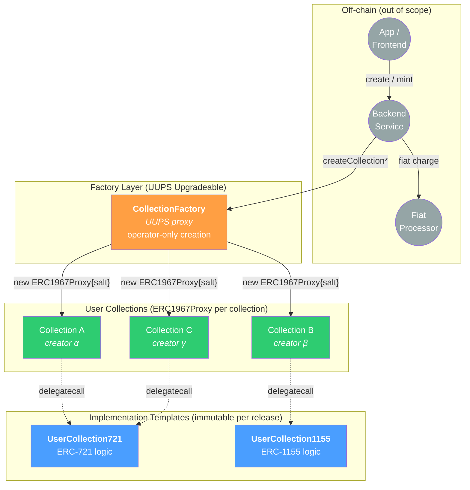
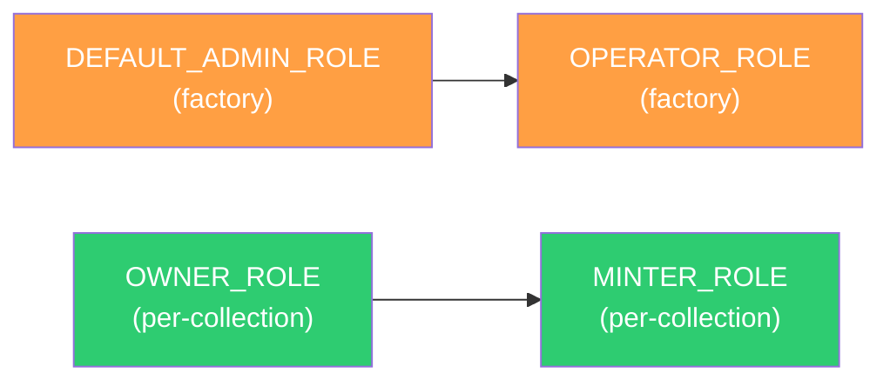
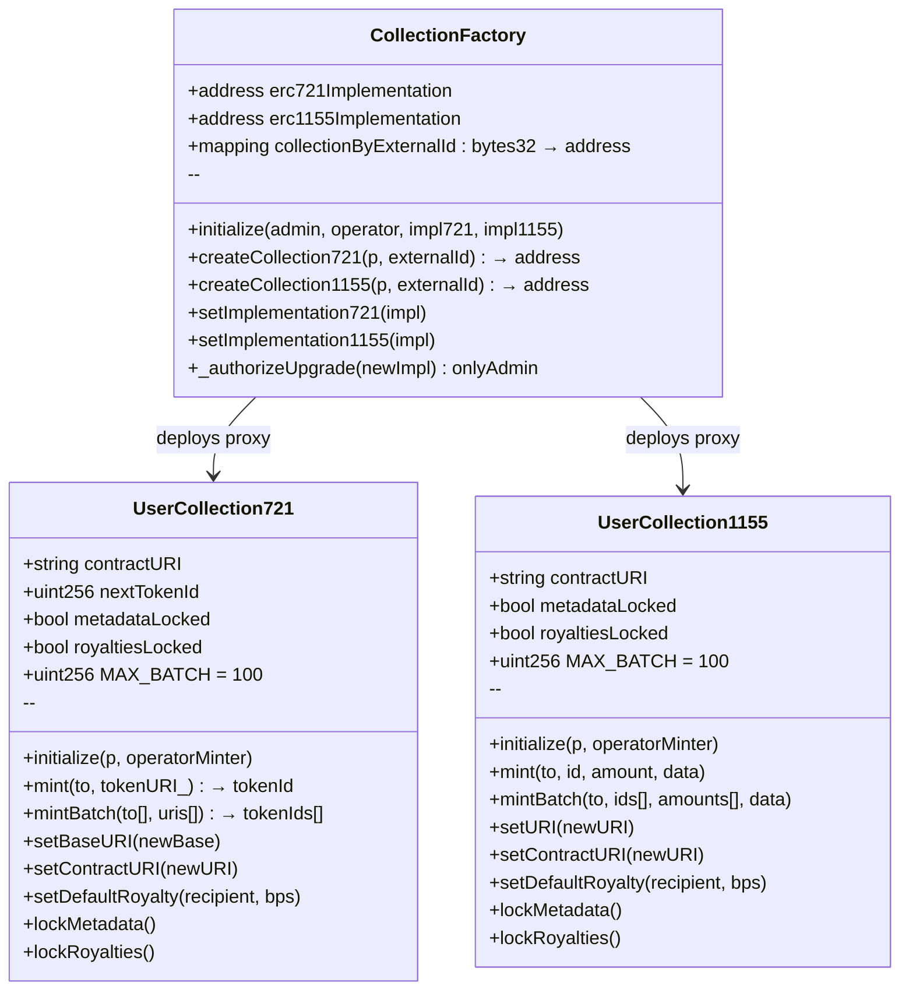
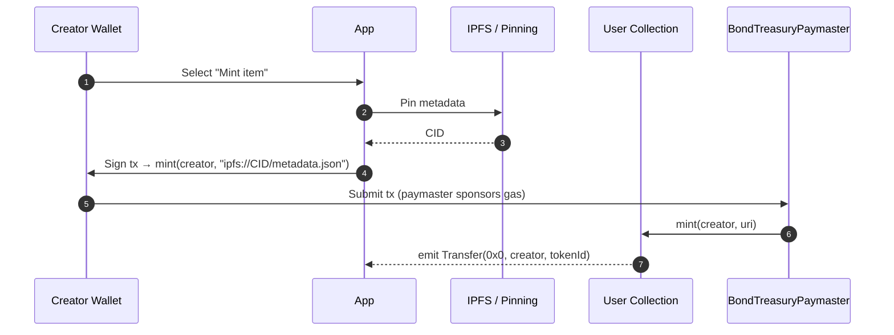
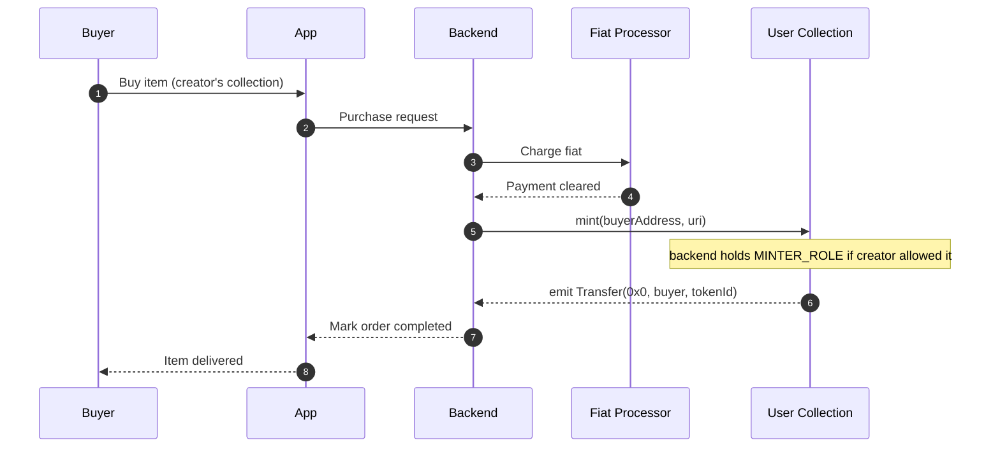

<div class="title-page">

# Nodle User Collections

## Technical Specification

**Operator-Triggered NFT Collection Factory with Per-Collection ERC1967Proxy Isolation**

Version 1.0 — April 2026

</div>

<div class="page-break"></div>

## Table of Contents

1. [Introduction & Architecture](#1-introduction--architecture)
2. [Roles & Access Control](#2-roles--access-control)
3. [Contract Interfaces](#3-contract-interfaces)
4. [Collection Creation Flow](#4-collection-creation-flow)
5. [Item Minting Flows](#5-item-minting-flows)
6. [Storage Layout](#6-storage-layout)
7. [Security Model](#7-security-model)
8. [Testing Strategy](#8-testing-strategy)
9. [Deployment & Operations](#9-deployment--operations)
10. [File Layout](#10-file-layout)
11. [Open Considerations](#11-open-considerations)

<div class="page-break"></div>

## 1. Introduction & Architecture

### 1.1 System Overview

The User Collections system lets users create their own ERC-721 or ERC-1155 NFT collections on the Nodle zkSync L2. Creation is paid in fiat off-chain; the on-chain deployment is triggered by a trusted backend after the fiat payment clears. Each collection is a fully-isolated per-collection ERC1967Proxy with its own address, owner, and metadata.

The on-chain layer provides:

- A single upgradeable factory that deploys per-collection `ERC1967Proxy` instances pointing at fixed-behavior implementation contracts.
- Two implementation templates (ERC-721 and ERC-1155), both inheriting OpenZeppelin's audited upgradeable primitives.
- Role-scoped permissions: a backend operator can trigger creation and mint into any collection, while creators retain ownership and minting rights on their own collection.
- Reconciliation hooks (`externalId` events and lookup map) so the off-chain payment ledger can deterministically locate the on-chain artifact for every order.

### 1.2 Architecture



### 1.3 Core Components

| Contract              | Role                                                           | Pattern                  | Upgradeability                            |
| :-------------------- | :------------------------------------------------------------- | :----------------------- | :---------------------------------------- |
| `CollectionFactory`   | Operator-triggered factory; emits creation events              | UUPS proxy               | Admin-upgradeable                         |
| `UserCollection721`   | ERC-721 implementation behind a per-collection ERC1967Proxy    | `ERC1967Proxy` implementation | Immutable per collection                  |
| `UserCollection1155`  | ERC-1155 implementation behind a per-collection ERC1967Proxy   | `ERC1967Proxy` implementation | Immutable per collection                  |

The factory is upgradeable so new implementation templates and bug fixes can be shipped without disrupting existing creators. Already-deployed collections cannot be upgraded — buyers and creators retain a permanent guarantee about each collection's behavior.

### 1.4 Design Decisions

| # | Decision                       | Choice                                                                                                                                                          |
| :- | :----------------------------- | :-------------------------------------------------------------------------------------------------------------------------------------------------------------- |
| 1 | Token standards                | Both ERC-721 and ERC-1155, selected per-collection                                                                                                              |
| 2 | Deployment model               | Per-collection `ERC1967Proxy` deployed via `CREATE2` with `externalId` salt; implementations deployed via `CREATE` only                                          |
| 3 | Payment model                  | Fiat, off-chain; on-chain creation is purely authorization-gated                                                                                                |
| 4 | Authorization                  | Operator-deployed: backend holds `OPERATOR_ROLE`, creator never signs creation                                                                                  |
| 5 | Item minting rights            | Creator and operator both hold `MINTER_ROLE` on every collection — operator grant is enforced on-chain by the factory (see §2.3), not by backend convention    |
| 6 | Per-collection mutability      | `baseURI`/`uri`, `contractURI`, royalties are owner-mutable until owner locks them one-way                                                                      |
| 7 | Upgradeability                 | Factory: UUPS-upgradeable. Per-collection proxies: immutable (impls do not inherit `UUPSUpgradeable`, no admin slot); admin can swap implementation pointer for *future* collections only [^upgradeability]  |
| 8 | Inheritance                    | Direct from OpenZeppelin `*Upgradeable` contracts. No reuse of `BaseContentSign` (constructor-based, non-upgradeable, structurally incompatible with proxy initialization) |
| 9 | External-ID dedup              | On-chain map `bytes32 externalId → address collection`; reverts on reuse                                                                                        |
| 10 | Per-creator on-chain limit    | None (backend rate-limits if needed)                                                                                                                            |
| 11 | Royalty ceiling                | None beyond OpenZeppelin's ERC-2981 100% (10000 bps) bound. Creators have full autonomy over `royaltyBps` until they call `lockRoyalties`. Marketplace-norm enforcement (e.g. ≤10%) is deliberately out of scope — buyers and frontends are expected to inspect the on-chain value |
| 12 | OZ alignment                   | Stay aligned with OpenZeppelin's `*Upgradeable` shapes; avoid overriding inherited methods or diverging from canonical signatures unless strictly required (e.g. role gating, lock checks). Custom batch / utility helpers ship as net-new functions, not overrides — keeps the audit surface small and lets us track upstream OZ patches without merge friction |

[^upgradeability]: We use `ERC1967Proxy` directly (not `TransparentUpgradeableProxy`, not `BeaconProxy`) because the implementation contracts deliberately do not inherit `UUPSUpgradeable`. With no upgrade selector exposed and no `ProxyAdmin` slot pattern, the proxy's implementation pointer is constructor-fixed and the per-collection immutability promise is enforced by code that already exists in the OZ canonical libraries — no custom upgrade gating needed. We migrated away from the EIP-1167 minimal-proxy pattern because it is incompatible with zkSync Era's `ContractDeployer` factoryDeps model (see `design-and-implementation.md`).

### 1.5 Non-Goals

- On-chain payment collection (fee paid in fiat off-chain).
- App, frontend, or off-chain backend implementation.
- Marketplace, secondary sales, or royalty enforcement beyond ERC-2981 declarations.
- Modifications to the existing `ContentSign` contract family.
- KYC, tax, or content moderation (off-chain concerns).

<div class="page-break"></div>

## 2. Roles & Access Control

### 2.1 Role Map

| Role                  | Held by                  | Scope         | Capabilities                                                                                       |
| :-------------------- | :----------------------- | :------------ | :------------------------------------------------------------------------------------------------- |
| `DEFAULT_ADMIN_ROLE`  | L2 admin Safe (multisig) | Factory       | Upgrade factory; swap implementation pointers; grant/revoke `OPERATOR_ROLE`                        |
| `OPERATOR_ROLE`       | Backend service key      | Factory       | Call `createCollection721` / `createCollection1155`                                                |
| `OWNER_ROLE`          | Collection creator       | Each collection | Set/lock `baseURI`/`uri`, `contractURI`, royalties; grant/revoke `MINTER_ROLE` on their collection |
| `MINTER_ROLE`         | Creator + operator       | Each collection | Mint items into the collection                                                                     |

### 2.2 Role Admin Hierarchy



On the factory, `DEFAULT_ADMIN_ROLE` administers `OPERATOR_ROLE`. On each collection, `OWNER_ROLE` administers `MINTER_ROLE` (so the creator can grant additional minters or revoke the operator's minting rights if they wish).

### 2.3 Operator Minter Auto-Grant

When the factory creates a collection, it passes `msg.sender` (the `OPERATOR_ROLE` holder that triggered creation) to the collection's `initialize` as a guaranteed minter. The collection unconditionally grants that address `MINTER_ROLE` during initialization, alongside any addresses listed in `additionalMinters`.

This makes operator-driven minting a **contract-level invariant** rather than a backend convention: it is impossible to deploy a collection through the factory that the calling operator cannot mint into. After creation, creators retain full control via `OWNER_ROLE` and may revoke the operator's `MINTER_ROLE` at any time.

**Operator key rotation.** When admin grants `OPERATOR_ROLE` to a new address, all *future* collections auto-grant `MINTER_ROLE` to the new operator. Existing collections are unaffected (immutable per release); creators must grant `MINTER_ROLE` to the new operator individually if they want operator-driven minting to continue on collections deployed before the rotation. The backend should track this as part of any rotation runbook.

`additionalMinters` remains available for creators who want extra minters seeded at creation (e.g. a co-creator wallet) and is orthogonal to the operator auto-grant.

### 2.4 Collection Role Finality (intentional)

Per-collection role wiring is deliberately minimal and final:

- **Collections have no `DEFAULT_ADMIN_ROLE` holder.** `initialize` grants only `OWNER_ROLE` + `MINTER_ROLE` (to the owner), `MINTER_ROLE` (to the operator and `additionalMinters`), and sets `_setRoleAdmin(MINTER_ROLE, OWNER_ROLE)`. It never grants `DEFAULT_ADMIN_ROLE` to anyone. This is a feature: there is no super-admin that could later seize a collection, reinforcing the §1.3 immutability promise.
- **`OWNER_ROLE` is non-transferable.** Its role-admin is the default `0x00` (`DEFAULT_ADMIN_ROLE`), which has no members — so `OWNER_ROLE` can never be granted to a new address. The creator is the permanent owner; they can self-manage `MINTER_ROLE` (grant co-minters, revoke the operator) but cannot hand off ownership on-chain.
- **Consequence — owner key loss is unrecoverable.** If the creator loses their key, all owner-only functions (`setBaseURI`/`setURI`, `setContractURI`, `setDefaultRoyalty`, `lockMetadata`, `lockRoyalties`, minter management) are permanently frozen. Token transfers, burns, and any already-granted minters are unaffected — the collection keeps functioning, it just can no longer be reconfigured. A creator may also `renounceRole(OWNER_ROLE, self)`, intentionally bricking owner governance (e.g. to credibly signal "settings are final" without using the lock flags). Backends should surface owner-key custody as a one-way decision to creators.

<div class="page-break"></div>

## 3. Contract Interfaces

### 3.1 Public Interfaces

| Interface                         | Description                                              |
| :-------------------------------- | :------------------------------------------------------- |
| `interfaces/ICollectionFactory.sol` | Factory public API                                     |
| `interfaces/IUserCollection721.sol` | ERC-721 implementation public API                      |
| `interfaces/IUserCollection1155.sol`| ERC-1155 implementation public API                     |
| `interfaces/CollectionTypes.sol`    | Shared enums and structs (`Standard`, `CreateParams*`) |

### 3.2 Contract Classes



### 3.3 Shared Types

```solidity
enum Standard { ERC721, ERC1155 }

struct CreateParams721 {
    address   owner;
    string    name;
    string    symbol;
    string    baseURI;
    string    contractURI;
    address   royaltyRecipient;
    uint96    royaltyBps;
    address[] additionalMinters;
}

struct CreateParams1155 {
    address   owner;
    string    uri;            // ERC-1155 URI (typically with {id} placeholder)
    string    contractURI;
    address   royaltyRecipient;
    uint96    royaltyBps;
    address[] additionalMinters;
}
```

ERC-1155 has no on-chain `name`/`symbol` convention; the collection display name lives in `contractURI` JSON metadata.

### 3.4 `CollectionFactory`

```solidity
interface ICollectionFactory {
    event CollectionCreated(
        address indexed creator,
        address indexed collection,
        Standard standard,
        bytes32 indexed externalId
    );
    event ImplementationUpdated(Standard standard, address newImpl);

    error ExternalIdAlreadyUsed(bytes32 externalId);
    error InvalidExternalId();
    error ZeroAddress();
    error NotAContract(address impl);

    function initialize(
        address admin,
        address operator,
        address impl721,
        address impl1155
    ) external;

    function createCollection721(CreateParams721 calldata p, bytes32 externalId)
        external returns (address collection);

    function createCollection1155(CreateParams1155 calldata p, bytes32 externalId)
        external returns (address collection);

    function setImplementation721(address impl) external;
    function setImplementation1155(address impl) external;

    function collectionByExternalId(bytes32 externalId) external view returns (address);
    function erc721Implementation() external view returns (address);
    function erc1155Implementation() external view returns (address);
}
```

#### Behavior

- `initialize` is callable once. Grants `admin → DEFAULT_ADMIN_ROLE`, `operator → OPERATOR_ROLE`. Reverts `ZeroAddress` if any of `admin`, `operator`, `impl721`, `impl1155` is zero. Reverts `NotAContract(impl)` if either implementation address has zero bytecode (`impl.code.length == 0`).
- `createCollection*`:
  - Restricted to `OPERATOR_ROLE`.
  - Reverts `InvalidExternalId` if `externalId == bytes32(0)` (forces a non-trivial ID).
  - Reverts `ExternalIdAlreadyUsed` if the ID has already been used.
  - Atomic flow: `abi.encodeCall(initialize, (p, msg.sender))` → `new ERC1967Proxy{salt: externalId}(impl, initData)` (deploy + delegatecall init in a single constructor frame) → `collectionByExternalId[externalId] = collection` → `emit CollectionCreated`. Passing `msg.sender` into `initData` ensures the calling operator is auto-granted `MINTER_ROLE` on the new collection (see §2.3).
  - Returns the collection address.
- `setImplementation*` is restricted to `DEFAULT_ADMIN_ROLE` and affects future collections only. Existing collections continue to delegatecall their original implementation. Reverts `ZeroAddress` if `impl == address(0)`. Reverts `NotAContract(impl)` if `impl.code.length == 0` (defends against EOA paste / unset env var). The setter does **not** verify the implementation matches the expected token standard (e.g. a 1155 implementation pasted into `setImplementation721`); the post-upgrade `cast` checks in §9.4 are the runbook layer that catches this.
- `_authorizeUpgrade(address)` is `onlyRole(DEFAULT_ADMIN_ROLE)`.

### 3.5 `UserCollection721`

```solidity
interface IUserCollection721 {
    event MetadataLocked();
    event RoyaltiesLocked();
    event ContractURIUpdated(string newURI);
    event BaseURIUpdated(string newBase);
    event DefaultRoyaltyUpdated(address recipient, uint96 bps);

    error MetadataIsLocked();
    error RoyaltiesAreLocked();
    error BatchTooLarge(uint256 length, uint256 max);
    error LengthMismatch();

    function initialize(CreateParams721 calldata p, address operatorMinter) external;

    function mint(address to, string calldata tokenURI_) external returns (uint256 tokenId);
    function mintBatch(address[] calldata to, string[] calldata uris)
        external returns (uint256[] memory tokenIds);

    function setBaseURI(string calldata newBase) external;
    function setContractURI(string calldata newURI) external;
    function setDefaultRoyalty(address recipient, uint96 bps) external;
    function lockMetadata() external;
    function lockRoyalties() external;

    function contractURI() external view returns (string memory);
    function nextTokenId() external view returns (uint256);
    function metadataLocked() external view returns (bool);
    function royaltiesLocked() external view returns (bool);
}
```

#### Behavior

- Inherits `Initializable`, `ERC721Upgradeable`, `ERC721URIStorageUpgradeable`, `ERC721BurnableUpgradeable`, `ERC2981Upgradeable`, `AccessControlUpgradeable`.
- Implementation contract calls `_disableInitializers()` in its constructor so the implementation itself can never be initialized directly.
- **Bytecode-permanence invariants** (load-bearing for the §1.3 immutability promise): the implementation contains no `SELFDESTRUCT` opcode (no `selfdestruct(...)` calls in the implementation's own code or in any inherited contract), and performs no `delegatecall` to caller-provided addresses. Both properties are asserted by the unit test in §8.2 and reviewed by the auditor.
- `initialize` (initializer-gated): sets name/symbol via `__ERC721_init`, sets `baseURI` and `contractURI`, sets default royalty if `royaltyBps > 0`, grants `OWNER_ROLE` and `MINTER_ROLE` to `owner`, grants `MINTER_ROLE` to `operatorMinter` (passed by the factory; see §2.3), grants `MINTER_ROLE` to each `additionalMinters` entry, and calls `_setRoleAdmin(MINTER_ROLE, OWNER_ROLE)`. Reverts `ZeroAddress` if `operatorMinter == address(0)`. Re-granting an already-held role is a no-op (OZ `grantRole` is idempotent), so duplicates between `owner`, `operatorMinter`, and `additionalMinters` are safe.
- `mint`: `MINTER_ROLE`-gated. Increments `nextTokenId`, calls `_safeMint`, sets per-token URI via `ERC721URIStorage._setTokenURI`. Returns the new token ID. Callers pass a *relative suffix* for `tokenURI_` (see §7.2 row 7 / the URI convention): the resolved `tokenURI` is `baseURI + tokenURI_` when `baseURI` is non-empty.
- `mintBatch`: `MINTER_ROLE`-gated. Reverts `LengthMismatch` if `to.length != uris.length`. Reverts `BatchTooLarge` if `to.length > MAX_BATCH` (100). Returns `uint256[] tokenIds` in the same order as `to`; the values are a contiguous range starting at the value of `nextTokenId` at call entry. The return lets backends reconcile per-buyer attribution synchronously without parsing `Transfer` logs or racing against concurrent minters.
- `setBaseURI`: `OWNER_ROLE`-gated. Reverts `MetadataIsLocked` when `metadataLocked == true`.
- `setContractURI`: `OWNER_ROLE`-gated. Reverts `MetadataIsLocked` when `metadataLocked == true`. The single `metadataLocked` flag covers both per-collection (`baseURI`) and collection-level (`contractURI`) metadata so that buyers see one verifiable "metadata is frozen" signal across the whole collection. (Per-token *suffixes* set via `ERC721URIStorage._setTokenURI` are fixed at mint, but the resolved `tokenURI` is `baseURI + suffix` — so it is **not** stable while `baseURI` remains mutable. Only `metadataLocked` provides the freeze guarantee — see §7.2 row 7.)
- `setDefaultRoyalty`: `OWNER_ROLE`-gated. Reverts `RoyaltiesAreLocked` when `royaltiesLocked == true`. No additional cap beyond OZ's ERC-2981 100% bound (see §1.4 row 11) — creators may set any value up to 10000 bps. Emits `DefaultRoyaltyUpdated(recipient, bps)` (a `bps == 0` emission signals the royalty was cleared) — ERC-2981 itself is event-less, so this is the only on-chain signal indexers can use to track royalty changes for buyer due-diligence.
- `lockMetadata` / `lockRoyalties`: `OWNER_ROLE`-gated, one-way; emit events for indexers.

### 3.6 `UserCollection1155`

Mirrors §3.5 with ERC-1155 mechanics:

- Inherits `Initializable`, `ERC1155Upgradeable`, `ERC1155SupplyUpgradeable`, `ERC1155BurnableUpgradeable`, `ERC2981Upgradeable`, `AccessControlUpgradeable`.
- `initialize(CreateParams1155 calldata p, address operatorMinter)` — same role-grant semantics as §3.5: `OWNER_ROLE` + `MINTER_ROLE` to `owner`, `MINTER_ROLE` to `operatorMinter` (factory-passed; see §2.3), `MINTER_ROLE` to each `additionalMinters` entry, `_setRoleAdmin(MINTER_ROLE, OWNER_ROLE)`. Reverts `ZeroAddress` if `operatorMinter == address(0)`.
- `mint(address to, uint256 id, uint256 amount, bytes data)` — `MINTER_ROLE`-gated.
- `mintBatch(address to, uint256[] ids, uint256[] amounts, bytes data)` — single recipient, matching OZ's `_mintBatch`. Reverts `BatchTooLarge` when `ids.length > MAX_BATCH` and `LengthMismatch` when `ids.length != amounts.length`. Multi-recipient batching (one tx, N different buyers) is intentionally out of scope for v1: it has no native OZ primitive, would require a custom loop emitting N `TransferSingle` events, and the dominant fiat-paid 1:1 flow (§5.2) doesn't naturally batch (per-buyer payments clear independently). If airdrop or allowlist-drop flows become a product requirement, a `mintBatchMulti` can be added in a future implementation pointer (admin swap, future collections only) without breaking existing callers — see §11.
- `setURI(string newURI)` instead of `setBaseURI`. Subject to `metadataLocked`.
- No `nextTokenId` (1155 IDs are caller-chosen).
- **Bytecode-permanence invariants** apply identically to §3.5: implementation constructor calls `_disableInitializers()`; implementation contains no `SELFDESTRUCT` opcode and no `delegatecall` to caller-provided addresses. Asserted by the §8.3 unit test.

<div class="page-break"></div>

## 4. Collection Creation Flow

### 4.1 End-to-End Sequence

```mermaid
sequenceDiagram
    autonumber
    participant U as User
    participant App as App
    participant BE as Backend
    participant Pay as Fiat Processor
    participant FAC as CollectionFactory
    participant CL as New Collection

    U->>App: Submit collection params
    App->>BE: createCollection request + payment authorization
    BE->>Pay: Charge fiat
    Pay-->>BE: Payment cleared
    BE->>BE: Assign orderId, externalId = keccak256(orderId)
    BE->>FAC: createCollection721(params, externalId)
    Note over FAC: only OPERATOR_ROLE may call
    FAC->>FAC: require externalId != 0
    FAC->>FAC: require collectionByExternalId[externalId] == 0
    FAC->>CL: new ERC1967Proxy{salt: externalId}(erc721Implementation, encodeCall(initialize, (p, msg.sender)))
    Note over CL: emit Upgraded(impl), emit Initialized(1) inside constructor
    Note over CL: auto-grants MINTER_ROLE to operator
    FAC->>FAC: collectionByExternalId[externalId] = collection
    FAC-->>BE: emit CollectionCreated(creator, collection, ERC721, externalId)
    BE->>App: Mark order completed; return collection address
    App-->>U: Display collection address
```

### 4.2 Atomicity & Front-Running

The collection is deployed and initialized inside the same transaction. The collection is never visible on-chain in an uninitialized state, so initialization cannot be front-run by an external observer. Deploy and initialize occur in a single constructor frame; there is no transient window where the proxy exists in an uninitialized state.

### 4.3 Reconciliation

`externalId` is emitted as an indexed event topic and stored in `collectionByExternalId`. The backend can:

- Confirm a collection exists for an order: `factory.collectionByExternalId(externalId)`.
- Detect duplicate triggers: revert on reuse prevents double-creation.
- Recover from local state loss: re-derive `externalId = keccak256(orderId)` and look up the collection on-chain.

### 4.4 Gas Profile

A successful `createCollection721`:

- On zkSync Era, per-collection deploy is dominated by `ContractDeployer.create2` plus the constructor's delegatecall init. Gas measured by `Collections.integration.t.sol` and quoted from the test output (target: < 1.5M gas on zkSync Sepolia for a typical `createCollection721`). The previous EIP-1167 baseline (~45k gas on EVM L1) is no longer applicable because we don't deploy minimal proxies.
- Calls `initialize(...)` via the proxy constructor — variable, dominated by string storage (`baseURI`, `contractURI`).
- Writes the `collectionByExternalId` mapping (one warm SSTORE).
- Emits the event.

On zkSync Era the absolute cost is dominated by L1 calldata fees and is well under one cent at typical L1 gas prices.

### 4.5 Address Determinism

Per-collection addresses are deterministic on-chain because the factory uses `new ERC1967Proxy{salt: externalId}(...)`. The address is a pure function of:

- `factory` proxy address (constant per environment)
- `externalId` (the salt; supplied by the operator)
- `_erc721Implementation` / `_erc1155Implementation` (read once via `erc721Implementation()` / `erc1155Implementation()`; refresh after admin upgrades)
- `initData = abi.encodeCall(initialize, (params, operatorAddress))`
- `ERC1967Proxy` zk bytecode hash (constant per zksolc release; pin in backend artifacts at the version used at factory deploy time)

Backends can pre-derive the collection address before broadcasting `createCollection*` using `zksync-ethers` `utils.create2Address`. The on-chain `_collectionByExternalId[externalId]` mapping remains the canonical registry — pre-derivation is a redundant off-chain lookup path, not a replacement.

**Caveats:**
1. Address is sensitive to every input — different `params` or different operator → different address.
2. Operator rotation (§2.3): pre-derive using the *current* OPERATOR_ROLE holder.
3. `_collectionByExternalId` mapping stays canonical and enforces uniqueness via `_checkExternalId`.
4. Pin the `ERC1967Proxy` zk bytecode hash; refresh only during a coordinated zksolc bump.

<div class="page-break"></div>

## 5. Item Minting Flows

### 5.1 Creator-Driven Mint



The creator holds `MINTER_ROLE` on their own collection by default. If the creator's wallet has bond allowance under `BondTreasuryPaymaster`, gas is sponsored; otherwise the creator pays gas directly.

### 5.2 Operator-Driven Mint (Fiat-Priced Item Sale)



The operator's `MINTER_ROLE` on each collection is established at creation time (via `additionalMinters`). Creators can revoke this role at any time, in which case operator-driven mints into that collection will revert until the role is re-granted.

<div class="page-break"></div>

## 6. Storage Layout

### 6.1 Factory Storage

```
[OZ AccessControlUpgradeable storage]
[OZ UUPSUpgradeable storage]
slot N+0 : erc721Implementation              (address)
slot N+1 : erc1155Implementation             (address)
slot N+2 : collectionByExternalId            (mapping bytes32 → address)
slot N+3 : __gap[47]                         (reserved for future fields)
```

Actual slot indices are determined by the inheritance chain. Storage layout is verified **manually** against the previous release before every factory upgrade — see §9.4 for the pre-upgrade checklist.

### 6.2 Per-Collection Storage

Each collection owns its full storage independently (`ERC1967Proxy` `delegatecall`s logic at the address in the EIP-1967 implementation slot but persists state in the proxy's own address).

```
[OZ ERC721Upgradeable / ERC1155Upgradeable storage]
[OZ ERC721URIStorageUpgradeable storage  (721 only)]
[OZ ERC1155SupplyUpgradeable storage    (1155 only)]
[OZ ERC2981Upgradeable storage]
[OZ AccessControlUpgradeable storage]
slot M+0 : contractURI                       (string)
slot M+1 : nextTokenId                       (uint256, 721 only — omitted on 1155, gap shifts up by one)
slot M+2 : metadataLocked (bool, byte 0) | royaltiesLocked (bool, byte 1) | 30 bytes free
slot M+3 : __gap[N]                          (reserved)
```

The two lock booleans share one slot via Solidity's automatic packing (declared adjacent in source order after the `string`/`uint256` fields above). This saves one slot of `__gap`, which materially extends the headroom for future appended fields when admin swaps the implementation pointer for *future* collections.

`__gap` is a defensive reservation. Per-collection proxies are immutable per release, but if admin swaps the implementation pointer for *future* collections, the gap allows the new implementation to extend storage without conflict for those future collections.

### 6.3 Storage-Layout Discipline

All upgradeable contracts in this package follow the same conventions used by `src/swarms/`:

- No state variables in inherited contracts shifted between releases.
- New variables appended only; gap reduced by the number of new slots.
- For packed slots (e.g. the `metadataLocked` / `royaltiesLocked` slot in §6.2), the manual diff must verify both the slot index **and** the byte offset of each sub-word field — Solidity's layout is sensitive to source order within a packed slot, and a reordering moves bytes without moving slots.
- Before each release that ships a factory upgrade, the engineer running the upgrade snapshots the previous and new layouts via `forge inspect ... storageLayout` and manually verifies that all prior slots remain at the same offsets. The full pre-upgrade checklist lives in §9.4.

<div class="page-break"></div>

## 7. Security Model

### 7.1 Trust Assumptions

| Principal             | Trusted to                                                                    | Compromise impact                                                                       |
| :-------------------- | :---------------------------------------------------------------------------- | :-------------------------------------------------------------------------------------- |
| Backend operator key  | Trigger creation only after fiat payment clears; not mint maliciously         | Free collections; mass minting into any collection where operator holds `MINTER_ROLE`   |
| Factory admin (Safe)  | Upgrade factory benignly; rotate operator role responsibly                    | Affects *future* creations only; already-deployed collections are immutable             |
| Collection creators   | Trusted by their own buyers (not by the platform)                             | Creator-side rugs (metadata / royalty) mitigated by opt-in lock flags                   |

### 7.2 Risks & Mitigations

| #   | Risk                                                              | Mitigation                                                                                          |
| :-- | :---------------------------------------------------------------- | :-------------------------------------------------------------------------------------------------- |
| 1   | Operator key compromise → free collections / mass mint            | HSM/KMS storage; role rotation via `grantRole`/`revokeRole`; off-chain monitoring on creation rate  |
| 2   | External-ID replay (double-creation)                              | On-chain `collectionByExternalId` map; revert on reuse                                              |
| 3   | Implementation contract initialized directly                      | `_disableInitializers()` in implementation constructor                                              |
| 4   | Initialization front-run on a fresh collection                    | Atomic deploy+init inside the proxy constructor; collection never observable uninitialized          |
| 5   | Storage-layout corruption on factory upgrade                      | `__gap` reserved slots; manual pre-upgrade `forge inspect storageLayout` diff against previous release (§9.4)  |
| 6   | Royalty rug (creator sets 100% post-mint)                         | `royaltiesLocked` opt-in; `RoyaltiesLocked` event indexed for buyer due-diligence                   |
| 7   | Metadata rug (creator changes baseURI mid-mint)                   | `metadataLocked` opt-in, one-way. **Important:** with a non-empty `baseURI`, OZ `ERC721URIStorage` resolves `tokenURI(id) = baseURI + perTokenSuffix`. The per-token *suffix* is fixed at mint, but the shared `baseURI` stays mutable until `lockMetadata` — so changing `baseURI` re-points the resolved URI of **every already-minted token**. Buyers therefore get a freeze guarantee **only** from `metadataLocked`; the per-token suffix alone is not sufficient. Backend convention (option b): pass a *relative suffix* (not a full URI) to `mint`/`mintBatch`, since a full URI would be double-prefixed by `baseURI`. |
| 8   | Reentrancy on `_safeMint` callback                                | OZ default ordering: state writes precede `onERC721Received`; no post-callback reads in our code    |
| 9   | DoS via huge `mintBatch` arrays                                   | `MAX_BATCH = 100`; revert `BatchTooLarge` if exceeded                                               |
| 10  | UUPS bricking via mis-set `_authorizeUpgrade`                     | Standard OZ pattern; unit test asserts non-admin cannot upgrade                                     |
| 11  | Operator granted to wrong address at init                         | `initialize` requires explicit `operator` arg, not `msg.sender`                                     |
| 12  | Creator revokes operator's `MINTER_ROLE` mid-flow                 | Operator-driven mints revert cleanly; backend surfaces error to operations                          |
| 13  | Operator key rotation leaves old collections without the new operator | Auto-grant only applies to *future* collections; runbook step requires creators to grant `MINTER_ROLE` to the new key for continued operator-driven sales on pre-rotation collections |
| 14  | Admin sets factory implementation pointer to zero / EOA / non-contract | `setImplementation*` and `initialize` reject zero addresses (`ZeroAddress`) and addresses with no bytecode (`NotAContract`); wrong-standard pointers caught by the §9.4 post-upgrade `cast` checks |
| 15a | Implementation bytecode permanence | Implementations deployed via `CREATE` only (sequential nonce, never `CREATE2`); no `SELFDESTRUCT` in own/inherited code; no `delegatecall` to caller-provided addresses; verified by opcode-walker test. **EVM vs EraVM:** the opcode-walker runs against the **EVM**-compiled bytecode (Foundry default backend), so it does not directly cover the zksolc/**EraVM** artifact that ships to zkSync. On EraVM this is acceptable because `selfdestruct` is unsupported at the VM level (the impl cannot be wiped on the target chain by construction). The deploy script adds a VM-agnostic gate that *does* cover the deployed artifact: `verify_implementation_permanence` (in `ops/deploy_collection_factory_zksync.sh`) asserts the zksolc-emitted ABI of both implementations exposes no `upgradeTo`/`upgradeToAndCall`/`proxiableUUID` selector, catching any accidental future `UUPSUpgradeable` inheritance that would break the §1.3 promise. |
| 15b | Per-collection proxy permanence    | Deployed via `CREATE2` with `externalId` salt using canonical OZ `ERC1967Proxy` unmodified; impls do not inherit `UUPSUpgradeable`; no `ProxyAdmin` pattern; therefore the EIP-1967 impl slot is constructor-fixed and the proxy bytecode is permanent. Verified by: (i) lockfile-pinned OZ import, (ii) opcode-walker test on `ERC1967Proxy` runtime, (iii) unit test asserting impls have no `upgradeTo*` selectors |
| 16  | Audit posture for OZ proxy import | Audit must verify `import {ERC1967Proxy} from '@openzeppelin/contracts/proxy/ERC1967/ERC1967Proxy.sol'` resolves to canonical OZ at the lockfile-pinned version; remappings or forks of OZ proxy contracts are out of band and would invalidate the bytecode-permanence proof |

### 7.3 Out of Scope

- Royalty enforcement on secondary markets — ERC-2981 is informational, on-chain enforcement is widely abandoned and breaks marketplace compatibility.
- Content moderation, KYC, and tax compliance — handled off-chain.
- Front-end phishing or wallet UX — out of scope for the on-chain layer.

### 7.4 Audit Posture

- New contracts inherit only OZ-audited `*Upgradeable` primitives.
- Custom code surface is small: factory glue, lock flags, role wiring, batch caps.
- Recommended: focused audit on `CollectionFactory.createCollection*` and both `initialize` flows before mainnet deployment.

<div class="page-break"></div>

## 8. Testing Strategy

Unit tests live under `test/collections/`, one file per contract plus an integration test:

### 8.1 `CollectionFactory.t.sol`

- `initialize` succeeds once; second call reverts `InvalidInitialization`.
- `initialize` reverts on zero addresses.
- Only `OPERATOR_ROLE` can call `createCollection*`.
- Atomic deploy + initialize → resulting collection has expected name/symbol, owner, base URI, contract URI, royalties, minters.
- After `createCollection*`, the calling operator (`msg.sender`) holds `MINTER_ROLE` on the new collection even when `additionalMinters` is empty (auto-grant invariant, §2.3).
- After admin rotates `OPERATOR_ROLE` to a new address, a collection created by the new operator auto-grants `MINTER_ROLE` to the new key; collections created by the previous operator are unaffected.
- `externalId == bytes32(0)` reverts `InvalidExternalId`.
- Reused `externalId` reverts `ExternalIdAlreadyUsed`.
- `collectionByExternalId(externalId)` returns the collection address after success.
- `setImplementation*` callable only by admin; affects future collections only (existing collections unchanged when verified by `EXTCODEHASH` or behavior probe).
- `setImplementation*` reverts `ZeroAddress` when called with `address(0)`.
- `setImplementation*` reverts `NotAContract` when called with an address that has no bytecode (e.g. an EOA).
- `initialize` reverts `ZeroAddress` for any zero arg and `NotAContract` for either implementation address with empty code.
- UUPS upgrade succeeds for admin and changes the EIP-1967 implementation slot to the new address (read the slot pre/post via `vm.load(proxy, bytes32(uint256(keccak256("eip1967.proxy.implementation")) - 1))`).
- UUPS upgrade reverts when called by an account holding `OPERATOR_ROLE` only (no role-escalation path from operator → admin) and reverts when called by a fresh EOA with no roles. Both assertions exercise OZ's `AccessControlUnauthorizedAccount` revert.
- UUPS upgrade preserves storage: a `CollectionFactoryV2Mock` (test-only fixture) is deployed; pre-upgrade state — admin/operator role grants, `erc721Implementation` / `erc1155Implementation` pointers, and at least one `collectionByExternalId` entry seeded by a prior `createCollection*` — must read correctly through the upgraded proxy. The mock adds a new public function whose presence post-upgrade is also asserted, confirming the upgrade path is genuinely exercised.
- UUPS upgrade to a non-UUPS implementation reverts via OZ's `proxiableUUID` check (`ERC1967InvalidImplementation`). Test deploys a plain `ERC721Upgradeable`-based contract that does not inherit `UUPSUpgradeable` and asserts the revert.
- `CollectionCreated` event fields are correct.

### 8.2 `UserCollection721.t.sol`

- Initialize sets all fields and roles correctly, including `MINTER_ROLE` for `operatorMinter`.
- `initialize` reverts with `ZeroAddress` when called with `operatorMinter == address(0)`.
- `_disableInitializers` blocks direct initialization on the implementation contract.
- `mint` requires `MINTER_ROLE`; emits `Transfer`; sets correct `tokenURI`; increments `nextTokenId`.
- `mintBatch` length-mismatch and oversize-batch reverts.
- `mintBatch` returns the array of newly-minted token IDs; values match the `Transfer` events emitted in-order and form a contiguous range starting at the pre-call `nextTokenId`.
- `setBaseURI` / `setContractURI` / `setDefaultRoyalty` permission and lock semantics.
- `lockMetadata` / `lockRoyalties` are one-way; subsequent setters revert with the corresponding error.
- Owner can grant and revoke `MINTER_ROLE` (verifies `_setRoleAdmin(MINTER_ROLE, OWNER_ROLE)`).
- ERC-2981 returns expected royalty info.
- `supportsInterface` returns true for ERC-721, ERC-721 metadata, ERC-2981, ERC-165, AccessControl.
- **Bytecode permanence**: scan `address(impl721).code` and assert no byte equals `0xff` (`SELFDESTRUCT` opcode) at any reachable position. Foundry's `bytecode_hash = "none"` setting (already pinned in `foundry.toml`, see §9.1) strips the metadata trailer that would otherwise produce false positives. Same scan asserts no `0xf4` (`DELEGATECALL`) appears in our own logic ranges; OZ inherited code contains none in the imported set.

### 8.3 `UserCollection1155.t.sol`

Analogous coverage adapted to ERC-1155 mechanics: per-ID supply tracking, single-recipient `mintBatch`, `setURI` lock semantics, ERC-1155 interface assertions. Includes the same **bytecode-permanence scan** as §8.2 against the 1155 implementation's runtime code.

### 8.4 `Collections.integration.t.sol`

End-to-end happy path:

1. Admin deploys factory + both implementations via UUPS proxy.
2. Operator creates an ERC-721 collection for creator α.
3. Operator creates an ERC-1155 collection for creator β.
4. Operator mints into both on behalf of fiat buyers.
5. Creator α transfers an item to a third party.
6. Creator α locks metadata and royalties.
7. Subsequent setter calls revert with lock errors.
8. Admin upgrades the factory and ships a new ERC-721 implementation.
9. New ERC-721 collection deploys with new implementation; old collections remain on the previous implementation (verified via `EXTCODEHASH`).

### 8.5 Coverage Target

≥ 95% line coverage on the new contracts, enforced by CI.

**What CI does** (`.github/workflows/checks.yml`):

- The `Tests` job runs `yarn spellcheck`, `yarn lint`, and `forge test` on every push and PR. Tests under `test/collections/` are picked up automatically by `forge test`.
- The `Coverage` job runs `forge coverage` on PRs to `main`. The `--match-path` filter includes `test/collections/*` alongside the existing swarms test files; a dedicated **"Check line coverage threshold (collections)"** step parses the lcov report for `src/collections/` and fails the build if line coverage falls below 95%. The swarms gate continues to enforce the same threshold against `src/swarms/`.
- While `src/collections/` is documentation-only (this PR), the collections threshold step skips cleanly with a GitHub Actions warning and a non-failing exit. The gate begins enforcing the moment Solidity sources land under `src/collections/`. No follow-up workflow change is required.

<div class="page-break"></div>

## 9. Deployment & Operations

### 9.1 Deployment Script

Two artifacts, mirroring the swarms pattern:

- `script/DeployCollectionFactoryZkSync.s.sol` — Forge script that performs the on-chain deployment work.
- `ops/deploy_collection_factory_zksync.sh` — orchestration shell script analogous to `ops/deploy_swarm_contracts_zksync.sh`: runs preflight checks, compiles with `forge build --zksync`, calls the Forge script, performs post-deploy `cast` checks, and invokes `ops/verify_zksync_contracts.py` for source-code verification on the zkSync explorer.

Environment variables (prefixed `N_` per repo convention; consumed by the Forge script):

| Variable             | Description                                                    |
| :------------------- | :------------------------------------------------------------- |
| `N_FACTORY_ADMIN`    | Multisig address that will hold `DEFAULT_ADMIN_ROLE`           |
| `N_FACTORY_OPERATOR` | Backend service address that will hold `OPERATOR_ROLE`         |

Steps performed by the Forge script:

1. Deploy `UserCollection721` implementation via `CREATE` (sequential nonce, **never** `CREATE2`). Constructor calls `_disableInitializers()`. Deploying via `CREATE` ensures that even if the Cancun `selfdestruct` semantics on zkSync Era are looser than on L1, the implementation address can never be re-occupied with different bytecode via salt collision (see §7.2 row 15).
2. Deploy `UserCollection1155` implementation. Same constraints (CREATE-only, `_disableInitializers()`).
3. Deploy `CollectionFactory` logic.
4. Deploy `ERC1967Proxy` pointing at `CollectionFactory`, with init data calling `initialize(N_FACTORY_ADMIN, N_FACTORY_OPERATOR, impl721, impl1155)`. Note: this `ERC1967Proxy(factoryImpl, ...)` is the *factory's own* proxy. The per-collection `ERC1967Proxy` instances are deployed by the factory itself at `createCollection*` time, not by this script.
5. Log all four addresses (implementation 721, implementation 1155, factory logic, factory proxy) in the same `<Name>: 0x...` format that the orchestration script greps for.

Steps performed by the orchestration shell script (after the Forge script broadcasts):

6. Sanity-check the deployment with `cast` (admin role granted, operator role granted, both implementation pointers set, UUPS implementation slot points at the factory logic).
7. Verify source code on the zkSync block explorer via `python3 ops/verify_zksync_contracts.py --broadcast broadcast/DeployCollectionFactoryZkSync.s.sol/<chainId>/run-latest.json --verifier-url $VERIFIER_URL --compiler-version 0.8.26 --zksolc-version v1.5.15 --project-root "$PROJECT_ROOT"`. Verifier URLs follow the swarms convention:
    - **Mainnet**: `https://zksync2-mainnet-explorer.zksync.io/contract_verification` (explorer at `https://explorer.zksync.io`)
    - **Testnet**: `https://explorer.sepolia.era.zksync.dev/contract_verification` (explorer at `https://sepolia.explorer.zksync.io`)
8. Append the deployed addresses to the appropriate `.env-test` / `.env-prod` file (same pattern as the swarms script's `update_env_file` step).
9. Add a usage example to `README.md` under the existing deployment section.

> **Note on tooling.** The repo's `README.md` still mentions Etherscan as the verification target; that wording predates the zkSync-era flow. The actual operational pattern (used by `ops/deploy_swarm_contracts_zksync.sh`) is: do **not** use `forge script --verify` (it sends absolute paths the zkSync verifier rejects) and do **not** rely on `forge verify-contract` directly (it sends `../` traversal imports the zkSync verifier rejects). Use `ops/verify_zksync_contracts.py`, which generates standard JSON via Forge, rewrites relative imports to project-rooted paths, and submits to the zkSync verifier API. With `bytecode_hash = "none"` already set in `foundry.toml`, this achieves full verification.

### 9.2 Indexing

Subquery (`subquery/` package) extension required:

- **Top-level source**: factory address. Handler on `CollectionCreated` writes a `Collection` entity and dynamically registers the new collection address as a `Transfer`-listening source (subquery dynamic-source pattern).
- **Per-collection handlers**: `Transfer` writes `Token` and `Owner` entities scoped by collection. Lock events (`MetadataLocked`, `RoyaltiesLocked`) update the corresponding `Collection` entity flags for buyer due-diligence.

Indexer wiring is out of this repo's contract scope but is referenced here so the implementation plan can include a tracking task for the subquery package.

### 9.3 Paymaster Integration

The operator account uses the existing `BondTreasuryPaymaster` for L2 gas. The operator must be seeded with bond allowance before first creation; subsequent adjustments use the paymaster's standard admin path. No new paymaster contract is required for this feature.

### 9.4 Upgrade & Rollback

All three on-chain operations below are driven by the orchestration wrapper
`ops/upgrade_collection_factory_zksync.sh <testnet|mainnet> <ACTION> [--broadcast]`
(ACTION ∈ `UPGRADE_FACTORY` / `SET_IMPL_721` / `SET_IMPL_1155`). The wrapper
runs the `--zksync` compile (with the L1-file move/restore), the artifact gates
(factoryDeps for the factory; no-upgrade-selector for collection impls), a
**storage-layout reminder** (manual — see below; we do not commit static layout
baselines), an admin-key pre-check, the mainnet confirmation guard, and the
post-broadcast asserts (slot/role/pointer preservation) plus source verification.

| Operation                            | Procedure                                                                                                     |
| :----------------------------------- | :------------------------------------------------------------------------------------------------------------ |
| Upgrade factory logic                | Run pre-upgrade checklist (below), then `upgrade_collection_factory_zksync.sh <net> UPGRADE_FACTORY --broadcast` (admin key); wraps `upgradeToAndCall` (UUPS) |
| Ship a new ERC-721 template          | `upgrade_collection_factory_zksync.sh <net> SET_IMPL_721 --broadcast`; wraps `setImplementation721`; affects *future* collections only |
| Ship a new ERC-1155 template         | `upgrade_collection_factory_zksync.sh <net> SET_IMPL_1155 --broadcast`; wraps `setImplementation1155`; affects *future* collections only |
| Rotate operator key                  | Admin calls `revokeRole(OPERATOR_ROLE, oldKey)` then `grantRole(OPERATOR_ROLE, newKey)`                       |
| Pause new creations                  | Admin revokes all addresses from `OPERATOR_ROLE`. Existing creations unaffected; new requests revert          |
| Rollback a faulty template           | Admin calls `setImplementation*` pointing back to the previous implementation; affects future collections only|

There is no rollback path for already-deployed collections — that is the explicit immutability guarantee. Bug fixes that require touching deployed collections must take the form of off-chain workarounds or new collections.

#### Pre-Upgrade Checklist (factory only)

CI does not currently diff storage layouts. Before any factory upgrade is broadcast, the engineer running the upgrade must execute the following manually, mirroring the procedure used by `src/swarms/` (see `src/swarms/doc/upgradeable-contracts.md`):

1. **Verify storage compatibility:**

   ```bash
   forge inspect CollectionFactory storageLayout > v1-layout.json
   forge inspect CollectionFactoryV2 storageLayout > v2-layout.json
   # Manually compare: ensure every V1 storage slot is preserved at the same slot index AND byte
   # offset in V2 (byte offsets matter for sub-word fields packed into the same slot, e.g. the
   # bool flags in per-collection storage; see §6.3). Only appended fields (consuming __gap slots) are
   # acceptable.
   ```

   **No committed layout baselines.** We deliberately do not keep static
   `*.v1.json` layout snapshots in the repo — they go stale silently and only
   mirror what git already records. Instead, regenerate the previous layout from
   the released ref at upgrade time and diff it against the new one:

   ```bash
   git stash; git checkout <released-ref>
   forge inspect CollectionFactory storageLayout --json > /tmp/old.json
   git checkout -; git stash pop
   forge inspect CollectionFactory storageLayout --json > /tmp/new.json
   diff <(jq -S '.storage|map({label,slot,offset,type})' /tmp/old.json) \
        <(jq -S '.storage|map({label,slot,offset,type})' /tmp/new.json)
   ```

   Only appended fields (consuming `__gap`) are acceptable. The upgrade wrapper
   prints this reminder; for stronger guarantees, wire up the OZ / zkSync
   upgradable plugin's automated storage-layout validation. Same applies to
   `UserCollection721` / `UserCollection1155` on a `setImplementation*` swap.

2. **Run all tests:**

   ```bash
   forge test --match-path "test/collections/**"
   ```

3. **Test on a fork:**

   ```bash
   forge script script/UpgradeCollectionFactory.s.sol \
     --fork-url $RPC_URL \
     --sender $ADMIN
   ```

4. **Post-upgrade verification (after broadcast):**

   ```bash
   # Implementation pointer changed
   cast implementation $FACTORY_PROXY --rpc-url $RPC_URL

   # Admin role unchanged
   cast call $FACTORY_PROXY "hasRole(bytes32,address)(bool)" \
     $(cast keccak "DEFAULT_ADMIN_ROLE") $ADMIN --rpc-url $RPC_URL

   # Stored implementation pointers unchanged (existing collections unaffected)
   cast call $FACTORY_PROXY "erc721Implementation()(address)" --rpc-url $RPC_URL
   cast call $FACTORY_PROXY "erc1155Implementation()(address)" --rpc-url $RPC_URL
   ```

   Per-collection EIP-1967 implementation slot check (run after each `createCollection*` to
   confirm the proxy points at the expected implementation):

   ```bash
   EIP1967_IMPL_SLOT=0x360894a13ba1a3210667c828492db98dca3e2076cc3735a920a3ca505d382bbc
   cast storage "$COLLECTION_ADDR" "$EIP1967_IMPL_SLOT" --rpc-url "$L2_RPC"
   # expected: padded address of UserCollection721 (or 1155) impl
   ```

Promoting any of these checks into a CI job is tracked under §11.

<div class="page-break"></div>

## 10. File Layout

```
src/collections/
  CollectionFactory.sol
  UserCollection721.sol
  UserCollection1155.sol
  interfaces/
    ICollectionFactory.sol
    IUserCollection721.sol
    IUserCollection1155.sol
    CollectionTypes.sol
  doc/
    README.md
    spec/
      user-collections-specification.md
      design-and-implementation.md
test/collections/
  CollectionFactory.t.sol
  UserCollection721.t.sol
  UserCollection1155.t.sol
  Collections.integration.t.sol
  mocks/
    CollectionFactoryV2Mock.sol         (test-only; UUPS upgrade-target fixture, see §8.1)
    NonUUPSImplementationMock.sol       (test-only; non-UUPS contract for proxiableUUID revert test)
script/
  DeployCollectionFactoryZkSync.s.sol
  UpgradeCollectionFactory.s.sol
ops/
  deploy_collection_factory_zksync.sh    (mirrors deploy_swarm_contracts_zksync.sh)
  upgrade_collection_factory_zksync.sh   (UPGRADE_FACTORY / SET_IMPL_721 / SET_IMPL_1155 wrapper; §9.4)
  verify_zksync_contracts.py             (source-code verification helper)
```

License header on every Solidity file: `// SPDX-License-Identifier: BSD-3-Clause-Clear`.

Solidity pragma: `^0.8.26` (matches existing contracts).

<div class="page-break"></div>

## 11. Open Considerations

These are not blocking for v1; recorded for future iteration.

| Item                                       | Status   | Notes                                                                                                                         |
| :----------------------------------------- | :------- | :---------------------------------------------------------------------------------------------------------------------------- |
| Deterministic collection addresses         | Done     | `new ERC1967Proxy{salt: externalId}(...)` already gives deterministic per-collection addresses; backends pre-derive via `zksync-ethers` `utils.create2Address` (see §4.5)            |
| Voucher-style non-custodial creation       | Deferred | Adds an EIP-712 signed-voucher path for power users; can ship as a parallel `createCollectionWithVoucher` without breaking v1 |
| Per-creator on-chain rate limit            | Deferred | Backend rate-limits today; can add `mapping(address => uint256) collectionsByCreator` and a configurable cap later            |
| Soulbound / non-transferable variant       | Deferred | Ship as a third implementation pointer; selected via a new `createCollectionSoulbound*` factory method                        |
| Per-token-URI mutability after lock        | Deferred | If creators ever need to update individual token URIs after locking the collection, would require a `tokenLocked` map         |
| CI storage-layout diff job                 | Deferred — required before factory upgrade | No upgrade has shipped yet, so there is nothing to gate against. Trigger to wire it: opening the PR for `CollectionFactoryV2`. The job (or the OZ/zkSync upgradable plugin's built-in validation) compares the new `forge inspect storageLayout` against the previous released ref — see the §9.4 reminder — and fails on any slot/offset mutation. |
| Multi-recipient ERC-1155 mint batch        | Deferred | v1 keeps OZ's single-recipient `_mintBatch` shape (see §3.6). Trigger to add `mintBatchMulti`: airdrops or allowlist drops on the product roadmap. Ships as a non-breaking addition via a new implementation pointer (admin swap, future collections only) |
