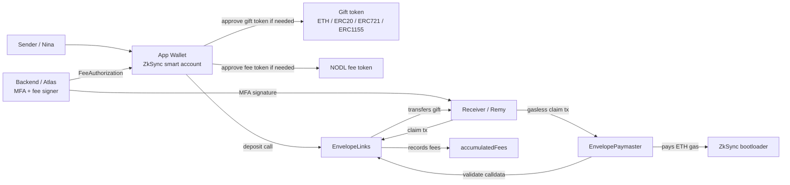
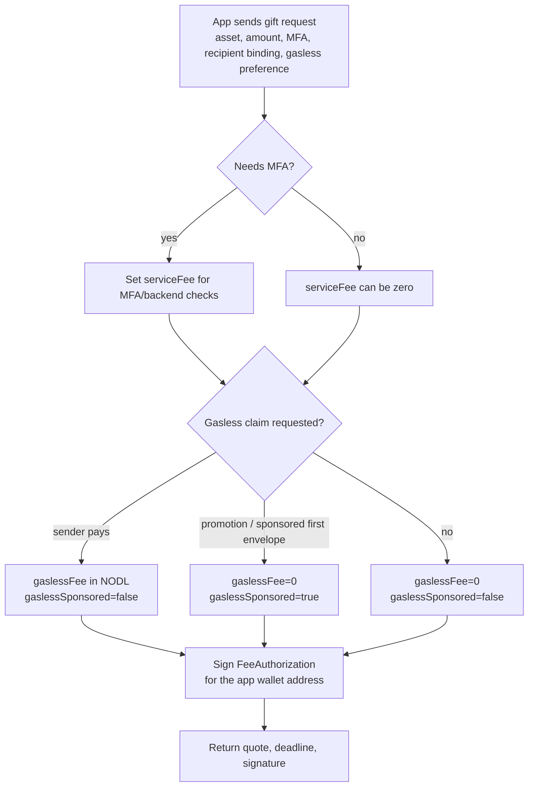
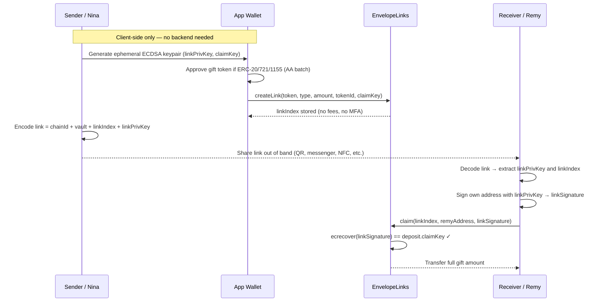
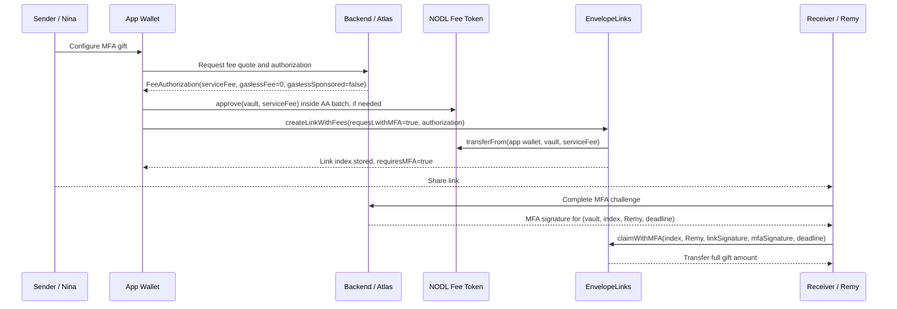
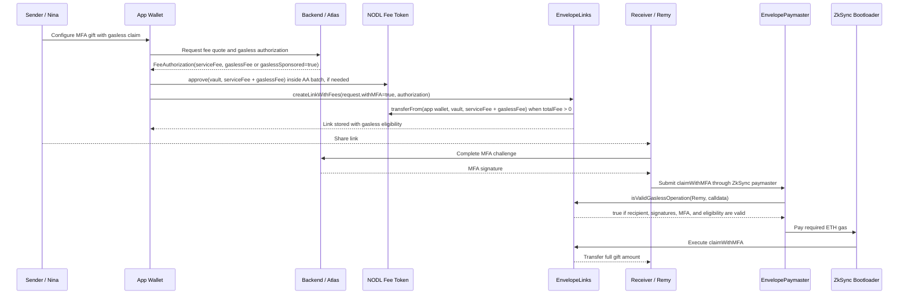

# EnvelopeLinks

`src/envelope/EnvelopeLinks.sol`

## Purpose

`EnvelopeLinks` is a link-based asset vault for ETH, ERC-20, ERC-721, and ERC-1155 gifts. A sender deposits an asset against a per-link claim key; the recipient claims by presenting a signature from the matching private key. The vault supports open links, address-bound links, optional backend MFA, sender reclaim, link-creation-time service fees, and prepaid or backend-sponsored gasless claim/reclaim eligibility for ZkSync paymasters.

## Actors And Architecture

The core product actors are:

| Actor             | Role                                                                                                                                                                                          |
| ----------------- | --------------------------------------------------------------------------------------------------------------------------------------------------------------------------------------------- |
| Sender / Nina     | Creates the gift link and funds the envelope. In the app, Nina signs one ZkSync smart-account batch instead of separate approval and deposit transactions.                                    |
| Backend / Atlas   | Prices the service and gasless portions, signs `FeeAuthorization`, and optionally signs MFA approvals at claim time. Atlas can also sponsor gasless eligibility with `gaslessSponsored=true`. |
| Receiver / Remy   | Opens the link and claims the gift. Remy may be explicitly recipient-bound, or the link may be open to whoever has the link key.                                                              |
| App Wallet        | A ZkSync smart account controlled by the app. It batches approvals plus the vault call into one user confirmation.                                                                            |
| EnvelopeLinks     | Custodies gifts, validates backend fee authorization, stores gasless eligibility, and executes claims/reclaims.                                                                               |
| EnvelopePaymaster | Pays ZkSync claim/reclaim gas only when `EnvelopeLinks.isValidGaslessOperation` approves the calldata.                                                                                        |



## Backend Fee Decision

The vault does not price fees. Atlas chooses the service fee, gasless fee, and whether the backend sponsors claim gas, then signs the complete link intent for the app wallet address that will call the vault.



`gaslessFee > 0` means the sender prepaid the paymaster budget in NODL. `gaslessSponsored == true` means Atlas approved paymaster eligibility without collecting a gasless fee from the sender. Either condition allows the paymaster path, but only the non-zero fee path transfers NODL into the vault.

## App Wallet Batch UX

For best UX, the app wallet should use ZkSync native account abstraction and present a single confirmation that internally executes the required approvals plus the vault call. This is especially important because the deployed L2 NODL token does not implement `ERC20Permit`.

Recommended sender flow:

1. Derive or load Nina's app-wallet smart-account address.
2. Build the `LinkRequest` using `onBehalfOf = appWalletAddress` when the app wallet should own sender reclaim rights.
3. Ask Atlas for a `FeeAuthorization` signed for `feePayer = appWalletAddress`.
4. Query current allowances and approvals.
5. Build an AA batch containing only the missing approvals plus `createLinkWithFees`.
6. Show Nina one clear confirmation: gift asset, recipient-binding status, MFA status, NODL service fee, gasless fee or sponsorship, and reclaim policy.
7. Submit one ZkSync smart-account transaction.

Pseudo-call plan:

```solidity
Call[] memory calls;

if (giftIsERC20 && giftAllowance < giftAmount) {
    calls.push(Call({
        to: giftToken,
        value: 0,
        data: abi.encodeCall(IERC20.approve, (address(vault), giftAmount))
    }));
}

if (feeAuthorization.serviceFee + feeAuthorization.gaslessFee > 0 && nodlAllowance < totalFee) {
    calls.push(Call({
        to: address(feeToken),
        value: 0,
        data: abi.encodeCall(IERC20.approve, (address(vault), totalFee))
    }));
}

calls.push(Call({
    to: address(vault),
    value: request.contractType == 0 ? request.amount : 0,
    data: abi.encodeCall(EnvelopeLinks.createLinkWithFees, (request, feeAuthorization))
}));

appWallet.executeBatch(calls, paymasterParams);
```

For ERC-721, use `approve(vault, tokenId)` before the vault call if the vault is not already approved. For ERC-1155, use `setApprovalForAll(vault, true)` only when needed; for one-shot UX, the app may add `setApprovalForAll(vault, false)` after the deposit call in the same batch to avoid leaving standing approval.

## Main Sequences

### No MFA, No Gasless P2P Gift

In this flow **no backend is involved**. The link secret is an ephemeral ECDSA private key generated entirely on the sender's device. The shareable link encodes: `chainId`, vault address, link index, and the raw private key. The recipient's app extracts the private key, signs the recipient's own address, and calls `claim`. Because no `FeeAuthorization` is submitted, the vault stores zero fees, no gasless eligibility, and no MFA requirement.



If Remy is recipient-bound, the sender uses `createCustomLink(..., recipient=Remy, reclaimableAfter=...)`, and Remy can call either `claim` with Remy as recipient or the stricter `claimAsBoundRecipient` path. The paymaster will only sponsor recipient-bound claims when the caller is the bound recipient and gasless eligibility exists.

### MFA Without Gasless Claim



In this flow Remy pays the claim transaction gas. The service fee is collected at link creation and does not reduce the gift amount.

### MFA With Gasless Claim



Gasless eligibility is independent of the gift amount. The paymaster must still be funded with ETH; NODL fee collection is an accounting and treasury process, not an on-chain claim-time swap.

## Constructor

```solidity
constructor(address mfaAuthorizer, address owner, address feeToken)
```

| Param           | Purpose                                                                                                                                                             |
| --------------- | ------------------------------------------------------------------------------------------------------------------------------------------------------------------- |
| `mfaAuthorizer` | Backend signer for MFA claim approvals and link-creation-time fee authorizations. `address(0)` disables non-zero fee authorizations and makes MFA withdrawals fail. Rotatable by owner via `setMfaAuthorizer`. |
| `owner`         | Owns the vault, can withdraw accumulated fees, and rotate the `mfaAuthorizer`.                                                                                      |
| `feeToken`      | ERC-20 used for Nodle service and gasless sponsorship fees, for example NODL. `address(0)` permits only zero-fee deposits.                                          |

## Owner Functions

| Function                            | Purpose                                                                                  |
| ----------------------------------- | ---------------------------------------------------------------------------------------- |
| `setMfaAuthorizer(address)`         | Rotate the MFA/fee-authorization signer. Invalidates all in-flight signatures from the old key. |
| `withdrawFees(address tokenAddress)`| Withdraw accumulated service and gasless fees for a given token.                         |

## Security Properties

### Fee-On-Transfer Token Safety

For ERC-20 deposits, the vault measures the actual `balanceOf` delta rather than trusting the requested `amount`. This prevents insolvency when fee-on-transfer or rebasing tokens are deposited. The recorded `link.asset.amount` reflects what the vault actually received and can transfer back.

For raffle-style links (which have per-link variable amounts), a fee-on-transfer token will cause the deposit to revert because the vault asserts the received total matches the requested total.

### Fee Authorization Replay Protection

Each `FeeAuthorization` signature can only be used once. The vault tracks consumed authorizations via `usedFeeAuthorizations[keccak256(signature)]` and reverts with `FeeAuthorizationAlreadyUsed` on replay attempts.

### Recipient Validation

- Claims to `address(0)` are rejected with `ZeroRecipientAddress`.
- `claimAsBoundRecipient` reverts with `LinkNotRecipientBound` if the link has no stored recipient, preventing misuse of the bound-mode signature on open links.

### MFA Authorizer Rotation

The `mfaAuthorizer` is mutable (not immutable). In case of backend key compromise, the owner can rotate the signer immediately via `setMfaAuthorizer`. All in-flight MFA and fee authorization signatures from the old key become invalid after rotation.

### Unsupported Token Types

The following token types are **not supported** and should not be deposited:

- **Rebasing tokens** (e.g., stETH, AMPL): balance changes between deposit and claim may cause under/overpayment.
- **Tokens with transfer hooks that modify balances** beyond a simple fee deduction.
- **ERC-777 tokens**: the vault does not implement `tokensReceived` and relies on `nonReentrant` guards.

ERC-20 tokens that charge a fixed transfer fee (e.g., USDT on some chains) are supported — the vault records the actual received amount.

### View-Only Functions (Off-Chain Only)

`getLinkIndexesCreatedBy` and `getAllLinkIndexes` iterate over the entire links array. These are O(n) and intended for off-chain use only. On-chain callers will encounter out-of-gas for large link counts.

## Deposit Model

All deposits store a `Deposit` record:

```solidity
struct Deposit {
    address claimKey;
    uint256 amount;
    address tokenAddress;
    uint8 contractType;      // 0=ETH, 1=ERC20, 2=ERC721, 3=ERC1155
    bool claimed;
    bool requiresMFA;
    bool gaslessSponsored;   // backend approved paymaster eligibility without gaslessFee
    uint40 timestamp;
    uint256 tokenId;
    address senderAddress;
    address recipient;
    uint40 reclaimableAfter;
    uint256 serviceFee;      // feeToken amount collected at link creation
    uint256 gaslessFee;      // feeToken amount prepaid for paymaster sponsorship
}
```

`serviceFee` and `gaslessFee` are not deducted from the gift amount. They are separate `feeToken` transfers from the depositor to the vault and are accounted in `accumulatedFees[address(feeToken)]`. `gaslessSponsored` records backend-approved paymaster eligibility when Atlas pays the gas budget operationally instead of collecting a sender-side `gaslessFee`.

## Main Deposit Functions

| Function                                                 | Flow                                                                                                                                                                                           |
| -------------------------------------------------------- | ---------------------------------------------------------------------------------------------------------------------------------------------------------------------------------------------- |
| `createLink(token, type, amount, tokenId, claimKey)`     | Basic open link. No MFA, no fees, no gasless sponsorship.                                                                                                                                      |
| `createMFALink(...)`                                     | Basic open link that requires backend MFA at claim time. No link-creation-time fees unless using `createLinkWithFees`.                                                                         |
| `createLinkFor(..., onBehalfOf)`                         | Creates a link whose reclaim rights belong to `onBehalfOf`. Used by batch flows.                                                                                                               |
| `createMFALinkFor(..., onBehalfOf)`                      | Selfless deposit plus MFA requirement.                                                                                                                                                         |
| `createCustomLink(...)`                                  | Canonical no-fee entry point with MFA flag, optional recipient binding, and optional reclaim delay.                                                                                            |
| `createLinkWithFees(request, feeAuthorization)`          | Canonical paid-service entry point. Pulls the gift asset, verifies backend-signed fees, collects `feeToken`, and records gasless eligibility when `gaslessFee > 0` or `gaslessSponsored=true`. |
| `createLinks(...)`                                       | Creates many same-shape no-fee deposits in one transaction. ETH, ERC-20, and ERC-1155 are supported; ERC-721 uses the heterogeneous batch path.                                                |
| `createLinksNoReturn(...)`                               | Same as `createLinks` but skips allocating/returning the link indexes array.                                                                                                                   |
| `createCustomLinks(...)`                                 | Creates a heterogeneous no-fee batch and supports ETH, ERC-20, ERC-721, and ERC-1155.                                                                                                          |
| `createCustomLinksWithFees(requests, feeAuthorizations)` | Creates a heterogeneous paid/gasless-ready batch using the same `LinkRequest` and `FeeAuthorization` structs as the single-deposit flow.                                                       |
| `createLinksRaffle(...)`                                 | Creates ETH or ERC-20 raffle-style deposits with different amounts and one shared `claimKey`.                                                                                                  |
| `createMFARaffleLinks(...)`                              | Same as raffle batching, but every deposit requires MFA at claim time.                                                                                                                         |

```solidity
struct FeeAuthorization {
    uint256 serviceFee;
    uint256 gaslessFee;
    bool gaslessSponsored;
    uint256 deadline;
    bytes signature;
}
```

`FeeAuthorization` covers the full link intent, the fee payer (`msg.sender`), the two fee amounts, `gaslessSponsored`, and a backend-selected deadline. `deadline == 0` means no expiry. If either fee is non-zero, if `gaslessSponsored` is true, or if a zero-fee authorization includes a non-empty signature, the signature must recover to `mfaAuthorizer`. This allows backend-approved free envelopes without forcing a fee transfer, and also allows promotional gasless eligibility without encoding fake fee amounts.

## Vault-Native Batching

Batching is implemented directly in `EnvelopeLinks` rather than a separate companion contract. This keeps the real sender as `msg.sender`, so reclaim rights and backend fee signatures use the same identity as single deposits. It also removes the extra custody hop where a batcher temporarily holds tokens before forwarding them to the vault.

The batching functions share the same storage and events as single deposits. Same-shape batches aggregate ERC-20/ERC-1155 pulls for efficiency; heterogeneous batches pull each asset separately and can include ERC-721 token IDs. Batched fee authorizations are signed for the caller of the vault, not an intermediate contract.

## Withdraw And Claim Functions

| Function                                                            | Caller                                   | Authorization                                                                                                 |
| ------------------------------------------------------------------- | ---------------------------------------- | ------------------------------------------------------------------------------------------------------------- |
| `claim(index, recipient, signature)`                                | Anyone, or a recipient using a paymaster | Link key signs `(salt, chainId, vault, index, recipient, OPEN_CLAIM_MODE)`.                                   |
| `claimWithMFA(index, recipient, signature, mfaSignature, deadline)` | Anyone, or a recipient using a paymaster | Link signature plus backend MFA signature over `(salt, chainId, vault, index, recipient, deadline)`.          |
| `claimAsBoundRecipient(index, recipient, signature)`                | Must be `recipient`                      | Link key signs using `BOUND_CLAIM_MODE`.                                                                      |
| `reclaim(index)`                                                    | Original `senderAddress`                 | Sender reclaim. If the deposit is recipient-bound, `block.timestamp` must be greater than `reclaimableAfter`. |

All withdrawal paths set `claimed = true` before transferring assets. Claim-time fee collection was intentionally removed: fees are now collected when the envelope is created.

## Gasless Paymaster Flow

Gasless operation is handled by ZkSync paymasters, not by an internal vault callback. The vault is only the source of truth for whether a paymaster should sponsor a call.

1. Sender creates a deposit through `createLinkWithFees` with `gaslessFee > 0` or `gaslessSponsored=true`.
2. The vault collects any non-zero gasless sponsorship fee immediately in `feeToken` and records gasless eligibility on the deposit.
3. A receiver submits a ZkSync transaction to `claim`, `claimWithMFA`, or `claimAsBoundRecipient` using `EnvelopePaymaster`.
4. ZkSync calls the paymaster before execution. The paymaster checks the transaction targets this vault and calls `isValidGaslessOperation(from, transaction.data)`.
5. The vault re-checks the deposit state, gasless eligibility, recipient/sender identity, signatures, MFA deadline, and reclaim delay.
6. If validation passes, the paymaster pays ETH to the bootloader. The vault function then executes normally.

Sender reclaim can also be gasless: the sender submits `reclaim(index)` through the paymaster. This is allowed only for deposits with `gaslessFee > 0` or `gaslessSponsored=true`, and the same reclaim timing rules as the regular reclaim path.

## Paymaster Validation Helper

```solidity
function isValidGaslessOperation(address caller, bytes calldata callData) external view returns (bool);
```

This function is intended for paymaster validation. It accepts only these selectors:

- `claim`
- `claimWithMFA`
- `claimAsBoundRecipient`
- `reclaim`

For claim calls, `caller` must be the recipient. For reclaim calls, `caller` must be the stored sender. The helper returns false for non-eligible deposits, claimed deposits, unsupported selectors, wrong callers, invalid signatures, expired MFA approvals, or early reclaims.

## Fees

| Fee / Flag         | Collected        | Meaning                                                                              |
| ------------------ | ---------------- | ------------------------------------------------------------------------------------ |
| `serviceFee`       | Deposit creation | Paid backend service fee for optional security/MFA/compliance checks.                |
| `gaslessFee`       | Deposit creation | Prepaid NODL compensation for paymaster-sponsored claim or reclaim.                  |
| `gaslessSponsored` | Not collected    | Backend-approved paymaster eligibility without collecting a sender-side gasless fee. |

Fees and sponsorship are backend-priced off-chain and backend-signed on-chain. The vault does not encode pricing policy; it enforces the signed amounts, sponsored eligibility flag, and deadline. The owner withdraws accumulated fees through `withdrawFees(token)`.

## Removed EIP-3009 Path

The previous EIP-3009 deposit and gasless reclaim paths were removed. ERC-20 deposits now use standard allowance-based transfers, and ZkSync gasless UX is provided by the paymaster flow above.

## Events

```solidity
event LinkCreated(uint256 indexed index, uint8 indexed contractType, uint256 amount, address indexed senderAddress);
event LinkRedeemed(uint256 indexed index, uint8 indexed contractType, uint256 amount, address indexed recipientAddress);
event FeeCollected(uint256 indexed index, address indexed tokenAddress, uint256 serviceFee, uint256 gaslessFee);
event FeesWithdrawn(address indexed tokenAddress, uint256 amount);
```

## Test Coverage

Core coverage lives in `test/envelope/`. Gasless fee and vault-side paymaster eligibility tests live in `test/envelope/Gasless.t.sol`; ZkSync paymaster validation tests live in `test/paymasters/EnvelopePaymaster.t.sol`.

## Post-Deployment Smoke Tests (cast)

After deploying `EnvelopeLinks`, verify the critical flows using `cast`. Replace placeholders with real values.

```bash
# ── Variables ──────────────────────────────────────────────────────────────────
LINKS=<deployed EnvelopeLinks address>
RPC=<rpc url, e.g. https://mainnet.era.zksync.io>
SENDER_PK=<sender private key>
SENDER=$(cast wallet address $SENDER_PK)
RECIPIENT=<recipient address>

# Generate an ephemeral link keypair
LINK_PK=$(cast wallet new --json | jq -r '.[0].private_key')
LINK_ADDR=$(cast wallet address $LINK_PK)
```

### 1. Create a simple ETH link (no fees, no MFA)

```bash
cast send $LINKS \
  "createLink(address,uint8,uint256,uint256,address)" \
  0x0000000000000000000000000000000000000000 0 0 0 $LINK_ADDR \
  --value 0.001ether --private-key $SENDER_PK --rpc-url $RPC
```

### 2. Read back the link

```bash
LINK_COUNT=$(cast call $LINKS "getLinkCount()(uint256)" --rpc-url $RPC)
echo "Total links: $LINK_COUNT"

# Fetch last created link (index = count - 1)
IDX=$((LINK_COUNT - 1))
cast call $LINKS "getLinkStatus(uint256)" $IDX --rpc-url $RPC
cast call $LINKS "getLinkAsset(uint256)" $IDX --rpc-url $RPC
cast call $LINKS "getLinkParties(uint256)" $IDX --rpc-url $RPC
cast call $LINKS "getLinkFees(uint256)" $IDX --rpc-url $RPC
```

### 3. Claim the link

```bash
# Build the claim message and sign with the link key
SALT=$(cast call $LINKS "ENVELOPE_SALT()(bytes32)" --rpc-url $RPC)
CHAIN=$(cast chain-id --rpc-url $RPC)
OPEN_MODE=$(cast call $LINKS "OPEN_CLAIM_MODE()(bytes32)" --rpc-url $RPC)

# The vault expects: keccak256(abi.encodePacked(SALT, chainId, vault, idx, recipient, OPEN_CLAIM_MODE))
MSG=$(cast keccak256 $(cast abi-encode "f(bytes32,uint256,address,uint256,address,bytes32)" \
  $SALT $CHAIN $LINKS $IDX $RECIPIENT $OPEN_MODE))

SIG=$(cast wallet sign --no-hash $MSG --private-key $LINK_PK)

cast send $LINKS "claim(uint256,address,bytes)" \
  $IDX $RECIPIENT $SIG \
  --private-key $SENDER_PK --rpc-url $RPC
```

### 4. Reclaim (sender takes back an unclaimed link)

```bash
# Create another link first
LINK_PK2=$(cast wallet new --json | jq -r '.[0].private_key')
LINK_ADDR2=$(cast wallet address $LINK_PK2)

cast send $LINKS \
  "createLink(address,uint8,uint256,uint256,address)" \
  0x0000000000000000000000000000000000000000 0 0 0 $LINK_ADDR2 \
  --value 0.001ether --private-key $SENDER_PK --rpc-url $RPC

RECLAIM_IDX=$(($(cast call $LINKS "getLinkCount()(uint256)" --rpc-url $RPC) - 1))

cast send $LINKS "reclaim(uint256)" $RECLAIM_IDX \
  --private-key $SENDER_PK --rpc-url $RPC
```

### 5. Quick health checks

```bash
# Contract is alive
cast call $LINKS "getLinkCount()(uint256)" --rpc-url $RPC

# Check accumulated fees (if fee token is set)
FEE_TOKEN=<fee token address>
cast call $LINKS "accumulatedFees(address)(uint256)" $FEE_TOKEN --rpc-url $RPC

# Paymaster points to correct contract
PAYMASTER=<paymaster address>
cast call $PAYMASTER "envelopeLinks()(address)" --rpc-url $RPC
```
