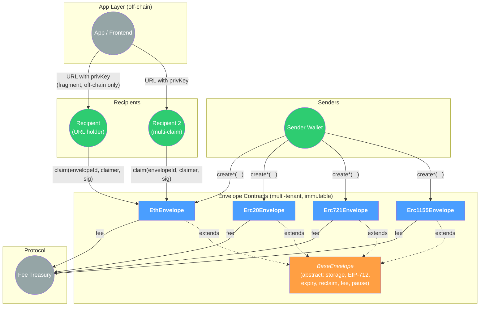
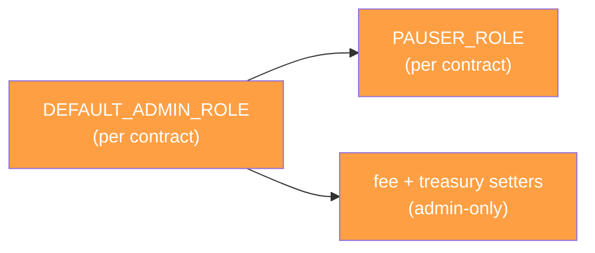
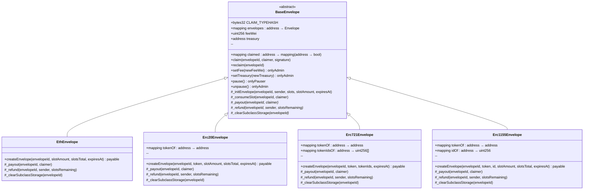
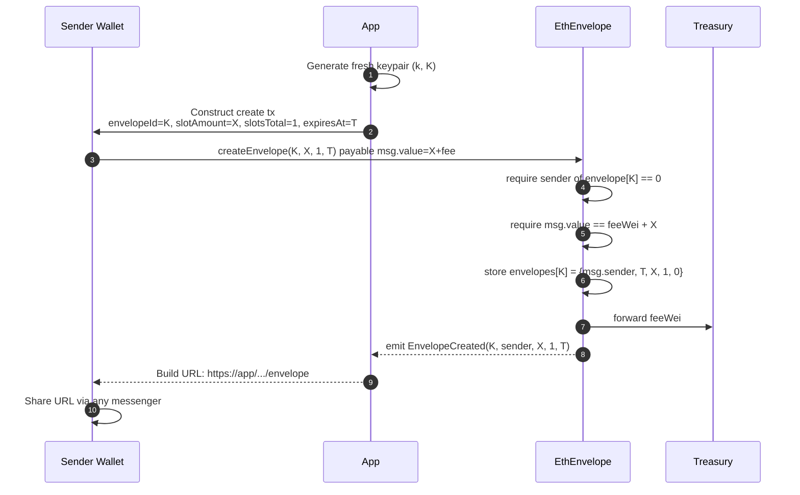
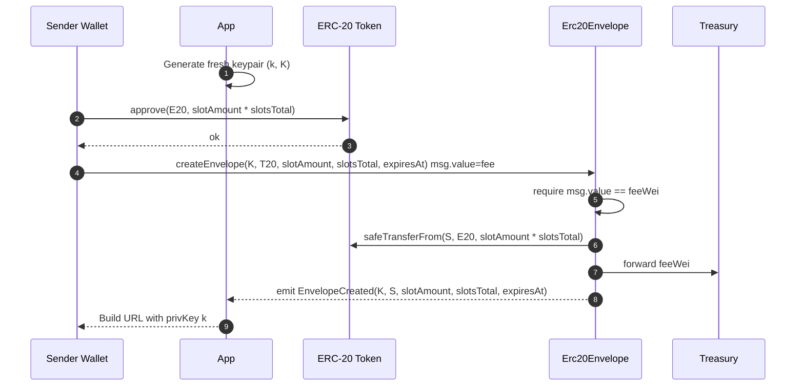
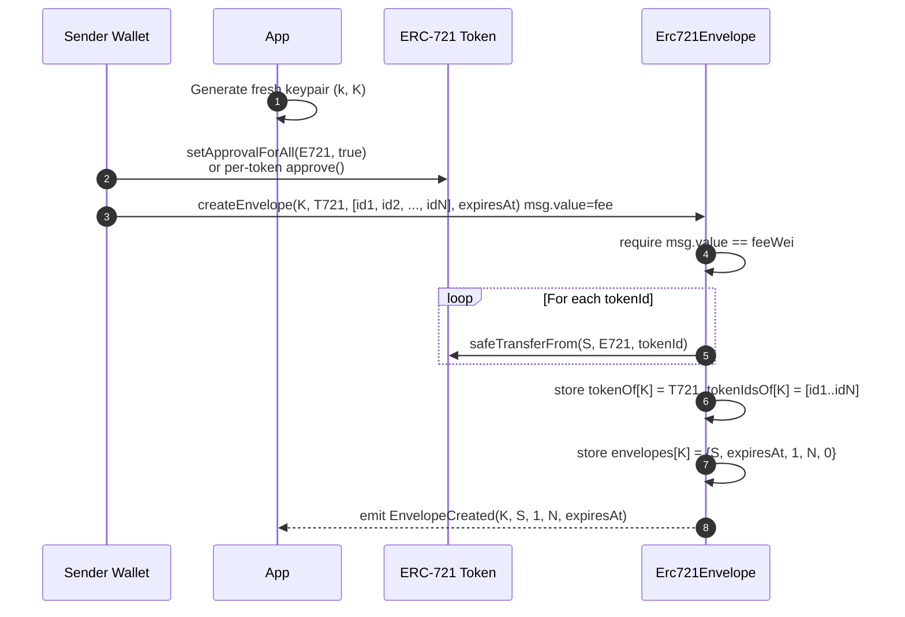
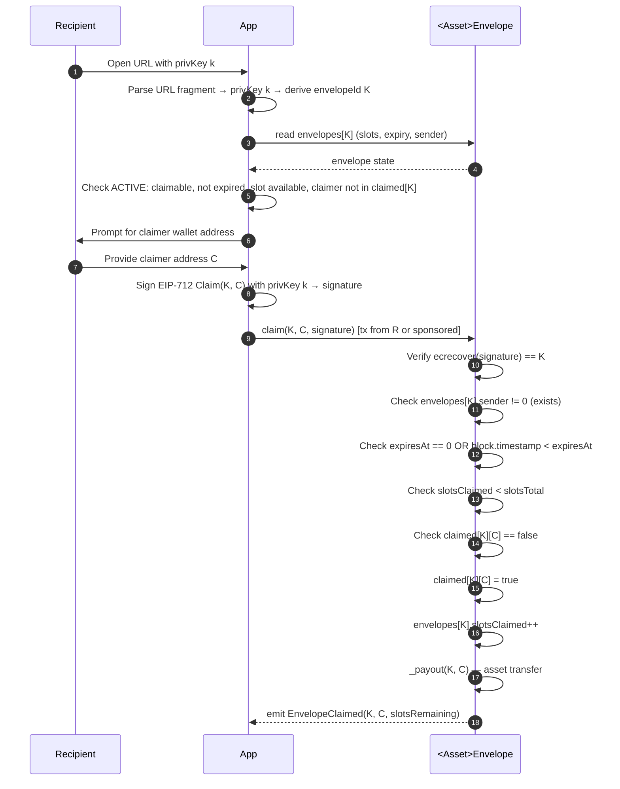
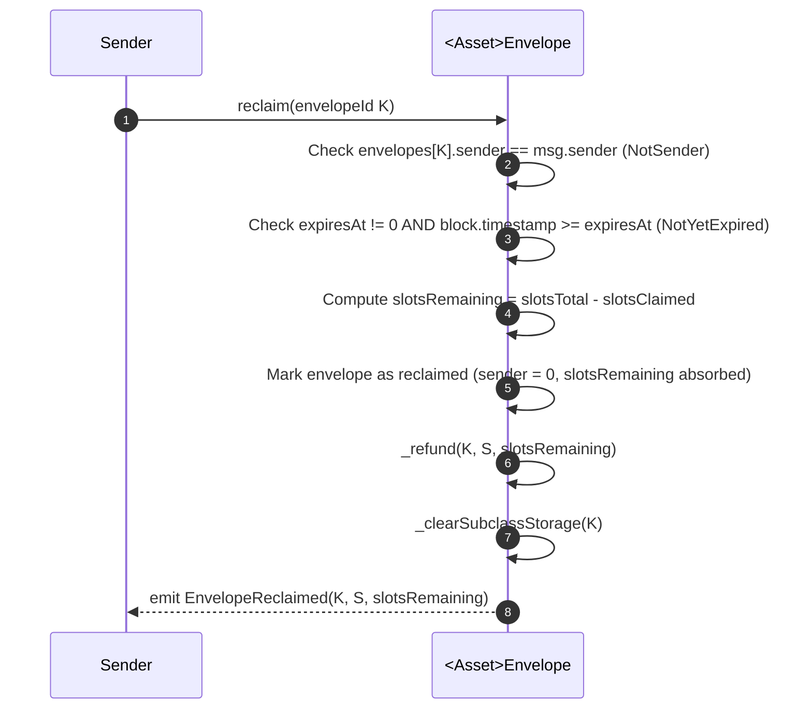

<div class="title-page">

# Nodle Envelopes

## Technical Specification

**Bearer-Link Asset Transfer with Fresh-Keypair Claim Authorization**

Version 1.0 — April 2026

</div>

<div class="page-break"></div>

## Table of Contents

1. [Introduction & Architecture](#1-introduction--architecture)
2. [Roles & Access Control](#2-roles--access-control)
3. [Contract Interfaces](#3-contract-interfaces)
4. [Envelope Creation Flow](#4-envelope-creation-flow)
5. [Claim & Reclaim Flows](#5-claim--reclaim-flows)
6. [Storage Layout](#6-storage-layout)
7. [Security Model](#7-security-model)
8. [Testing Strategy](#8-testing-strategy)
9. [Deployment & Operations](#9-deployment--operations)
10. [File Layout](#10-file-layout)
11. [Open Considerations](#11-open-considerations)

<div class="page-break"></div>

## 1. Introduction & Architecture

### 1.1 System Overview

The Envelopes system lets a sender wrap on-chain assets in a bearer instrument that anyone holding a shareable URL can claim. The URL carries a fresh ECDSA private key in its fragment; the corresponding public address acts as the envelope's on-chain identifier. Claiming requires producing a signature from that private key bound to the claimer's wallet address — so anyone who has the URL can claim, but no observer of an in-flight claim transaction can hijack it.

The on-chain layer provides:

- A multi-tenant contract per asset class (ETH, ERC-20, ERC-721, ERC-1155) holding many envelopes in a single deployment.
- A shared `BaseEnvelope` abstract for envelope storage, EIP-712 claim verification, slot bookkeeping, expiry, reclaim, fee accounting, and pause control.
- Front-run-safe claim semantics by construction: the claim signature commits to the claimer's address, so a third party who observes a claim transaction cannot reuse the signature for a different recipient.

### 1.2 Architecture



### 1.3 Core Components

| Contract           | Role                                                  | Pattern                            | Upgradeability |
| :----------------- | :---------------------------------------------------- | :--------------------------------- | :------------- |
| `BaseEnvelope`     | Abstract base: shared storage, signature verification, expiry, fee accounting, pause | Abstract, not deployed standalone | —              |
| `EthEnvelope`      | Wraps native ETH                                      | Multi-tenant, deployed once         | Immutable      |
| `Erc20Envelope`    | Wraps ERC-20 (any approved token)                     | Multi-tenant, deployed once         | Immutable      |
| `Erc721Envelope`   | Wraps ERC-721 (sender provides `tokenIds[]`)          | Multi-tenant, deployed once         | Immutable      |
| `Erc1155Envelope`  | Wraps ERC-1155 (single `id` per envelope, all slots equal) | Multi-tenant, deployed once    | Immutable      |

Each concrete contract is **deployed once and is immutable**. Bug fixes are shipped by deploying a new version; the app routes new envelopes to the new deployment while old envelopes drain via claim, expiry, or reclaim. There is no factory and no clone pattern — envelopes are short-lived bearer instruments and per-envelope clones would be wasteful.

### 1.4 Design Decisions

| #  | Decision                          | Choice                                                                                                                                                       |
| :- | :-------------------------------- | :----------------------------------------------------------------------------------------------------------------------------------------------------------- |
| 1  | URL authorization pattern         | Linkdrop-style: fresh ECDSA keypair per envelope; private key in URL fragment; on-chain envelope keyed by the public address                                 |
| 2  | Front-run safety                  | EIP-712 claim signature commits to the claimer's address; the claim payload is `Claim(address envelopeId, address claimer)`                                  |
| 3  | Claim model                       | Sender chooses single-claim or multi-claim per envelope; one URL per envelope; equal-share slots; on-chain dedup keyed by claimer address                   |
| 4  | Asset payload                     | One asset class per envelope (ETH or ERC-20 or ERC-721 or ERC-1155). Multi-asset bundles are out of scope                                                    |
| 5  | Contract organization             | One abstract base + four concrete contracts (per asset class), deployed independently                                                                        |
| 6  | Lifecycle                         | Optional `expiresAt` (uint96, 0 = never expires). Sender can `reclaim` only after expiry. No mid-flight cancel                                               |
| 7  | Creation policy                   | Permissionless — any wallet can call `create*`                                                                                                                |
| 8  | Fee model                         | Configurable flat per-envelope fee in **ETH**, taken at creation, forwarded to a configurable treasury. Default 0 at deployment                              |
| 9  | Upgradeability                    | Contracts are immutable. Bug fixes ship as new deployments; old contracts drain via claim/expiry/reclaim. Ops can pause `create*` while a v2 rolls out      |
| 10 | Reentrancy protection             | OpenZeppelin `ReentrancyGuard` on `claim` and `reclaim`. Asset transfers always follow checks-effects-interactions                                            |
| 11 | Inheritance                       | Direct from OpenZeppelin (non-upgradeable) primitives — `AccessControl`, `Pausable`, `ReentrancyGuard`, plus standard ERC token interfaces                   |

### 1.5 Non-Goals

- Multi-asset bundles in a single envelope.
- Non-bearer claim authorization (e.g., per-recipient allowlists, KYC). Recipients are anonymous-by-URL.
- Royalty enforcement on transferred NFTs (ERC-2981 is informational; see §1.6).
- App / frontend, URL parsing, key generation, or messaging integration.
- Bridging or cross-chain envelopes.
- On-chain envelope discovery or search (envelopes are intentionally pseudonymous; the URL is the lookup key).

### 1.6 Lifecycle States

For any envelope `e`:

```
ACTIVE      e.slotsClaimed < e.slotsTotal
            AND (e.expiresAt == 0 OR block.timestamp < e.expiresAt)
            AND e.sender != address(0)

EXHAUSTED   e.slotsClaimed == e.slotsTotal
            → claim reverts (no slots), reclaim reverts (nothing to refund)

EXPIRED     e.expiresAt != 0 AND block.timestamp >= e.expiresAt
            AND e.slotsClaimed < e.slotsTotal
            → claim reverts (expired), reclaim by sender refunds remaining

RECLAIMED   sender called reclaim
            → e.sender zeroed, all subclass refs cleared
            → claim reverts (no envelope), reclaim reverts (already reclaimed)
```

<div class="page-break"></div>

## 2. Roles & Access Control

### 2.1 Role Map

| Role                  | Held by                       | Scope        | Capabilities                                                                                              |
| :-------------------- | :---------------------------- | :----------- | :-------------------------------------------------------------------------------------------------------- |
| `DEFAULT_ADMIN_ROLE`  | L2 admin Safe (multisig)      | Each contract | Set protocol fee; set treasury address; grant/revoke `PAUSER_ROLE`                                       |
| `PAUSER_ROLE`         | L2 admin Safe + ops key       | Each contract | Pause new envelope creation only. Existing claims and reclaims always work even when paused              |

There is **no operator role**, **no whitelist**, and **no creator role** — envelope creation is permissionless. The only privileged operations are administrative (fee/treasury) and emergency (pause-create).

### 2.2 Role Admin Hierarchy



`DEFAULT_ADMIN_ROLE` administers `PAUSER_ROLE` and is the only role that can adjust fee/treasury. Each of the four contracts has its own role registry; admin manages all four (typically the same multisig address).

### 2.3 Pause Semantics

When `paused == true`:

- `create*` reverts with `EnforcedPause`.
- `claim` and `reclaim` continue to function normally.

Rationale: a discovered bug should not trap funds in flight. Senders who already deposited assets can still see them claimed or reclaimed. Pause only prevents new exposure.

<div class="page-break"></div>

## 3. Contract Interfaces

### 3.1 Public Interfaces

| Interface                              | Description                                                            |
| :------------------------------------- | :--------------------------------------------------------------------- |
| `interfaces/IBaseEnvelope.sol`         | Shared envelope storage, claim, reclaim, view APIs                     |
| `interfaces/IEthEnvelope.sol`          | ETH-specific `create` overload                                         |
| `interfaces/IErc20Envelope.sol`        | ERC-20-specific `create` overload                                      |
| `interfaces/IErc721Envelope.sol`       | ERC-721-specific `create` overload                                     |
| `interfaces/IErc1155Envelope.sol`      | ERC-1155-specific `create` overload                                    |
| `interfaces/EnvelopeTypes.sol`         | Shared enums and structs (`Envelope`, `ClaimSig` typedata)             |

### 3.2 Contract Classes



### 3.3 Shared Types

```solidity
struct Envelope {
    address sender;        // creator; zero after reclaim
    uint96  expiresAt;     // 0 = never expires
    uint128 slotAmount;    // amount per slot (1 for ERC-721)
    uint16  slotsTotal;    // total slots at creation
    uint16  slotsClaimed;  // running count
    // 12 bytes free for subclass packing (kept reserved)
}
```

Layout fits in two 32-byte slots:

- Slot 0: `sender` (20) | `expiresAt` (12) = 32 bytes
- Slot 1: `slotAmount` (16) | `slotsTotal` (2) | `slotsClaimed` (2) | reserved (12)

### 3.4 EIP-712 Claim Payload

All four contracts share the same EIP-712 type and a per-deployment domain separator:

```solidity
// Domain (per deployed contract)
EIP712Domain {
    string name;            // e.g., "NodleEnvelopes-ETH" / "-ERC20" / "-ERC721" / "-ERC1155"
    string version;         // "1"
    uint256 chainId;
    address verifyingContract;
}

// Claim type
Claim {
    address envelopeId;     // public address of the envelope keypair
    address claimer;        // wallet receiving the assets
}
bytes32 constant CLAIM_TYPEHASH = keccak256("Claim(address envelopeId,address claimer)");
```

Front-run safety: the signature commits to `claimer`. Replay-by-different-recipient is impossible because the signature would not recover to `envelopeId`. Replay for the same `claimer` is rejected by the on-chain `claimed[envelopeId][claimer]` map.

The `name` field differs per contract so a signature for an ERC-20 envelope cannot be replayed against the ETH envelope contract (or any other class) at the same `envelopeId`. (`envelopeId` collisions across contracts are cryptographically improbable, but per-contract domains add belt-and-braces.)

### 3.5 `BaseEnvelope` (abstract)

```solidity
interface IBaseEnvelope {
    event EnvelopeCreated(
        address indexed envelopeId,
        address indexed sender,
        uint128 slotAmount,
        uint16 slotsTotal,
        uint96 expiresAt
    );
    event EnvelopeClaimed(
        address indexed envelopeId,
        address indexed claimer,
        uint16 slotsRemaining
    );
    event EnvelopeReclaimed(
        address indexed envelopeId,
        address indexed sender,
        uint16 slotsRemainingRefunded
    );
    event FeeUpdated(uint256 oldFee, uint256 newFee);
    event TreasuryUpdated(address oldTreasury, address newTreasury);

    error EnvelopeAlreadyExists(address envelopeId);
    error EnvelopeNotFound(address envelopeId);
    error EnvelopeExpired(address envelopeId);
    error EnvelopeExhausted(address envelopeId);
    error AlreadyClaimed(address envelopeId, address claimer);
    error InvalidSignature();
    error NotSender();
    error NotYetExpired();
    error ZeroSlots();
    error InsufficientFee(uint256 required, uint256 provided);
    error ZeroAddress();

    function claim(
        address envelopeId,
        address claimer,
        bytes calldata signature
    ) external;

    function reclaim(address envelopeId) external;

    function setFee(uint256 newFeeWei) external;
    function setTreasury(address newTreasury) external;
    function pause() external;
    function unpause() external;

    function feeWei() external view returns (uint256);
    function treasury() external view returns (address);

    function envelopes(address envelopeId) external view returns (
        address sender,
        uint96 expiresAt,
        uint128 slotAmount,
        uint16 slotsTotal,
        uint16 slotsClaimed
    );
    function claimed(address envelopeId, address candidate) external view returns (bool);
}
```

### 3.6 `EthEnvelope`

```solidity
interface IEthEnvelope is IBaseEnvelope {
    error WrongMsgValue(uint256 required, uint256 provided);

    function createEnvelope(
        address envelopeId,
        uint128 slotAmount,
        uint16 slotsTotal,
        uint96 expiresAt
    ) external payable;
}
```

Behavior:

- `msg.value == feeWei + uint256(slotAmount) * uint256(slotsTotal)` exactly. Reverts `WrongMsgValue` otherwise.
- Reverts `ZeroSlots` if `slotsTotal == 0` or `slotAmount == 0`.
- Reverts `EnvelopeAlreadyExists` if `envelopes[envelopeId].sender != address(0)`.
- Forwards `feeWei` to `treasury` via `call{value:}`. Reverts on failure.
- `_payout`: `call{value: slotAmount}(claimer)`.
- `_refund`: `call{value: slotsRemaining * slotAmount}(sender)`.
- `_clearSubclassStorage`: no-op (no subclass storage).

### 3.7 `Erc20Envelope`

```solidity
interface IErc20Envelope is IBaseEnvelope {
    function createEnvelope(
        address envelopeId,
        address token,
        uint128 slotAmount,
        uint16 slotsTotal,
        uint96 expiresAt
    ) external payable;

    function tokenOf(address envelopeId) external view returns (address);
}
```

Behavior:

- `msg.value == feeWei` exactly (asset payload travels via `transferFrom`, not `msg.value`).
- Sender must have approved this contract for `slotAmount * slotsTotal` of `token` before calling `createEnvelope`.
- Pulls `slotAmount * slotsTotal` via `SafeERC20.safeTransferFrom(token, msg.sender, address(this), total)`.
- Stores `tokenOf[envelopeId] = token`.
- `_payout`: `SafeERC20.safeTransfer(token, claimer, slotAmount)`.
- `_refund`: `SafeERC20.safeTransfer(token, sender, slotsRemaining * slotAmount)`.
- `_clearSubclassStorage`: `delete tokenOf[envelopeId]`.

### 3.8 `Erc721Envelope`

```solidity
interface IErc721Envelope is IBaseEnvelope {
    error TokenIdsLengthMismatch(uint256 expected, uint256 provided);

    function createEnvelope(
        address envelopeId,
        address token,
        uint256[] calldata tokenIds,
        uint96 expiresAt
    ) external payable;

    function tokenOf(address envelopeId) external view returns (address);
    function tokenIdsOf(address envelopeId) external view returns (uint256[] memory);
    function remainingTokenIds(address envelopeId) external view returns (uint256[] memory);
}
```

Behavior:

- `slotsTotal = tokenIds.length`. `slotAmount = 1` (one NFT per slot).
- `msg.value == feeWei` exactly.
- Sender must have approved this contract per token (or `setApprovalForAll`). Pulls each `tokenId` via `IERC721.safeTransferFrom(msg.sender, address(this), tokenId)` in a loop.
- Stores `tokenOf[envelopeId] = token` and `tokenIdsOf[envelopeId] = tokenIds` (full array).
- `_payout`: pops the last element of `tokenIdsOf[envelopeId]` (LIFO order is gas-cheaper than shifting; semantics from claimer's perspective don't depend on order) and `IERC721.safeTransferFrom(address(this), claimer, tokenId)`.
- `_refund`: loop the remaining `tokenIdsOf[envelopeId]` and transfer each back to `sender`.
- `_clearSubclassStorage`: `delete tokenOf[envelopeId]` and `delete tokenIdsOf[envelopeId]`.

`Erc721Envelope` implements `IERC721Receiver` (returning `IERC721Receiver.onERC721Received.selector`) so `safeTransferFrom` accepts the contract as recipient during `createEnvelope`.

### 3.9 `Erc1155Envelope`

```solidity
interface IErc1155Envelope is IBaseEnvelope {
    function createEnvelope(
        address envelopeId,
        address token,
        uint256 id,
        uint128 slotAmount,
        uint16 slotsTotal,
        uint96 expiresAt
    ) external payable;

    function tokenOf(address envelopeId) external view returns (address);
    function idOf(address envelopeId) external view returns (uint256);
}
```

Behavior:

- All slots wrap `slotAmount` of the same `id` (one ERC-1155 id per envelope).
- `msg.value == feeWei` exactly.
- Sender must have called `setApprovalForAll(envelopeContract, true)` on the ERC-1155 token. Pulls `slotAmount * slotsTotal` of `id` via `IERC1155.safeTransferFrom(msg.sender, address(this), id, total, "")`.
- Stores `tokenOf[envelopeId] = token` and `idOf[envelopeId] = id`.
- `_payout`: `IERC1155.safeTransferFrom(address(this), claimer, id, slotAmount, "")`.
- `_refund`: `IERC1155.safeTransferFrom(address(this), sender, id, slotsRemaining * slotAmount, "")`.
- `_clearSubclassStorage`: `delete tokenOf[envelopeId]` and `delete idOf[envelopeId]`.

`Erc1155Envelope` implements `IERC1155Receiver` (returning the standard selectors) so `safeTransferFrom` accepts the contract as recipient.

<div class="page-break"></div>

## 4. Envelope Creation Flow

### 4.1 ETH Single-Claim Sequence



### 4.2 ERC-20 Multi-Claim Sequence



### 4.3 ERC-721 Sequence



ERC-1155 mirrors §4.2 with a single `safeTransferFrom` call moving `slotAmount * slotsTotal` of the chosen `id`.

### 4.4 Atomicity & Race Conditions

`createEnvelope` is single-transaction-atomic: the caller cannot observe partial state. Two senders race-creating with the same `envelopeId` would result in one tx reverting via `EnvelopeAlreadyExists` — but `envelopeId` is the public address of a fresh ECDSA keypair, so collisions are cryptographically improbable.

<div class="page-break"></div>

## 5. Claim & Reclaim Flows

### 5.1 Claim — Single or Multi



The submitting tx (`claim`) does not have to come from `claimer` — anyone can relay it (e.g., the app's paymaster, a meta-tx relayer). The signature commits to `claimer`, so a relayer cannot redirect the asset.

### 5.2 Reclaim



`reclaim` is idempotent-resistant: after success, `envelopes[K].sender == 0`, so a repeat call reverts `EnvelopeNotFound` (or `NotSender` because `sender` is now zero and `msg.sender` cannot be zero).

The fee is **not refunded** — it was paid to treasury at creation time. This is consistent with a "service fee for hosting the envelope" model.

### 5.3 Edge Cases

| Scenario                                    | Outcome                                                              |
| :------------------------------------------ | :------------------------------------------------------------------- |
| Claim on exhausted envelope                  | Reverts `EnvelopeExhausted`                                          |
| Claim past expiry                            | Reverts `EnvelopeExpired`                                            |
| Claim with reused claimer address            | Reverts `AlreadyClaimed`                                             |
| Claim with signature for different envelope  | Reverts `InvalidSignature` (recovered address mismatch)              |
| Claim while paused                           | Succeeds (pause only blocks `create*`)                               |
| Reclaim before expiry                        | Reverts `NotYetExpired`                                              |
| Reclaim with `expiresAt == 0`                | Reverts `NotYetExpired` (never expires → cannot be reclaimed)        |
| Reclaim by non-sender                        | Reverts `NotSender`                                                  |
| Reclaim of fully-claimed envelope            | Succeeds with `slotsRemaining == 0`; no asset transfer; envelope cleared |
| Reclaim already reclaimed                    | Reverts `EnvelopeNotFound` / `NotSender` (sender slot zeroed)        |

<div class="page-break"></div>

## 6. Storage Layout

### 6.1 Per-Contract Storage

Inherited:

- `AccessControl` — role registry (one slot for `_roles` mapping head)
- `Pausable` — `_paused` bool
- `ReentrancyGuard` — `_status` uint256
- `EIP712` — cached domain separator + chain id

Contract-specific:

```
[OZ AccessControl + Pausable + ReentrancyGuard + EIP712 storage]
slot N+0 : envelopes                  (mapping address → Envelope)
slot N+1 : claimed                    (mapping address → mapping(address → bool))
slot N+2 : feeWei                     (uint256)
slot N+3 : treasury                   (address)
```

Subclass storage extends with one or two extra mappings (see §3.7–§3.9).

Contracts are immutable so there is no storage gap; storage layout discipline applies only when shipping a v2 contract that needs to be deployed alongside v1 (no in-place migration).

### 6.2 Per-Envelope Footprint

Base:

- `envelopes[envelopeId]` — 2 storage slots (struct packed per §3.3).
- `claimed[envelopeId]` — one slot per claimer that ever claimed (mapping head consumes no slot until written).

Subclass extras:

- `Erc20Envelope`: 1 slot for `tokenOf[envelopeId]`.
- `Erc721Envelope`: 1 slot for `tokenOf[envelopeId]` + ⌈N/1⌉ slots for `tokenIdsOf[envelopeId]` (Solidity dynamic array; one slot for length, N slots for elements).
- `Erc1155Envelope`: 2 slots for `tokenOf[envelopeId]` and `idOf[envelopeId]`.

After full claim or reclaim, subclass extras are explicitly cleared via `delete` so that completed envelopes return their storage and refund gas to the caller.

<div class="page-break"></div>

## 7. Security Model

### 7.1 Trust Assumptions

| Principal           | Trusted to                                                                    | Compromise impact                                                                                |
| :------------------ | :---------------------------------------------------------------------------- | :----------------------------------------------------------------------------------------------- |
| Admin (Safe)        | Set fee/treasury benignly; rotate pauser; not pause maliciously                | Can redirect future fees to a malicious treasury. Cannot move existing envelope assets           |
| Pauser              | Pause only in genuine emergencies                                              | Can DoS new envelope creation. Cannot affect existing claims or reclaims                         |
| Senders             | Hold the assets they wrap and approve transfer                                 | A malicious sender wraps and immediately reclaims → slots-remaining = 0; fee already collected   |
| URL holders         | Treat the URL as bearer credential                                             | Anyone who obtains the URL can claim. Sharing the URL outside the intended audience leaks funds |

The protocol does not, and cannot, distinguish "intended" claimers from anyone else with the URL. That is the whole point of the bearer model.

### 7.2 Risks & Mitigations

| #  | Risk                                                                  | Mitigation                                                                                                          |
| :- | :-------------------------------------------------------------------- | :------------------------------------------------------------------------------------------------------------------ |
| 1  | Front-run of claim by extracting URL key from tx                      | Tx contains `(envelopeId, claimer, signature)` — signature reveals only `envelopeId` (public address), not the private key. Front-runners cannot derive a signature for a different claimer |
| 2  | Replay of a captured claim signature                                   | Signature commits to `claimer`; replay just re-fills `claimer`'s claim, which is rejected by `claimed[K][C]`        |
| 3  | Replay of a signature across asset classes                             | Per-contract EIP-712 domain `name` differs (e.g., `NodleEnvelopes-ETH` vs `-ERC20`); same `envelopeId` yields different digests across contracts |
| 4  | Reentrancy via `safeTransferFrom` callback (claimer's contract code)  | `nonReentrant` guard on `claim` and `reclaim`; checks-effects-interactions pattern (state writes precede transfers) |
| 5  | Large `tokenIds[]` DoS on ERC-721 create or reclaim                    | Cap `tokenIds.length` to `MAX_SLOTS = 256` (representable in `uint16` and bounded loop)                              |
| 6  | Sender provides duplicate `tokenIds` in ERC-721                        | First `safeTransferFrom` succeeds; second on the same id reverts (sender no longer owns it). Atomic creation reverts as a whole |
| 7  | ETH refund failure (claimer is a contract that rejects ETH)           | `_payout` uses `call{value:}` and reverts on failure; multi-claim envelopes can have other claims continue. Documented: contracts that reject ETH cannot claim ETH envelopes |
| 8  | Treasury is a contract that reverts on receive                         | Fee transfer at creation reverts the entire `createEnvelope`; admin must set treasury to a payable address          |
| 9  | Admin sets treasury to attacker address                                | Trust assumption: admin is multisig. Each fee is small and per-envelope. Not retroactive — assets already in escrow are safe |
| 10 | `expiresAt` set to a time well in the past                             | Envelope is created in the EXPIRED state immediately. Sender can `reclaim` and recover; fee still paid. Documented as user error |
| 11 | Sender wraps and immediately reclaims (fee griefing of treasury)      | By design: fee is the cost of using the service; treasury keeps it. Not exploitable as DoS                          |
| 12 | Storage exhaustion from many tiny envelopes                            | Each envelope has a one-time fee (when configured); zero fee at default. If this becomes abuse vector, raise fee   |
| 13 | Reclaim of an already-claimed-out envelope                             | `slotsRemaining == 0` → no asset transfer, just clear sender. No funds lost, just emits an event                    |
| 14 | Pause used to trap fees                                                | Pause cannot affect existing claims or reclaims; only `create*`. New senders simply cannot create until unpaused   |

### 7.3 Out of Scope

- Royalty enforcement on transferred NFTs. Envelopes use OpenZeppelin's standard `safeTransferFrom`; royalty hooks (if any) on the token contract apply normally during these transfers.
- Front-end / wallet UX for URL parsing and key handling. The contract layer assumes the app correctly parses the URL fragment and never transmits the private key off-device.
- Bridging or cross-chain envelopes.
- KYC / sanctions screening of claimers.

### 7.4 Audit Posture

- The four concrete contracts share the entire claim/reclaim/expiry flow via `BaseEnvelope`. Audit attention should concentrate on `BaseEnvelope`'s signature verification and slot bookkeeping; subclass overrides are small and asset-specific.
- All asset transfers go through OpenZeppelin's `SafeERC20`, `IERC721`, `IERC1155` standard safe-transfer primitives.
- Recommended: focused audit on `BaseEnvelope.claim` and `BaseEnvelope.reclaim` plus each subclass's `_payout`/`_refund` before mainnet deployment.

<div class="page-break"></div>

## 8. Testing Strategy

Unit tests live under `test/envelopes/`:

### 8.1 `BaseEnvelopeShared.t.sol`

A shared harness exercising lifecycle invariants against a minimal concrete subclass (`MockEnvelope`) so the shared logic is tested in isolation.

- `claim` succeeds with a valid signature; emits `EnvelopeClaimed`; updates `slotsClaimed`; populates `claimed[envelopeId][claimer]`.
- `claim` reverts `InvalidSignature` for a signature that recovers to a different address.
- `claim` reverts `AlreadyClaimed` when the same claimer claims twice.
- `claim` reverts `EnvelopeExhausted` after all slots are taken.
- `claim` reverts `EnvelopeExpired` after `expiresAt`.
- `claim` succeeds while paused (pause only affects `create*`).
- `reclaim` reverts `NotSender` for non-sender callers.
- `reclaim` reverts `NotYetExpired` before `expiresAt` (and always for `expiresAt == 0`).
- `reclaim` clears subclass storage and zeros `sender`.
- `setFee` and `setTreasury` are admin-only; emit corresponding events.
- `pause`/`unpause` permissions and effects.
- ReentrancyGuard prevents reentrant `claim` / `reclaim`.

### 8.2 `EthEnvelope.t.sol`

- `createEnvelope` requires `msg.value == feeWei + slotAmount * slotsTotal`.
- Reverts `EnvelopeAlreadyExists` on duplicate `envelopeId`.
- Reverts `ZeroSlots` for `slotsTotal == 0` or `slotAmount == 0`.
- Fee is forwarded to treasury at creation; fee = 0 path skips the transfer.
- Multi-claim ETH: each claim transfers `slotAmount` to claimer.
- Reclaim refunds `(slotsTotal - slotsClaimed) * slotAmount` to sender; fee not refunded.
- Reclaim of fully-claimed envelope succeeds with no asset transfer.
- Claimer that rejects ETH (`receive` reverts) → claim reverts; envelope state unchanged.

### 8.3 `Erc20Envelope.t.sol`

- Sender approval flow; reverts on insufficient allowance.
- `msg.value == feeWei` strict.
- Pulls `slotAmount * slotsTotal` of `token` at creation.
- Multi-claim transfers the right amount to each claimer.
- Reclaim returns remaining tokens to sender.
- Token with `transfer` returning false (non-standard ERC-20) → handled correctly via `SafeERC20`.

### 8.4 `Erc721Envelope.t.sol`

- Sender provides `tokenIds[]`; contract pulls each via `safeTransferFrom`.
- Reverts on duplicate `tokenIds` (second pull reverts ownership check).
- Reverts on `tokenIds.length > MAX_SLOTS`.
- Multi-claim distributes one NFT per slot in LIFO order.
- Reclaim returns all remaining NFTs to sender.
- `IERC721Receiver` is implemented and returns the correct selector during creation.

### 8.5 `Erc1155Envelope.t.sol`

- Sender approves via `setApprovalForAll`.
- Single `safeTransferFrom` pulls `slotAmount * slotsTotal` at creation.
- Multi-claim transfers `slotAmount` per claim.
- Reclaim returns remaining balance.
- `IERC1155Receiver` is implemented and returns correct selectors.

### 8.6 `Envelopes.integration.t.sol`

End-to-end: deploy all four contracts, set fees, exercise creation + claim + reclaim across all asset classes, verify treasury accounting and event emission.

### 8.7 Coverage Target

≥ 95% line coverage on the new contracts, measured locally via `forge coverage`.

<div class="page-break"></div>

## 9. Deployment & Operations

### 9.1 Deployment Script

Two artifacts mirror the swarms ZkSync pattern:

- `script/DeployEnvelopesZkSync.s.sol` — Forge script that deploys all four contracts (or a configurable subset).
- `ops/deploy_envelopes_zksync.sh` — orchestration shell script analogous to `ops/deploy_swarm_contracts_zksync.sh`: runs preflight checks, compiles with `forge build --zksync`, calls the Forge script, performs post-deploy `cast` checks, and invokes `ops/verify_zksync_contracts.py` for source-code verification.

Environment variables (prefixed `N_` per repo convention):

| Variable                        | Description                                                          |
| :------------------------------ | :------------------------------------------------------------------- |
| `N_ENVELOPES_ADMIN`             | Multisig that will hold `DEFAULT_ADMIN_ROLE` on all four contracts   |
| `N_ENVELOPES_PAUSER`            | Address (typically a Safe or ops key) that will hold `PAUSER_ROLE`   |
| `N_ENVELOPES_FEE_TREASURY`      | Address that receives protocol fees                                  |
| `N_ENVELOPES_INITIAL_FEE_WEI`   | Initial fee in wei. Default `0`                                      |

Steps performed by the Forge script:

1. Deploy `EthEnvelope(admin, pauser, treasury, initialFeeWei)`.
2. Deploy `Erc20Envelope(admin, pauser, treasury, initialFeeWei)`.
3. Deploy `Erc721Envelope(admin, pauser, treasury, initialFeeWei)`.
4. Deploy `Erc1155Envelope(admin, pauser, treasury, initialFeeWei)`.
5. Log all four addresses in the same `<Name>: 0x...` format the orchestration script greps for.

Steps performed by the orchestration shell script:

6. Sanity-check each deployment with `cast` (admin role granted, pauser role granted, treasury and fee values correct).
7. Verify source code on the zkSync block explorer via `python3 ops/verify_zksync_contracts.py --broadcast broadcast/DeployEnvelopesZkSync.s.sol/<chainId>/run-latest.json --verifier-url $VERIFIER_URL --compiler-version 0.8.26 --zksolc-version v1.5.15 --project-root "$PROJECT_ROOT"`. Verifier URLs follow the swarms convention:
    - **Mainnet**: `https://zksync2-mainnet-explorer.zksync.io/contract_verification` (explorer at `https://explorer.zksync.io`)
    - **Testnet**: `https://explorer.sepolia.era.zksync.dev/contract_verification` (explorer at `https://sepolia.explorer.zksync.io`)
8. Append the deployed addresses to the appropriate `.env-test` / `.env-prod` file.
9. Add a usage example to `README.md`.

> **Note on tooling.** Do **not** use `forge script --verify` (sends absolute paths the zkSync verifier rejects). Use `ops/verify_zksync_contracts.py`, which generates standard JSON, rewrites relative imports to project-rooted paths, and submits to the zkSync verifier API. With `bytecode_hash = "none"` already set in `foundry.toml`, this achieves full verification.

### 9.2 Indexing

Subquery extension:

- Four top-level sources, one per contract address. Handlers on `EnvelopeCreated`, `EnvelopeClaimed`, and `EnvelopeReclaimed` write `Envelope`, `EnvelopeClaim`, and `EnvelopeReclaim` entities respectively.
- Treasury accounting reconstructed from `feeWei` at `EnvelopeCreated` time and `FeeUpdated` events.

Indexer wiring is out of this repo's contract scope but is referenced here so the implementation plan can include a tracking task for the subquery package.

### 9.3 Paymaster Integration

`BondTreasuryPaymaster` is not used by envelopes by default — creation is expected to be paid by the sender, since the sender is the asset owner. If the platform wants to sponsor sender gas for trusted users, the paymaster's existing whitelist mechanism can wrap the `create*` call sites without changes to envelope contracts.

Claim transactions are typically relayed by the app on behalf of the recipient (so recipients don't need ETH for gas). Any meta-tx relayer or paymaster works because the claim's authorization is the EIP-712 signature, not `tx.origin`.

### 9.4 Bug-Fix Rollout (Replace, Don't Upgrade)

Envelopes are immutable. To ship a fix:

1. Pause `create*` on the affected v1 contract (`PAUSER_ROLE`).
2. Deploy the v2 contract.
3. Update the app to route new envelopes to v2.
4. Existing v1 envelopes continue to be claimable / reclaimable until they are exhausted, expired, or reclaimed.
5. Once v1 has fully drained (no active envelopes), it can be left dormant — there is no on-chain decommissioning step.

If a critical bug allows draining funds from existing v1 envelopes, there is no on-chain rescue path. Mitigations are:

- Monitor `EnvelopeClaimed` event rates and assets-at-rest balances; alert on anomalies.
- Pause `create*` immediately to stop new exposure.
- Coordinate with affected senders off-chain.

This is the explicit trade-off accepted in §1.4 row 9.

<div class="page-break"></div>

## 10. File Layout

```
src/envelopes/
  BaseEnvelope.sol
  EthEnvelope.sol
  Erc20Envelope.sol
  Erc721Envelope.sol
  Erc1155Envelope.sol
  interfaces/
    IBaseEnvelope.sol
    IEthEnvelope.sol
    IErc20Envelope.sol
    IErc721Envelope.sol
    IErc1155Envelope.sol
    EnvelopeTypes.sol
  doc/
    README.md
    spec/
      envelopes-specification.md
test/envelopes/
  BaseEnvelopeShared.t.sol
  EthEnvelope.t.sol
  Erc20Envelope.t.sol
  Erc721Envelope.t.sol
  Erc1155Envelope.t.sol
  Envelopes.integration.t.sol
  mocks/
    MockEnvelope.sol            (minimal subclass for shared tests)
    MockReentrantClaimer.sol    (test helper for reentrancy)
script/
  DeployEnvelopesZkSync.s.sol
ops/
  deploy_envelopes_zksync.sh    (mirrors deploy_swarm_contracts_zksync.sh)
```

License header on every Solidity file: `// SPDX-License-Identifier: BSD-3-Clause-Clear`.

Solidity pragma: `^0.8.26` (matches existing contracts).

<div class="page-break"></div>

## 11. Open Considerations

These are not blocking for v1; recorded for future iteration.

| Item                                                  | Status   | Notes                                                                                                                                                       |
| :---------------------------------------------------- | :------- | :---------------------------------------------------------------------------------------------------------------------------------------------------------- |
| Multi-asset bundle envelope                           | Deferred | Add a 5th `BundleEnvelope` template later if real demand arises; existing four contracts are unchanged                                                       |
| NODL-denominated fees                                 | Deferred | Currently fee is in ETH; can add per-contract NODL-fee variants if desired without breaking the ETH path                                                    |
| Per-recipient allowlist                               | Deferred | Out of scope by design (bearer model). If future use cases demand it, ship as a parallel `GatedEnvelope` contract — does not affect base                    |
| Sender cancellation before expiry                     | Deferred | Out of scope per §1.4 row 6. Could be added as a flag at creation but breaks recipient guarantees; revisit only with strong UX justification               |
| CI storage-layout diff for v2 → v3 deploys            | Not applicable | Contracts are immutable; storage compatibility between deployments is not required. v2 simply lives at a new address                                   |
| Envelope expiry indexing for app "expiring soon" UX   | Deferred | Subquery can index `expiresAt` and surface a sender's pending envelopes; not a contract change                                                             |
| Cross-chain envelopes                                 | Deferred | Out of scope; would require a bridge or LayerZero-style integration                                                                                          |
