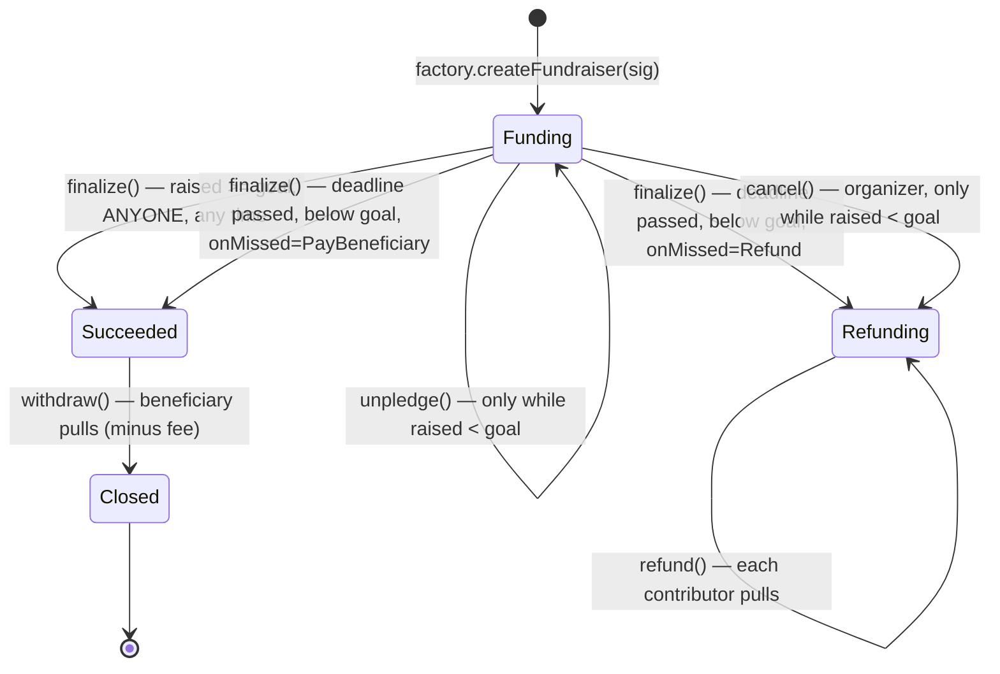

# Fundraising

## Design Document

**A CrowdFund-shaped ERC-20 escrow, built on OpenZeppelin**

Version 1.0 — August 2026

---

## Table of Contents

1. [Scope](#1-scope)
2. [Why This Shape](#2-why-this-shape)
3. [The Decision](#3-the-decision)
4. [What We Build](#4-what-we-build)
5. [State Machine](#5-state-machine)
6. [Contract Surface](#6-contract-surface)
7. [Security Model](#7-security-model)
8. [Gas and Allowances](#8-gas-and-allowances)
9. [Test Harness Plan](#9-test-harness-plan)
10. [Open Decisions](#10-open-decisions)
- [Appendix A: Integration Notes](#appendix-a-integration-notes)
- [Sources](#sources)

<div class="page-break"></div>

## 1. Scope

A **fundraise** collects one ERC-20 toward a target by a deadline. Contributors deposit; the fundraise then resolves to exactly one of two outcomes — the beneficiary is paid, or every contributor takes their own money back.

The on-chain scope is deliberately narrow:

- The contract is an **escrow with a resolution rule**. It holds contributions, tracks who put in how much, and enforces one terminal outcome. Nothing else.
- **It is permissionless: anyone can create a fundraise, and anyone can contribute to one.** There is no membership, eligibility, or signature check anywhere in the flow.
- A fundraise's `name` is stored on-chain so it is self-describing at its own address. Any richer metadata belongs to whatever created it.
- Callers that need to associate fundraises with something of their own do so through the opaque `externalId` tag emitted at creation, and should resolve those associations from their own records — the tag is unverified (§6.1).

**Hard constraint: this deploys new contracts only.** It modifies no deployed contract, requires no token migration, and needs no change to any live paymaster. Nothing currently in production is touched. Any option requiring a change to an existing deployment is out of scope by definition, not merely a low priority — that is what makes this shippable independently, and §8 is written to respect it.

Non-goals for V1: yield on idle funds, contributor voting, milestone payouts, NFT receipts, native ETH, and multiple tokens in one fundraise.

---

## 2. Why This Shape

Three facts decided the design, and they are worth stating because they are not obvious:

**There is nothing importable.** OpenZeppelin removed `Escrow`, `ConditionalEscrow` and `RefundEscrow` in 5.0.0, so the version this repo vendors has no escrow primitive to inherit. Party Protocol, Gitcoin Allo and Mirror's crowdfunds have all wound down. Juicebox is still running, but its model is rejected on its own merits (§3.1) rather than for lack of a maintainer. And no ERC standard for crowdfunding escrow was ever adopted. Writing our own is therefore the normal choice, not not-invented-here.

**One shape converged twice.** OpenZeppelin's `RefundEscrow` (`Active → Refunding | Closed`) and Solidity by Example's `CrowdFund` (`launch / pledge / unpledge / claim / refund`) are the same state machine, reached independently a decade apart, and `CrowdFund` is among the most widely copied crowdfunding contracts in the community. That convergence is stronger evidence the model is right than any single audit.

**The best-reviewed implementation is not the most-used one.** Party Protocol has the deepest published review history for this contract shape — a 0xMacro audit plus several Code4rena engagements, all collected in `PartyDAO/party-protocol/audits/` — and is also the one that no longer runs. So it is an audit checklist, not a dependency (§3.2).

One caveat carried forward: **most-used is not safest.** `CrowdFund` is a teaching reference — no reentrancy guard, no balance-delta accounting, no authorization, and `unpledge` open right to the deadline. §3 and §4 take the shape and add what a contract holding contributors' money needs.

---

## 3. The Decision

Two decisions: **which model**, and **whose code**.

### 3.1 The model — a goal, and an exit that closes when it is reached

A fundraise has a name, a target amount, an asset to collect, and either a deadline or none at all. Contributors deposit toward it. If the target is reached, the beneficiary withdraws. If a deadline passes below target, the fundraise does whatever it committed to at creation — refund everyone (the default) or pay out what was raised. A contributor may withdraw their own deposit at any time **before** the target is reached; that door shuts permanently the moment it is.

Why this one, on the three axes:

- **Security.** It is the only candidate where the failure path is guaranteed and needs nobody's cooperation. Once the goal is hit, or a deadline passes, *anyone* can trigger resolution, and every contributor pulls their own funds rather than waiting to be paid. No operator, no organizer, and no backend key can move a contributor's deposit anywhere except back to that contributor or to the declared beneficiary.
- **Functionality.** It is what "fundraise" means to a user. A goal that doesn't gate anything isn't a goal.
- **Usability.** The default failure mode explains itself in one sentence — *we didn't reach it, take your money back* — and the pre-goal exit removes the worst support ticket in the design: *I typed the wrong amount and now my money is stuck until September.*

**The goal latch is what makes the last two compatible.** Free withdrawal all the way to the deadline lets a fundraise that hit its target be unwound at the last second. Locking from day one commits a contributor's money for months with no individual undo. Cutting the exit at the goal gives contributors a real way out while the outcome is still open, and gives the beneficiary certainty the instant it succeeds. Below the goal, everyone withdrawing is not an attack — it is the contributors collectively changing their minds, which is the correct outcome.

Rejected, with what each trades away:

| Model | Why not |
|---|---|
| Keep-what-you-raise **as the only mode** | Removes the refund guarantee that makes a backend-vouched escrow trustworthy. Adopted instead as a per-fundraise option chosen at creation and visible to contributors before they contribute (§6.1), never as the default |
| Milestone / approved payouts | Every tranche gate is a freeze lever, and whoever signs the approvals becomes custodial |
| Limited payout (Juicebox-style) | Periods and draw accounting solve a treasury problem a single-target fundraise does not have |
| ERC-4626 share vault | No goal, no deadline, no refund condition. Shares imply free exit — that is the open-unpledge model with extra steps and extra attack surface |
| Safe multisig per fundraise | Contributors must become signers, and a set of signers that stops responding is frozen forever. Custody, not fundraising |

### 3.2 The code lineage — blueprint, not dependency

**There is nothing importable.** No maintained, audited crowdfunding contract exists to take as a dependency: OpenZeppelin removed its escrow contracts in 5.0.0, Party Protocol has wound down, and no ERC standard for escrow was ever adopted (§2).

So the decision is a three-part lineage:

1. **Shape** — Solidity by Example's `CrowdFund` (MIT), among the most widely copied crowdfunding contracts in the community, and the same state machine as OpenZeppelin's old `RefundEscrow`. Two independent arrivals at the same design, a decade apart, is the strongest signal available that the model is right.
2. **Substance** — OpenZeppelin primitives. This is what we actually import and the audited surface we inherit. Most of the contract by line count ends up being OZ code rather than ours.
3. **Adversary** — Party Protocol, read-only. The deepest published review history for this shape: a 0xMacro audit and several Code4rena engagements. Its published findings become our test cases; its code becomes none of our dependencies.

No forks and no upstream to track — but equally no upstream to inherit fixes from. The audit burden is entirely ours, which is why §7 and §8 carry the weight they do.

---

## 4. What We Build

### 4.1 `CrowdFund` mapped onto this design

| `CrowdFund` | Here | Change |
|---|---|---|
| `launch(goal, startAt, endAt)` | `FundraiserFactory.createFundraiser` | Deploys a contract per fundraise; deadline optional |
| `pledge(id, amount)` | `deposit` | Credits the amount actually received rather than the amount requested |
| `unpledge(id, amount)` | `unpledge` | **Disabled once `raised >= goal`** — the latch |
| `claim(id)` — creator, if pledged ≥ goal | `withdraw` | Beneficiary only; optional protocol fee |
| `refund(id)` — each backer, if goal missed | `refund` | Unchanged in spirit; plus `refundFor` so a third party can push a contributor's refund *to that contributor* |
| *(implicit — resolution happens inside claim/refund)* | `finalize` | Made an explicit, **permissionless** step so nobody's inaction can freeze funds |

### 4.2 What `CrowdFund` lacks that we add

`CrowdFund` is a ~100-line teaching reference, not a library. Four additions turn it into something that can hold consumer money:

1. **`SafeERC20`** — `CrowdFund` assumes a well-behaved token that returns a bool.
2. **`ReentrancyGuard` plus strict checks-effects-interactions** — zero the balance, then transfer, on every exit path.
3. **Credit what actually arrived**, not what was requested — otherwise a fee-on-transfer token leaves the last contributor unable to get their money back.
4. **The goal latch** — `CrowdFund` leaves `unpledge` open right up to the deadline; here it closes the moment the target is reached (§3.1).

Note what is *not* on that list: an authorization layer. Like `CrowdFund`, this contract asks nobody for permission. That is the simpler design, and §7 #7 records what it moves rather than removes.

`CrowdFund` is MIT-licensed; re-implementing from the shape rather than copying keeps the provenance clean regardless.

### 4.3 What we import

OpenZeppelin 5.3 (already vendored in `lib/`): `SafeERC20`, `ReentrancyGuard`, and `AccessControl` on the factory for the token allow-list and fee parameters. Nothing else — no proxy, no `Initializable`, and with deposits permissionless no `EIP712` or `SignatureChecker` either. Nothing else — with deposits permissionless, `EIP712` and `SignatureChecker` drop out of the design entirely. No escrow primitive exists in 5.x to inherit — that is the gap this contract fills.

---

## 5. State Machine



Rules that hold everywhere:

- Deposits are accepted **only** in `Funding`, and only before `deadline` where one is set.
- `unpledge` is available **only** in `Funding` and **only while `raised < goal`**.
- Once `raised >= goal` the fundraise is latched: no `unpledge`, no `cancel`, and `finalize` is callable by anyone immediately.
- An fundraise with **no deadline** stays in `Funding` until it reaches its goal or is cancelled, so `unpledge` stays available to every contributor indefinitely. In §6.2 this stops being a convenience and becomes the property that makes open-ended fundraises safe at all.
- `refund` is per-contributor and pull-only. No function anywhere loops over contributors.
- `Refunding` is terminal. There is no path back to `Funding`, and no admin path that redirects contributor funds to the beneficiary.
- `onMissed` is fixed at creation and read only on `finalize`. Nobody can change what a missed target means after contributors have contributed under it.
- `raised` is **not** monotonic — `unpledge` decrements it. Anything indexing this contract must not assume otherwise.

---

## 6. Contract Surface

Two contracts: a **factory** that deploys one **full `Fundraiser` contract per fundraise**.

`FundraiserFactory` is a singleton holding the token allow-list and fee parameters. `Fundraiser` is deployed per fundraise, configured by its constructor, and holds only that fundraise's money. **No proxy, and therefore no initializer.**

### The deployment mechanism, and why it is not what you would reach for on the EVM

On EraVM, `create` and `create2` are not opcodes — the compiler lowers them into calls to the `ContractDeployer` system contract, keyed on a bytecode hash the operator must already know, with the bytecode published in the transaction's `factory_deps`.

**Two consequences, and they point in opposite directions from EVM habit.**

**`Clones` / EIP-1167 does not work at all.** `Clones.clone()` assembles the EIP-1167 blob in memory at runtime, so zksolc never sees it, `factoryDependencies` comes up empty, and the deploy cannot resolve — it reverts `ERC1167: create failed`. Confirmed three ways, so it does not need re-testing: [zkSync's documentation](https://docs.zksync.io/zksync-protocol/era-vm/differences/contract-deployment) ("the operator must be aware of the contract's code before deployment"); [Matter Labs answering this exact OpenZeppelin failure](https://github.com/zkSync-Community-Hub/zksync-developers/discussions/91) ("EIP 1167 is written directly in EVM bytecode… not feasible to use on zkSync's Era"); and this repo, where Collections shipped on `Clones`, hit it, and replaced it ([post-mortem](../../../collections/doc/spec/design-and-implementation.md) §1.1). zksolc will also warn about it directly at compile time.

**And a proxy is not worth its cost here either.** Because bytecode is published once by hash and every later deployment merely references it, the saving that justifies proxies on the EVM does not exist on Era. Measured on `anvil-zksync` with a representative child contract:

| Per-fundraise deployment | Era | EVM, for contrast |
|---|---|---|
| Full contract, constructor | **249,305** | 443,645 |
| `ERC1967Proxy` + initializer | 276,855 | 269,470 |

The proxy is ~40% cheaper on the EVM and ~11% *more expensive* on Era. It also costs about 3,000 gas more on every subsequent call for the `delegatecall` hop, and it publishes more bytecode one-time, not less — the proxy route publishes both an implementation and the proxy itself, where the direct route publishes only the contract.

So: **`new Fundraiser(...)` with a compile-time-known type.** This is the pattern zkSync's own factory guidance teaches, and it is what the numbers favor.

A related Era-specific finding, recorded because it inverts standard practice: **`immutable` costs more here, not less.** EraVM routes immutables through the `ImmutableSimulator` system contract rather than baking them into code, so a constructor using `immutable` measured *more* expensive than plain storage both to deploy (+23,000) and to read (+4,000). Configuration fields are ordinary storage, set once in the constructor and never written again.

### What a contract per fundraise buys

- **Fund isolation.** An accounting bug can only reach one fundraise's balance, never every fundraise's money at once. For funds held on behalf of others that is the deciding argument.
- **Simpler accounting.** Each contract holds exactly one token for exactly one fundraise, so what it owes is arithmetic over its own state — no per-token liability accumulator, no cross-fundraise solvency invariant, and surplus rescue becomes trivially safe.
- **No initialization surface.** A constructor cannot be front-run, cannot be called twice, and leaves no bare implementation for someone to seize. The entire class of proxy-initializer hazards is absent rather than mitigated.
- **Immutable by construction.** There is no implementation slot and no upgrade path. Changing the escrow's behavior means deploying a new factory, which cannot touch anything already live.
- **Its own address.** An fundraise is a thing a contributor can look up, watch, and verify independently of the app.

### 6.1 Creation

```solidity
struct FundraiserParams {
    string  name;           // shown in-app; the app remains source of truth for richer metadata
    address token;          // must be allow-listed; USDC is the default offered by the app
    uint128 goal;           // > 0, in the token's smallest unit
    uint40  deadline;       // 0 = open-ended: runs until the goal is reached or it is cancelled
    OnMissed onMissed;      // what happens if the deadline passes below goal
    address beneficiary;    // fixed at creation; only the beneficiary can later repoint its own payout
    address organizer;      // the only address that may cancel; supplied, not taken from msg.sender
    uint128 minContribution;        // 0 = none
    uint128 maxTotalContributions;  // 0 = uncapped
}

enum OnMissed { Refund, PayBeneficiary }
```

**`organizer` is supplied, not inferred from `msg.sender`.** A fundraise can therefore be created *on someone's behalf* — by a service paying the gas, for instance — without taking from them the one thing an organizer controls, which is cancelling while below target. Whoever actually sent the transaction is emitted separately as `creator`, so paying the gas confers no authority and provenance is not lost.

Anyone may name anyone as organizer, and that is not a hazard worth preventing: the only power it carries is cancellation, and cancelling can move money back to contributors and nowhere else. It is not a claim about who created the fundraise, any more than `externalId` is a claim about which fundraise this is — both are resolved from records, not from the chain.

`createFundraiser(params)` is **callable by anyone**. It checks the token is allow-listed, deploys `new Fundraiser(params, msg.sender, feeBps, address(this))` — snapshotting the fee by value — records the address in its registry, and emits `FundraiserCreated` with that address and an opaque `externalId` tag. All other parameter validation lives in the `Fundraiser` constructor, so the escrow enforces its own invariants regardless of who deploys it.

That `externalId` is a **hint for reconciliation, not a claim**: nothing verifies it, so anyone can create a fundraise carrying any tag, including one already in use. Resolve a fundraise from the records written when it was created, never from the on-chain tag. Treating the tag as authoritative is how an unrelated contract ends up mistaken for a known one.

**`Refund`** returns every contributor their money — all-or-nothing, the default. **`PayBeneficiary`** pays the beneficiary whatever was raised — keep-what-you-raise.

The identifier is deliberately not `Distribute`. In product conversation "distribute" is the natural word, but as an on-chain enum it reads just as easily as *distribute back to the contributors*, which is the opposite behavior. The name that cannot be misread costs nothing here and prevents an implementer, an auditor, or an indexer from getting it backwards. The app can still say "pay out what we raised" or whatever tests best.

The choice is per-fundraise, made at creation and immutable afterward, so a contributor can see which one they are contributing to before they contribute. That matters: under `PayBeneficiary` there is no guarantee of getting the money back, and the app must say so plainly rather than burying it.

### 6.2 Open-ended fundraises (`deadline == 0`)

An fundraise with no deadline runs until it reaches its goal or the organizer cancels. This is safe, but only because of a property that now becomes load-bearing: **`unpledge` is available whenever `raised < goal`**, and an open-ended fundraise that never reaches its goal is below goal forever. So every contributor can always leave. Without the goal latch (§3.2), an open-ended fundraise would be a way to trap money permanently.

**`PayBeneficiary` requires a deadline.** With no deadline there is no moment at which the target is "missed", so the policy would be unreachable. Creation therefore **rejects `deadline == 0` combined with `OnMissed.PayBeneficiary`** rather than silently accepting a setting that can never fire. The app should hide the choice entirely when a contributor picks "no end date".

### 6.3 Functions on `Fundraiser`

| Function | Caller | State | Notes |
|---|---|---|---|
| `deposit(amount)` | **anyone** | `Funding` | Credits the amount actually received |
| `unpledge(amount)` | contributor | `Funding`, `raised < goal` | Returns only what that caller put in |
| `finalize()` | **anyone**, once `raised >= goal` or after a non-zero `deadline` | `Funding` | → `Succeeded`, or `Refunding` / `Succeeded` per `onMissed` |
| `cancel()` | organizer | `Funding`, `raised < goal` | → `Refunding`. The only terminal exit for an open-ended fundraise that stalls |
| `withdraw()` | beneficiary | `Succeeded` | Pays `raised - fee`, → `Closed` |
| `setPayoutAddress(addr)` | **beneficiary only** | `Succeeded` | Escape hatch for a lost or blocklisted key |
| `refund()` | any contributor | `Refunding` | Zeroes the balance, then transfers |
| `refundFor(contributor)` | anyone | `Refunding` | Funds always go to `contributor`, so a third party can sweep refunds without custody |

Views for the app: `state()`, `contributionOf(account)`, `remainingToGoal()`, `canUnpledge()`.

One role lives on the factory and none on fundraises: an **admin** managing the token allow-list and fee parameters. It cannot touch escrowed funds, finalize, cancel, or redirect a beneficiary on any fundraise — and with authorization gone there is no backend key in this design at all, so there is no signer to compromise, rotate, or wait on.

## 7. Security Model

The threat list, each item traceable to prior art or to a hazard this repo has already encountered.

| # | Risk | Mitigation |
|---|---|---|
| 1 | **Funds frozen because nobody can resolve** — the failure mode that matters most, and the one Party Protocol's audits kept surfacing | `finalize` is permissionless once the goal is met *or* the deadline passes. No role, no signature, no organizer cooperation |
| 2 | **Deposit-time rules blocking resolution** (Party Protocol, Code4rena October 2023, finding M-06 — a minimum-contribution check made a crowdfund impossible to finalize, locking contributor funds until expiry) | `finalize` checks only state, deadline, and `raised >= goal` |
| 3 | Refund griefing via push payments | Pull only, everywhere |
| 4 | Reentrancy through token callbacks | `nonReentrant` + checks-effects-interactions. Both, not either |
| 5 | Fee-on-transfer token insolvency | Credit the amount actually received; pay out credited units |
| 6 | Rebasing tokens | Excluded by the token allow-list |
| 7 | Unbounded lock-up | `deadline <= now + MAX_DURATION` |
| 8 | Beneficiary key lost or blocklisted after success | `setPayoutAddress`, callable only by the beneficiary. No organizer or admin lever |
| 9 | Smart-account contributors | Never assume EOA; never use `tx.origin` |
| 10 | **Gap-funding force-close** — the cost of permissionless deposits | Anyone can top up the remaining gap to latch the target, closing every contributor's exit. With deposits open to all, this needs no cooperation from anyone. Worse, it is close to **free for an organizer who is also the beneficiary**: they fund the gap, the latch closes, they finalize, and they collect the whole pot including their own top-up. What they cannot do is redirect the money — it still goes to the beneficiary the contributors saw and agreed to at creation, and the contributors' loss is the *option* to change their mind, not the funds. Accepted, but it must be stated in the product rather than discovered: the honest framing of the goal latch is "your contribution is committed once the target is reached, and anyone can make that happen" |
| 11 | **Impersonated fundraises** — the cost of permissionless creation | Anyone can deploy a fundraise and tag it with any `externalId`. The contract cannot tell a known fundraise from an unrelated lookalike, so callers must resolve addresses from the records they wrote at creation, never from the on-chain tag (§6.1). Passing a raw contract address around as an invitation is a phishing vector |

Because the contract is immutable, **`finalize` and `refund` are the two functions where a bug is unrecoverable.** Audit and testing effort should be concentrated there, deliberately and disproportionately.

---

## 8. Gas and Allowances

Two different allowances are involved, and only one of them is this contract's problem.

### 8.1 Gas — already solved by infrastructure that exists

`ERC20FeePaymaster` (`src/paymasters/ERC20FeePaymaster.sol`, merged in #127) is a zkSync `approvalBased` paymaster that lets a contributor pay gas in NODL. It is **destination-agnostic**: an off-chain `erc20-fee-signer` prices the fee, applies markup, and EIP-712-signs `(from, to, token, amount, expirationTime, maxFeePerGas, gasLimit)`. Which contracts it serves is therefore an off-chain policy decision, not an on-chain allow-list — **serving this escrow requires no change to the paymaster and no change to the escrow**, only that the fee signer agrees to price transactions whose `to` is the escrow.

Three properties that matter to this design:

- It is `approvalBased` **only** — the `general` (sponsored) flow reverts. The contributor always pays, in NODL. There is no free tier on this path.
- The allowance that flow grants is to the **paymaster, for gas**. The escrow's allowance is a different allowance to a different spender (§8.2).
- The fee amount is signed off-chain per transaction, so there is **no on-chain rate and no oracle** — a question this design does not have to answer. The paymaster caps signature lifetime at 15 minutes, checks the real on-chain allowance before pulling tokens, and bounds periodic ETH spend through `QuotaControl`.

### 8.2 The contribution allowance — this is ours

`deposit` calls `transferFrom`, so the contributor must have approved **the escrow**:

- **Offer `depositWithPermit`** for tokens implementing EIP-2612: one transaction, no standing allowance left behind. Works for permit-capable stablecoins; **not** for L2 NODL, which is a plain `ERC20Burnable` with no permit.
- **One-time approval otherwise** — first deposit two transactions, every later one a single transaction. Smart-account wallets can batch the pair.
- **Not an option: adding `ERC20Permit` to the deployed L2 NODL.** It would collapse every NODL deposit to a single transaction, but it means changing a token already in production, which §1 rules out. NODL deposits therefore use the two-step approve path, and the escrow gains the single-transaction path automatically for any permit-capable token it is given.

### 8.3 Rules this places on the escrow

- **Never assume a paymaster exists.** Every function works when called by an ordinary self-paying transaction. This is what keeps `finalize`, `unpledge`, and `refund` reachable regardless of what happens to gas infrastructure.
- **No feature-specific paymaster is introduced.**
- **A validator hook is not needed for the NODL-fee path.** If *sponsored* gas is ever wanted — the contributor paying nothing — that requires a general-flow paymaster, and only then does the escrow need an `isValidGaslessOperation(from, data)` hook of the kind `EnvelopeLinks` exposes.

One contributor-facing consequence: paying gas in NODL means holding NODL. Natural for a NODL fundraise; a contributor funding a stablecoin fundraise still needs either some NODL or ETH.

---

## 9. Test Harness Plan

What the harness must cover:

- **Every edge in §5**, including the reverting ones: deposit after deadline, unpledge at or above goal, cancel at or above goal, refund while `Funding`, double `finalize`, withdraw by a non-beneficiary.
- **The latch specifically**: deposit to `goal - 1` and unpledge (allowed); cross to `goal` and unpledge (must revert); cross to `goal`, then confirm `cancel` reverts and `finalize` succeeds for a random caller.
- **Regression tests named after the prior art**: finalize an fundraise whose last contribution is below the minimum (the Party M-06 case); finalize with an organizer who never calls anything.
- **Fuzz**: amounts, contributor counts, deadlines, and the `goal - 1 / goal / goal + 1` boundary with interleaved unpledges.
- **Invariants**: contributions sum to `raised`; contract balance always covers outstanding liabilities; `Refunding` never pays the beneficiary; `raised` never crosses back below `goal` once reached.
- **Adversarial token mocks**: fee-on-transfer, reentrant, blocklisting.
- **Permissionless paths**: a non-contributor contributing succeeds and is refundable like any other contributor; `unpledge` returns only the caller's own contribution and never anyone else's; a stranger funding the gap latches the target exactly as a contributor would.
- **Paymaster-independence** (§8.3): every state-changing function must succeed when called by an ordinary self-paying transaction, with no paymaster in the picture at all. `depositWithPermit` against a permit-capable mock; the two-step approve path against a mock without permit.

Everything must run under `forge test`.

---

## 10. Open Decisions

All of these concern the new contract only. None requires changing anything already deployed (§1).

1. **Changing the escrow later.** Fundraises are immutable by construction — no proxy, no implementation slot, no upgrade path — which is survivable only because every fundraise has a signature-free, admin-free exit. That condition holds. Changing behavior therefore means deploying a new factory, and live fundraises are untouched by definition. What is open is only whether the *factory* should be replaceable in place or simply redeployed with the app pointed at the new address; redeployment is simpler and is the recommendation.
2. **Should `PayBeneficiary` carry a higher bar?** It is a creation-time option (§6.1), but it removes the contributor's refund guarantee. Worth deciding whether callers restrict it, or place it behind an extra confirmation, rather than presenting it as an equal peer of `Refund`.
3. **Protocol fee — on or off, and in which token?**
4. **Does the `erc20-fee-signer` policy cover this escrow?** (§8.1) Off-chain configuration only: the paymaster contract needs no change and neither does the escrow, so this stays inside the §1 constraint. Cross-team, not a contract change, and not a launch blocker — without it contributors simply pay their own gas in ETH.
5. **Overshoot past the goal.** Permissionless finalize-on-goal means anyone can close the fundraise the instant the target is hit, so "raise at least X, more welcome" is not expressible in V1. A flag is the V2 answer if that is wanted.
6. **How callers present "anyone can contribute."** The contract cannot restrict contributors, so whether a fundraise address is shared freely or held closely is entirely a decision for whatever surfaces it.
7. **What callers do about §7 #10.** The gap-funding force-close cannot be prevented on-chain. Whether that is disclosed plainly, mitigated in product terms, or simply accepted is a call to make deliberately.

---

## Appendix A: Integration Notes

Detail needed at implementation time.

### A.1 Storage sketch

Per fundraise, so there are no ids and no cross-fundraise bookkeeping:

```solidity
enum Status   { Funding, Succeeded, Refunding, Closed }
enum OnMissed { Refund, PayBeneficiary }

// set once by the constructor, never written again. Plain storage, not
// `immutable`: on EraVM immutables measured more expensive both to write
// and to read (see section 6).
string   name;
IERC20   token;
address  organizer;
address  beneficiary;      // the beneficiary itself may repoint this while Succeeded
uint128  goal;
uint40   deadline;         // 0 = open-ended
OnMissed onMissed;
uint16   feeBps;           // snapshotted from the factory at creation
uint128  minContribution;
uint128  maxTotalContributions;

// mutable
Status  status;
uint128 raised;            // net credited contributions; decremented by unpledge
uint128 unpledged;
uint128 refunded;
mapping(address => uint256) contributions;
```

What the singleton design needed and this one does not: an fundraise id threaded through every call, a per-token liability accumulator, and a solvency invariant spanning every fundraise at once. Here one contract holds one token for one fundraise, so what it owes is the sum of `contributions`, and anything above that is surplus.

### A.2 No authorization layer

There is none, deliberately. `createFundraiser` and `deposit` are callable by anyone, so there is no EIP-712 payload, no nonce, no replay map, no signer key, and no rotation procedure.

Two consequences worth writing down because they read as absences rather than decisions:

- **No backend liveness risk.** Contributing does not require the app, or a signature from it, to be reachable. An outage cannot block deposits and cannot sink a fundraise close to its deadline.
- **No key to compromise.** The earlier design's largest standing risk was a backend signer whose compromise would let an attacker bless arbitrary deposits and fundraises. That risk is not mitigated here, it is absent.

What such a key would have bought — restricting who may contribute — cannot be enforced on-chain here at all, and certainly not against someone interacting with the contract directly. §7 #10 and #11 are the price.

### A.3 Token handling

One ERC-20 per fundraise, fixed at creation, drawn from an **admin-managed allow-list**. Truly permissionless token choice lets anyone create a fundraise in a token that makes the contract insolvent (fee-on-transfer, rebasing) or its funds unrecoverable. De-listing must never block deposits, unpledges, or refunds on live fundraises — otherwise de-listing becomes a freeze switch.

Credit the balance delta on receipt, never the requested amount. Pay out credited units on every exit.

A bounded `rescueSurplus(token)` recovers mis-sends and airdrops without ever being able to touch contributor money. No accumulator is needed for it — that was a singleton-era requirement. One contract holds one escrow token for one fundraise, so its outstanding liability is arithmetic over state that already exists (`raised` while `Funding` or `Succeeded`, `raised - refunded` while `Refunding`, zero once `Closed`), and any other token's balance is surplus in full. Unclaimed refunds stay liabilities forever, and stay untouchable.

### A.4 Fees

Optional, off by default. `feeBps` snapshotted into the fundraise at creation so a later increase cannot skim an in-flight fundraise; hard-capped by a constant; charged **only on withdraw**, never on refunds or unpledges; rounded down, remainder to the beneficiary.

**The fee is accrued, not paid inline.** `withdraw` pays the beneficiary and records `feeOwed`; the recipient pulls separately with `collectFee`, which anyone may call and which always pays the factory's current recipient. This matters more than it looks: paying the fee inside `withdraw` puts the fee recipient on the beneficiary's critical path, so a recipient that cannot receive the token — a blocklisting stablecoin, and USDC is the default — reverts the whole call and strands the pot until an admin rotates the recipient. That makes resolution depend on admin cooperation, which §7 #1 says it never does. Accruing instead means a blocked recipient costs the protocol its fee and nobody else anything. An uncollected fee counts toward `outstandingLiability`, so surplus rescue cannot sweep it.

### A.5 Events

```
FundraiserCreated, ContributionMade, Unpledged, Finalized, Cancelled,
Withdrawn, PayoutAddressChanged, Refunded, TokenAllowed,
FeeParamsUpdated, SurplusRescued
```

Two indexer traps: use the **credited** amount, not the call argument; and `raised` can go **down**, because `unpledge` exists.

### A.6 File layout

```
src/fundraising/FundraiserFactory.sol
src/fundraising/Fundraiser.sol
src/fundraising/interfaces/FundraisingTypes.sol      # shared enums + params struct
src/fundraising/interfaces/IFundraiser.sol
src/fundraising/interfaces/IFundraiserFactory.sol
test/fundraising/{Lifecycle,GoalLatch,Permissionless,Refunds,Invariants}.t.sol
test/fundraising/mocks/{FeeOnTransferERC20,ReentrantERC20,BlocklistERC20}.sol
script/DeployFundraiserFactory.s.sol
src/fundraising/doc/spec/fundraising-design.md
```

License header `// SPDX-License-Identifier: BSD-3-Clause-Clear`, per repo convention.

---

## Sources

- Solidity by Example — `CrowdFund`, the shape this contract follows: https://solidity-by-example.org/app/crowd-fund/
- OpenZeppelin Contracts CHANGELOG — removal of `Escrow` / `ConditionalEscrow` / `RefundEscrow` in 5.0.0 (2023-10-05): https://github.com/OpenZeppelin/openzeppelin-contracts/blob/master/CHANGELOG.md
- OpenZeppelin escrow API reference (the contracts survived through 4.x): https://docs.openzeppelin.com/contracts/4.x/api/utils#Escrow
- Party Protocol — Code4rena findings & analysis, October 2023: https://code4rena.com/reports/2023-10-party
- Party Protocol — `ETHCrowdfundBase` finalization DoS via `minContribution` (Code4rena Oct 2023, M-06), the source of §7 #2: https://github.com/code-423n4/2023-10-party-findings/issues/127
- Party Protocol — 0xMacro audit: https://github.com/PartyDAO/party-protocol/blob/main/audits/Party-Protocol-Macro-Audit.pdf
- ERC-2612 permit (`depositWithPermit`, §8.2): https://eips.ethereum.org/EIPS/eip-2612
