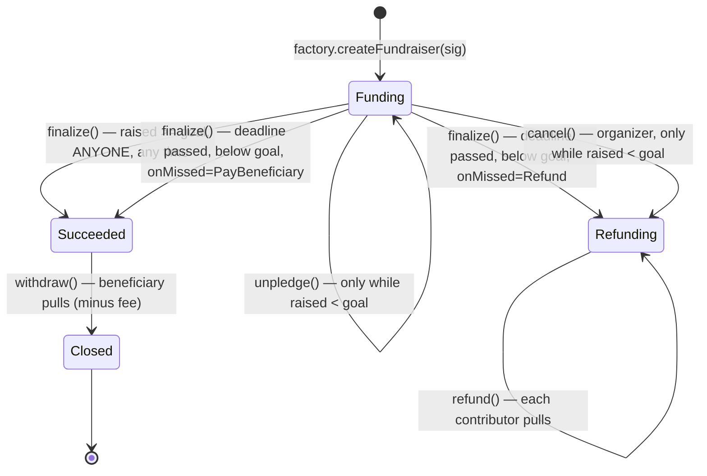

# Group Fundraising

## Design Document

**A CrowdFund-shaped escrow for group objectives, built on OpenZeppelin**

Version 1.0 — August 2026 — *specification; not yet implemented*

---

## Table of Contents

1. [Product Framing](#1-product-framing)
2. [Why This Shape](#2-why-this-shape)
3. [The Decision](#3-the-decision)
4. [What We Build](#4-what-we-build)
5. [State Machine](#5-state-machine)
6. [Contract Surface](#6-contract-surface)
7. [Security Model](#7-security-model)
8. [Gas and Allowances](#8-gas-and-allowances)
9. [Test Harness Plan](#9-test-harness-plan)
10. [Open Decisions](#10-open-decisions)
- [Appendix A: Integration Notes](#appendix-a-integration-notes)
- [Sources](#sources)

<div class="page-break"></div>

## 1. Product Framing

The app has **groups**. A group creates an **objective** — a funding target with a deadline — and group **members deposit** toward it. When the objective resolves, either the beneficiary gets the money or the members get their money back.

On-chain scope is deliberately narrow:

- Groups, membership, invitations and chat stay **off-chain** in the app. The contract never learns what a group is. The objective's `name` is stored on-chain so an objective is self-describing at its own address; richer metadata (image, description) stays in the app.
- The contract is an **escrow with a resolution rule**. It holds ERC-20 contributions, tracks who put in how much, and enforces exactly one of two terminal outcomes: pay the beneficiary, or refund the contributors.
- **The contract is group-agnostic and permissionless: anyone can create a fundraise, and anyone can contribute to one.** There is no membership check on-chain and no backend signature anywhere in the flow. "Groups" is a product layer deciding which fundraise to show to whom; the escrow underneath is general-purpose.
- The app is therefore the only place the mapping from a group to its fundraise addresses lives, and it should trust its own records rather than anything a contract claims about itself.

**Hard constraint: this feature deploys new contracts only.** It modifies no deployed contract, requires no token migration, and needs no change to any live paymaster. Nothing currently in production is touched. Any option that would require altering an existing deployment is out of scope by definition, not merely a low priority — that constraint is what makes this feature shippable independently of everything else, and §8 is written to respect it.

Non-goals for V1: yield on idle funds, contributor voting, milestone payouts, NFT receipts, native ETH, cross-token objectives.

---

## 2. Why This Shape

Three facts decided the design, and they are worth stating because they are not obvious:

**There is nothing importable.** OpenZeppelin removed `Escrow`, `ConditionalEscrow` and `RefundEscrow` in 5.0.0, so the version this repo vendors has no escrow primitive to inherit. Party Protocol, Gitcoin Allo and Mirror's crowdfunds have all wound down. Juicebox is still running, but its model is rejected on its own merits (§3.1) rather than for lack of a maintainer. And no ERC standard for crowdfunding escrow was ever adopted. Writing our own is therefore the normal choice, not not-invented-here.

**One shape converged twice.** OpenZeppelin's `RefundEscrow` (`Active → Refunding | Closed`) and Solidity by Example's `CrowdFund` (`launch / pledge / unpledge / claim / refund`) are the same state machine, reached independently a decade apart, and `CrowdFund` is among the most widely copied crowdfunding contracts in the community. That convergence is stronger evidence the model is right than any single audit.

**The best-reviewed implementation is not the most-used one.** Party Protocol has the deepest published review history for this contract shape — a 0xMacro audit plus several Code4rena engagements, all collected in `PartyDAO/party-protocol/audits/` — and is also the one that no longer runs. So it is an audit checklist, not a dependency (§3.2).

One caveat carried forward: **most-used is not safest.** `CrowdFund` is a teaching reference — no reentrancy guard, no balance-delta accounting, no authorization, and `unpledge` open right to the deadline. §3 and §4 take the shape and add what a contract holding members' money needs.

---

## 3. The Decision

Two decisions: **which model**, and **whose code**.

### 3.1 The model — a goal, and an exit that closes when it is reached

A group sets an objective: a name, a target amount, an asset to collect, and either a deadline or none at all. Members deposit toward it. If the target is reached, the group's beneficiary withdraws. If a deadline passes below target, the objective does whatever it committed to at creation — refund everyone (the default) or pay out what was raised. A member may withdraw their own deposit at any time **before** the target is reached; that door shuts permanently the moment it is.

Why this one, on the three axes:

- **Security.** It is the only candidate where the failure path is guaranteed and needs nobody's cooperation. Once the goal is hit, or a deadline passes, *anyone* can trigger resolution, and every member pulls their own funds rather than waiting to be paid. No operator, no organizer, and no backend key can move a member's deposit anywhere except back to that member or to the declared beneficiary.
- **Functionality.** It is what "objective" means to a user. A goal that doesn't gate anything isn't a goal.
- **Usability.** The default failure mode explains itself in one sentence — *we didn't reach it, take your money back* — and the pre-goal exit removes the worst support ticket in the design: *I typed the wrong amount and now my money is stuck until September.*

**The goal latch is what makes the last two compatible.** Free withdrawal all the way to the deadline lets a group that hit its target be unwound at the last second. Locking from day one commits a member's money for months with no individual undo. Cutting the exit at the goal gives members a real way out while the group is still deciding, and gives the group certainty the instant it succeeds. Below the goal, everyone withdrawing is not an attack — it is a group changing its mind, which is the correct outcome.

Rejected, with what each trades away:

| Model | Why not |
|---|---|
| Keep-what-you-raise **as the only mode** | Removes the refund guarantee that makes a backend-vouched escrow trustworthy. Adopted instead as a per-objective option chosen at creation and visible to members before they contribute (§6.1), never as the default |
| Milestone / approved payouts | Every tranche gate is a freeze lever, and whoever signs the approvals becomes custodial |
| Limited payout (Juicebox-style) | Periods and draw accounting solve a treasury problem that a group trip does not have |
| ERC-4626 share vault | No goal, no deadline, no refund condition. Shares imply free exit — that is the open-unpledge model with extra steps and extra attack surface |
| Safe multisig per group | Members must become signers with real keys on consumer phones, and a group that drifts apart is frozen forever. Custody, not fundraising |

### 3.2 The code lineage — blueprint, not dependency

**There is nothing importable.** No maintained, audited crowdfunding contract exists to take as a dependency: OpenZeppelin removed its escrow contracts in 5.0.0, Party Protocol has wound down, and no ERC standard for escrow was ever adopted (§2).

So the decision is a three-part lineage:

1. **Shape** — Solidity by Example's `CrowdFund` (MIT), among the most widely copied crowdfunding contracts in the community, and the same state machine as OpenZeppelin's old `RefundEscrow`. Two independent arrivals at the same design, a decade apart, is the strongest signal available that the model is right.
2. **Substance** — OpenZeppelin primitives. This is what we actually import and the audited surface we inherit. Most of the contract by line count ends up being OZ code rather than ours.
3. **Adversary** — Party Protocol, read-only. The deepest published review history for this shape: a 0xMacro audit and several Code4rena engagements. Its published findings become our test cases; its code becomes none of our dependencies.

No forks and no upstream to track — but equally no upstream to inherit fixes from. The audit burden is entirely ours, which is why §7 and §8 carry the weight they do.

---

## 4. What We Build

### 4.1 `CrowdFund` mapped onto Groups

| `CrowdFund` | Groups | Change |
|---|---|---|
| `launch(goal, startAt, endAt)` | `FundraiserFactory.createFundraiser` | Deploys a contract per objective; deadline optional |
| `pledge(id, amount)` | `deposit` | Credits the amount actually received rather than the amount requested |
| `unpledge(id, amount)` | `unpledge` | **Disabled once `raised >= goal`** — the latch |
| `claim(id)` — creator, if pledged ≥ goal | `withdraw` | Beneficiary only; optional protocol fee |
| `refund(id)` — each backer, if goal missed | `refund` | Unchanged in spirit; plus `refundFor` so a third party can push a member's refund *to that member* |
| *(implicit — resolution happens inside claim/refund)* | `finalize` | Made an explicit, **permissionless** step so nobody's inaction can freeze funds |

### 4.2 What `CrowdFund` lacks that we add

`CrowdFund` is a ~100-line teaching reference, not a library. Four additions turn it into something that can hold consumer money:

1. **`SafeERC20`** — `CrowdFund` assumes a well-behaved token that returns a bool.
2. **`ReentrancyGuard` plus strict checks-effects-interactions** — zero the balance, then transfer, on every exit path.
3. **Credit what actually arrived**, not what was requested — otherwise a fee-on-transfer token leaves the last member unable to get their money back.
4. **The goal latch** — `CrowdFund` leaves `unpledge` open right up to the deadline; here it closes the moment the target is reached (§3.1).

Note what is *not* on that list: an authorization layer. Like `CrowdFund`, this contract asks nobody for permission. That is the simpler design, and §7 #7 records what it moves rather than removes.

`CrowdFund` is MIT-licensed; re-implementing from the shape rather than copying keeps the provenance clean regardless.

### 4.3 What we import

OpenZeppelin 5.3 (already vendored in `lib/`): `SafeERC20`, `ReentrancyGuard`, `Clones`, and `AccessControl` on the factory for the token allow-list and fee parameters. Nothing else — with deposits permissionless, `EIP712` and `SignatureChecker` drop out of the design entirely. No escrow primitive exists in 5.x to inherit — that is the gap this contract fills.

---

## 5. State Machine



Rules that hold everywhere:

- Deposits are accepted **only** in `Funding`, and only before `deadline` where one is set.
- `unpledge` is available **only** in `Funding` and **only while `raised < goal`**.
- Once `raised >= goal` the objective is latched: no `unpledge`, no `cancel`, and `finalize` is callable by anyone immediately.
- An objective with **no deadline** stays in `Funding` until it reaches its goal or is cancelled, so `unpledge` stays available to every contributor indefinitely. In §6.2 this stops being a convenience and becomes the property that makes open-ended objectives safe at all.
- `refund` is per-contributor and pull-only. No function anywhere loops over contributors.
- `Refunding` is terminal. There is no path back to `Funding`, and no admin path that redirects member funds to the beneficiary.
- `onMissed` is fixed at creation and read only on `finalize`. Nobody can change what a missed target means after members have contributed under it.
- `raised` is **not** monotonic — `unpledge` decrements it. Anything indexing this contract must not assume otherwise.

---

## 6. Contract Surface

Two contracts: a **factory** that deploys one **objective contract per fundraise**.

`FundraiserFactory` is a singleton holding the token allow-list, fee parameters, and the objective implementation address. `Fundraiser` is deployed per objective and holds only that objective's money.

Per-objective contracts cost more to create than rows in a shared mapping, so the factory deploys **minimal proxies** rather than full copies. What that buys is worth the cost:

- **Fund isolation.** An accounting bug can only reach one objective's balance, never every group's money at once. For consumer funds that is the deciding argument.
- **Simpler accounting.** Each contract holds exactly one token for exactly one objective, so "what do we owe?" is `token.balanceOf(this)` — no per-token liability accumulator, no cross-objective solvency invariant, and surplus rescue becomes trivially safe.
- **Its own address.** An objective is a thing a member can look up, watch, and verify independently of the app.

### 6.1 Creation

```solidity
struct FundraiserParams {
    string  name;           // shown in-app; the app remains source of truth for richer metadata
    address token;          // must be allow-listed; USDC is the default offered by the app
    uint128 goal;           // > 0, in the token's smallest unit
    uint40  deadline;       // 0 = open-ended: runs until the goal is reached or it is cancelled
    OnMissed onMissed;      // what happens if the deadline passes below goal
    address beneficiary;    // fixed at creation; only the beneficiary can later repoint its own payout
    uint128 minContribution;        // 0 = none
    uint128 maxTotalContributions;  // 0 = uncapped
}

enum OnMissed { Refund, PayBeneficiary }
```

`createFundraiser(params)` is **callable by anyone**. It checks the token is allow-listed, validates the parameters, snapshots the current `feeBps`, deploys the proxy, and emits `FundraiserCreated` with the new address and an opaque `groupId` tag.

That `groupId` is a **hint for indexing, not a claim**: nothing verifies it, so anyone can create a fundraise tagged with any group. The app must map a group to its fundraise addresses from its own records — the records it wrote when it created them — and never from an on-chain tag. Treating that tag as authoritative is how a stranger's contract ends up displayed inside somebody's group.

**`Refund`** returns every contributor their money — all-or-nothing, the default. **`PayBeneficiary`** pays the beneficiary whatever was raised — keep-what-you-raise.

The identifier is deliberately not `Distribute`. In product conversation "distribute" is the natural word, but as an on-chain enum it reads just as easily as *distribute back to the contributors*, which is the opposite behavior. The name that cannot be misread costs nothing here and prevents an implementer, an auditor, or an indexer from getting it backwards. The app can still say "pay out what we raised" or whatever tests best.

The choice is per-objective, made at creation and immutable afterward, so a member can see which one they are contributing to before they contribute. That matters: under `PayBeneficiary` there is no guarantee of getting the money back, and the app must say so plainly rather than burying it.

### 6.2 Open-ended objectives (`deadline == 0`)

An objective with no deadline runs until it reaches its goal or the organizer cancels. This is safe, but only because of a property that now becomes load-bearing: **`unpledge` is available whenever `raised < goal`**, and an open-ended objective that never reaches its goal is below goal forever. So every contributor can always leave. Without the goal latch (§3.2), an open-ended objective would be a way to trap money permanently.

**`PayBeneficiary` requires a deadline.** With no deadline there is no moment at which the target is "missed", so the policy would be unreachable. Creation therefore **rejects `deadline == 0` combined with `OnMissed.PayBeneficiary`** rather than silently accepting a setting that can never fire. The app should hide the choice entirely when a member picks "no end date".

### 6.3 Functions on `Fundraiser`

| Function | Caller | State | Notes |
|---|---|---|---|
| `deposit(amount)` | **anyone** | `Funding` | Credits the amount actually received |
| `unpledge(amount)` | contributor | `Funding`, `raised < goal` | Returns only what that caller put in |
| `finalize()` | **anyone**, once `raised >= goal` or after a non-zero `deadline` | `Funding` | → `Succeeded`, or `Refunding` / `Succeeded` per `onMissed` |
| `cancel()` | organizer | `Funding`, `raised < goal` | → `Refunding`. The only terminal exit for an open-ended objective that stalls |
| `withdraw()` | beneficiary | `Succeeded` | Pays `raised - fee`, → `Closed` |
| `setPayoutAddress(addr)` | **beneficiary only** | `Succeeded` | Escape hatch for a lost or blocklisted key |
| `refund()` | any contributor | `Refunding` | Zeroes the balance, then transfers |
| `refundFor(contributor)` | anyone | `Refunding` | Funds always go to `contributor`, so the backend can sweep on the group's behalf |

Views for the app: `state()`, `contributionOf(account)`, `remainingToGoal()`, `canUnpledge()`.

One role lives on the factory and none on objectives: an **admin** managing the token allow-list and fee parameters. It cannot touch escrowed funds, finalize, cancel, or redirect a beneficiary on any objective — and with authorization gone there is no backend key in this design at all, so there is no signer to compromise, rotate, or wait on.

## 7. Security Model

The threat list, each item traceable to prior art or to a hazard this repo has already encountered.

| # | Risk | Mitigation |
|---|---|---|
| 1 | **Funds frozen because nobody can resolve** — the failure mode that matters most, and the one Party Protocol's audits kept surfacing | `finalize` is permissionless once the goal is met *or* the deadline passes. No role, no signature, no organizer cooperation |
| 2 | **Deposit-time rules blocking resolution** (Party Protocol, Code4rena October 2023, finding M-06 — a minimum-contribution check made a crowdfund impossible to finalize, locking contributor funds until expiry) | `finalize` checks only state, deadline, and `raised >= goal` |
| 3 | Refund griefing via push payments | Pull only, everywhere |
| 4 | Reentrancy through token callbacks | `nonReentrant` + checks-effects-interactions. Both, not either |
| 5 | Fee-on-transfer token insolvency | Credit the amount actually received; pay out credited units |
| 6 | Rebasing tokens | Excluded by the token allow-list |
| 7 | Unbounded lock-up | `deadline <= now + MAX_DURATION` |
| 8 | Beneficiary key lost or blocklisted after success | `setPayoutAddress`, callable only by the beneficiary. No organizer or admin lever |
| 9 | Smart-account members | Never assume EOA; never use `tx.origin` |
| 10 | **Gap-funding force-close** — the cost of permissionless deposits | Anyone can top up the remaining gap to latch the target, closing every member's exit. With deposits open to all, this needs no cooperation from anyone. Worse, it is close to **free for an organizer who is also the beneficiary**: they fund the gap, the latch closes, they finalize, and they collect the whole pot including their own top-up. What they cannot do is redirect the money — it still goes to the beneficiary the members saw and agreed to at creation, and the members' loss is the *option* to change their mind, not the funds. Accepted, but it must be stated in the product rather than discovered: the honest framing of the goal latch is "your contribution is committed once the target is reached, and anyone can make that happen" |
| 11 | **Impersonated fundraises** — the cost of permissionless creation | Anyone can deploy a fundraise and tag it with any `groupId`. The contract cannot tell a group's real objective from a stranger's lookalike, so the app must resolve group to address from the records it wrote at creation, never from the on-chain tag (§6.1). Sharing a raw contract address as an invitation is a phishing vector; share app links instead |

Because the contract is immutable, **`finalize` and `refund` are the two functions where a bug is unrecoverable.** Audit and testing effort should be concentrated there, deliberately and disproportionately.

---

## 8. Gas and Allowances

Two different allowances are involved, and only one of them is this contract's problem.

### 8.1 Gas — already solved by infrastructure that exists

`ERC20FeePaymaster` (`src/paymasters/ERC20FeePaymaster.sol`, merged in #127) is a zkSync `approvalBased` paymaster that lets a member pay gas in NODL. It is **destination-agnostic**: an off-chain `erc20-fee-signer` prices the fee, applies markup, and EIP-712-signs `(from, to, token, amount, expirationTime, maxFeePerGas, gasLimit)`. Which contracts it serves is therefore an off-chain policy decision, not an on-chain allow-list — **serving this escrow requires no change to the paymaster and no change to the escrow**, only that the fee signer agrees to price transactions whose `to` is the escrow.

Three properties that matter to this design:

- It is `approvalBased` **only** — the `general` (sponsored) flow reverts. The member always pays, in NODL. There is no free tier on this path.
- The allowance that flow grants is to the **paymaster, for gas**. The escrow's allowance is a different allowance to a different spender (§8.2).
- The fee amount is signed off-chain per transaction, so there is **no on-chain rate and no oracle** — a question this design does not have to answer. The paymaster caps signature lifetime at 15 minutes, checks the real on-chain allowance before pulling tokens, and bounds periodic ETH spend through `QuotaControl`.

### 8.2 The contribution allowance — this is ours

`deposit` calls `transferFrom`, so the member must have approved **the escrow**:

- **Offer `depositWithPermit`** for tokens implementing EIP-2612: one transaction, no standing allowance left behind. Works for permit-capable stablecoins; **not** for L2 NODL, which is a plain `ERC20Burnable` with no permit.
- **One-time approval otherwise** — first deposit two transactions, every later one a single transaction. Smart-account wallets can batch the pair.
- **Not an option: adding `ERC20Permit` to the deployed L2 NODL.** It would collapse every NODL deposit to a single transaction, but it means changing a token already in production, which §1 rules out. NODL deposits therefore use the two-step approve path, and the escrow gains the single-transaction path automatically for any permit-capable token it is given.

### 8.3 Rules this places on the escrow

- **Never assume a paymaster exists.** Every function works when called by an ordinary self-paying transaction. This is what keeps `finalize`, `unpledge`, and `refund` reachable regardless of what happens to gas infrastructure.
- **No feature-specific paymaster is introduced.**
- **A validator hook is not needed for the NODL-fee path.** If *sponsored* gas is ever wanted — the member paying nothing — that requires a general-flow paymaster, and only then does the escrow need an `isValidGaslessOperation(from, data)` hook of the kind `EnvelopeLinks` exposes.

One member-facing consequence: paying gas in NODL means holding NODL. Natural for a NODL objective; a member funding a stablecoin objective still needs either some NODL or ETH.

---

## 9. Test Harness Plan

What the harness must cover:

- **Every edge in §5**, including the reverting ones: deposit after deadline, unpledge at or above goal, cancel at or above goal, refund while `Funding`, double `finalize`, withdraw by a non-beneficiary.
- **The latch specifically**: deposit to `goal - 1` and unpledge (allowed); cross to `goal` and unpledge (must revert); cross to `goal`, then confirm `cancel` reverts and `finalize` succeeds for a random caller.
- **Regression tests named after the prior art**: finalize an objective whose last contribution is below the minimum (the Party M-06 case); finalize with an organizer who never calls anything.
- **Fuzz**: amounts, contributor counts, deadlines, and the `goal - 1 / goal / goal + 1` boundary with interleaved unpledges.
- **Invariants**: contributions sum to `raised`; contract balance always covers outstanding liabilities; `Refunding` never pays the beneficiary; `raised` never crosses back below `goal` once reached.
- **Adversarial token mocks**: fee-on-transfer, reentrant, blocklisting.
- **Permissionless paths**: a non-member contributing succeeds and is refundable like any other contributor; `unpledge` returns only the caller's own contribution and never anyone else's; a stranger funding the gap latches the target exactly as a member would.
- **Paymaster-independence** (§8.3): every state-changing function must succeed when called by an ordinary self-paying transaction, with no paymaster in the picture at all. `depositWithPermit` against a permit-capable mock; the two-step approve path against a mock without permit.

Everything must run under `forge test`.

---

## 10. Open Decisions

All of these concern the new contract only. None requires changing anything already deployed (§1).

1. **Immutable or upgradeable?** Recommended immutable, for both the factory and the objective implementation. This is survivable *only* because every objective has a signature-free, admin-free exit — that is the condition, and it holds. Per-objective deployment also gives a cheaper answer to the same problem: pointing the factory at a new implementation changes *future* objectives without touching a single live one, so upgradeability buys less here than it would for a singleton.
2. **Should `PayBeneficiary` carry a higher bar?** It is a creation-time option (§6.1), but it removes the member's refund guarantee. Worth deciding whether the app restricts it — to certain group types, or behind an extra confirmation — rather than presenting it as an equal peer of `Refund`.
3. **Protocol fee — on or off, and in which token?**
4. **Does the `erc20-fee-signer` policy cover this escrow?** (§8.1) Off-chain configuration only: the paymaster contract needs no change and neither does the escrow, so this stays inside the §1 constraint. Cross-team, not a contract change, and not a launch blocker — without it members simply pay their own gas in ETH.
5. **Overshoot past the goal.** Permissionless finalize-on-goal means anyone can close the objective the instant the target is hit, so "raise at least X, more welcome" is not expressible in V1. A flag is the V2 answer if groups ask for it.
6. **One objective per group at a time, or many?** The contract does not care; the backend can enforce either.
7. **How the app frames "anyone can contribute."** The contract cannot restrict contributors, so this is a presentation decision: is a fundraise link shareable outside the group deliberately (a parent chips in) or is the group boundary something the app should try to preserve? Both are defensible; picking neither means it gets decided by whoever writes the share sheet.
8. **What the app does about §7 #10.** The gap-funding force-close cannot be prevented on-chain. Whether that is disclosed plainly, mitigated in product terms, or simply accepted is a call to make deliberately.

---

## Appendix A: Integration Notes

Detail needed at implementation time.

### A.1 Storage sketch

Per objective, so there are no ids and no cross-objective bookkeeping:

```solidity
enum Status   { Funding, Succeeded, Refunding, Closed }
enum OnMissed { Refund, PayBeneficiary }

// set once at clone initialization
string   name;
IERC20   token;
address  organizer;
address  beneficiary;      // the beneficiary itself may repoint this while Succeeded
uint128  goal;
uint40   deadline;         // 0 = open-ended
OnMissed onMissed;
uint16   feeBps;           // snapshotted from the factory at creation
uint128  minContribution;
uint128  maxTotalContributions;

// mutable
Status  status;
uint128 raised;            // net credited contributions; decremented by unpledge
uint128 unpledged;
uint128 refunded;
mapping(address => uint256) contributions;
```

What the singleton design needed and this one does not: an objective id threaded through every call, a per-token liability accumulator, and a solvency invariant spanning every objective at once. Here one contract holds one token for one objective, so what it owes is the sum of `contributions`, and anything above that is surplus.

### A.2 No authorization layer

There is none, deliberately. `createFundraiser` and `deposit` are callable by anyone, so there is no EIP-712 payload, no nonce, no replay map, no signer key, and no rotation procedure.

Two consequences worth writing down because they read as absences rather than decisions:

- **No backend liveness risk.** Contributing does not require the app, or a signature from it, to be reachable. An outage cannot block deposits and cannot sink a fundraise close to its deadline.
- **No key to compromise.** The earlier design's largest standing risk was a backend signer whose compromise would let an attacker bless arbitrary deposits and fundraises. That risk is not mitigated here, it is absent.

What was bought with that key — knowing that a contributor is really a group member — is now the app's to enforce at the presentation layer, and cannot be enforced at all against someone interacting with the contract directly. §7 #10 and #11 are the price.

### A.3 Token handling

One ERC-20 per objective, fixed at creation, drawn from an **admin-managed allow-list**. Truly permissionless token choice lets any group create an objective in a token that makes the contract insolvent (fee-on-transfer, rebasing) or its funds unrecoverable. De-listing must never block deposits, unpledges, or refunds on live objectives — otherwise de-listing becomes a freeze switch.

Credit the balance delta on receipt, never the requested amount. Pay out credited units on every exit.

Maintain a per-token `liabilities` accumulator so a bounded `rescueSurplus(token)` — moving only `balanceOf(this) - liabilities[token]` — can recover mis-sends and airdrops without ever being able to touch member money. Unclaimed refunds stay liabilities forever, and stay untouchable.

### A.4 Fees

Optional, off by default. `feeBps` snapshotted into the objective at creation so a later increase cannot skim an in-flight objective; hard-capped by a constant; charged **only on withdraw**, never on refunds or unpledges; rounded down, remainder to the group.

### A.5 Events

```
ObjectiveCreated, ContributionMade, Unpledged, ObjectiveFinalized, ObjectiveCancelled,
Withdrawn, PayoutAddressChanged, Refunded, TokenAllowed,
FeeParamsUpdated, SurplusRescued
```

Two indexer traps: use the **credited** amount, not the call argument; and `raised` can go **down**, because `unpledge` exists.

### A.6 File layout

```
src/fundraising/FundraiserFactory.sol
src/fundraising/Fundraiser.sol
src/fundraising/interfaces/IFundraiser.sol
test/fundraising/{Lifecycle,GoalLatch,Permissionless,Refunds,Invariants}.t.sol
test/fundraising/mocks/{FeeOnTransferERC20,ReentrantERC20,BlocklistERC20}.sol
script/DeployFundraiserFactory.s.sol
src/fundraising/doc/spec/group-fundraising-design.md
```

License header `// SPDX-License-Identifier: BSD-3-Clause-Clear`, per repo convention.

---

## Sources

- Solidity by Example — `CrowdFund`, the shape this contract follows: https://solidity-by-example.org/app/crowd-fund/
- OpenZeppelin Contracts CHANGELOG — removal of `Escrow` / `ConditionalEscrow` / `RefundEscrow` in 5.0.0 (2023-10-05): https://github.com/OpenZeppelin/openzeppelin-contracts/blob/master/CHANGELOG.md
- OpenZeppelin escrow API reference (the contracts survived through 4.x): https://docs.openzeppelin.com/contracts/4.x/api/utils#Escrow
- Party Protocol — Code4rena findings & analysis, October 2023: https://code4rena.com/reports/2023-10-party
- Party Protocol — `ETHCrowdfundBase` finalization DoS via `minContribution` (Code4rena Oct 2023, M-06), the source of §7 #2: https://github.com/code-423n4/2023-10-party-findings/issues/127
- Party Protocol — 0xMacro audit: https://github.com/PartyDAO/party-protocol/blob/main/audits/Party-Protocol-Macro-Audit.pdf
- ERC-2612 permit (`depositWithPermit`, §8.2): https://eips.ethereum.org/EIPS/eip-2612
