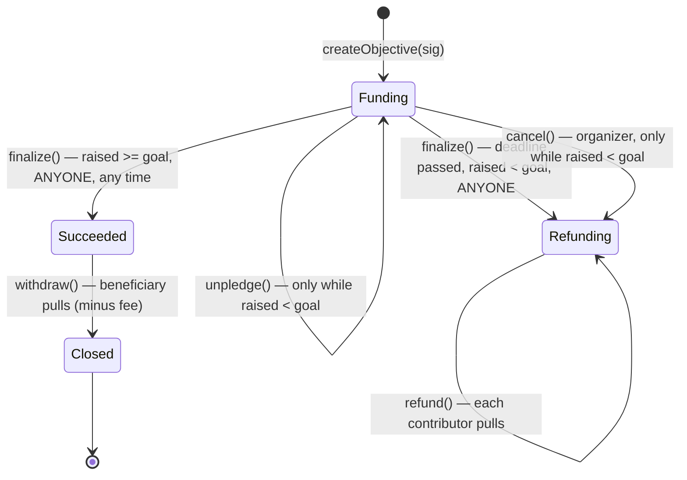

# Group Fundraising

## Design Document

**A CrowdFund-shaped escrow for group objectives, built on OpenZeppelin**

Version 0.3 — August 2026 — *approach agreed, not yet implemented*

---

## Table of Contents

1. [Product Framing](#1-product-framing)
2. [Why This Shape](#2-why-this-shape)
3. [The Decision](#3-the-decision)
4. [What We Build](#4-what-we-build)
5. [State Machine](#5-state-machine)
6. [Contract Surface](#6-contract-surface)
7. [Security Model](#7-security-model)
8. [Gas and Allowances](#8-gas-and-allowances)
9. [Test Harness Plan](#9-test-harness-plan)
10. [Open Decisions](#10-open-decisions)
- [Appendix A: Integration Notes](#appendix-a-integration-notes)
- [Sources](#sources)

<div class="page-break"></div>

## 1. Product Framing

The app has **groups**. A group creates an **objective** — a funding target with a deadline — and group **members deposit** toward it. When the objective resolves, either the beneficiary gets the money or the members get their money back.

On-chain scope is deliberately narrow:

- Groups, membership, invitations, chat, and the objective's human metadata (title, image, description) stay **off-chain** in the app. The contract never learns what a group is.
- The contract is an **escrow with a resolution rule**. It holds ERC-20 contributions, tracks who put in how much, and enforces exactly one of two terminal outcomes: pay the beneficiary, or refund the contributors.
- The backend signs an EIP-712 authorization to say *"this address may create this objective"* and *"this address is a member and may deposit"*. This is the same backend-signed authorization pattern already used elsewhere in this repo.

Non-goals for V1: yield on idle funds, contributor voting, milestone payouts, NFT receipts, native ETH, cross-token objectives.

---

## 2. Why This Shape

Three facts decided the design, and they are worth stating because they are not obvious:

**There is nothing importable.** Every named onchain crowdfunding protocol has wound down or gone quiet — Juicebox, Party Protocol, Gitcoin Allo, Mirror. `RefundEscrow` was deleted from OpenZeppelin in 4.0, and no ERC standard for crowdfunding escrow was ever adopted. Writing our own is the normal choice here, not not-invented-here. It also means no upstream to inherit fixes from: the audit burden is entirely ours, which is why §7 and §8 carry the weight they do.

**One shape converged twice.** OpenZeppelin's `RefundEscrow` (`Active → Refunding | Closed`) and Solidity by Example's `CrowdFund` (`launch / pledge / unpledge / claim / refund`) are the same state machine, reached independently a decade apart, and `CrowdFund` is the most-copied crowdfunding contract in the community. That convergence is stronger evidence the model is right than any single audit.

**The best-reviewed implementation is not the most-used one.** Party Protocol has the only serious audit history in this space — 0xMacro plus two Code4rena contests — and is also the one that no longer runs. So it is an audit checklist, not a dependency (§3.2).

One caveat carried forward: **most-used is not safest.** `CrowdFund` is a teaching reference — no reentrancy guard, no balance-delta accounting, no authorization, and `unpledge` open right to the deadline. §3 and §4 take the shape and add what a contract holding members' money needs.

---

## 3. The Decision

Two decisions, agreed: **which model**, and **whose code**.

### 3.1 The model — all-or-nothing, with an exit that closes at the goal

A group sets an objective: a target amount and a deadline. Members deposit toward it. Exactly two outcomes are possible — the target is met and the group's beneficiary withdraws, or it isn't and every member takes their own money back. A member may withdraw their own deposit at any time **before** the target is reached; that door shuts permanently the moment it is.

Why this one, on the three axes:

- **Security.** It is the only candidate where the failure path is guaranteed and needs nobody's cooperation. Once the deadline passes or the goal is hit, *anyone* can trigger resolution, and every member pulls their own funds rather than waiting to be paid. No operator, no organizer, and no backend key can move a member's deposit anywhere except back to that member or to the declared beneficiary.
- **Functionality.** It is what "objective" means to a user. A goal that doesn't gate anything isn't a goal.
- **Usability.** The failure mode explains itself in one sentence — *we didn't reach it, take your money back* — and the pre-goal exit removes the worst support ticket in the design: *I typed the wrong amount and now my money is stuck until September.*

**The goal latch is what makes the last two compatible.** Free withdrawal all the way to the deadline lets a group that hit its target be unwound at the last second. Locking from day one commits a member's money for months with no individual undo. Cutting the exit at the goal gives members a real way out while the group is still deciding, and gives the group certainty the instant it succeeds. Below the goal, everyone withdrawing is not an attack — it is a group changing its mind, which is the correct outcome.

Rejected, with what each trades away:

| Model | Why not |
|---|---|
| Keep-what-you-raise | Removes the refund guarantee that makes a backend-vouched escrow trustworthy. One address walks off with partial funds, no goal required. Reserved as a future *mode*, not the default |
| Milestone / approved payouts | Every tranche gate is a freeze lever, and whoever signs the approvals becomes custodial |
| Limited payout (Juicebox-style) | Periods and draw accounting solve a treasury problem that a group trip does not have |
| ERC-4626 share vault | No goal, no deadline, no refund condition. Shares imply free exit — that is the open-unpledge model with extra steps and extra attack surface |
| Safe multisig per group | Members must become signers with real keys on consumer phones, and a group that drifts apart is frozen forever. Custody, not fundraising |

### 3.2 The code lineage — blueprint, not dependency

**There is nothing importable.** No maintained, audited crowdfunding contract exists to take as a dependency: Juicebox and Party Protocol are wound down, `RefundEscrow` was deleted from OpenZeppelin in 4.0, and no ERC standard for escrow was ever adopted (§2).

So the decision is a three-part lineage:

1. **Shape** — Solidity by Example's `CrowdFund`, the most-copied crowdfunding contract in the community, and the same state machine as OpenZeppelin's old `RefundEscrow`. Two independent arrivals at the same design, a decade apart, is the strongest signal available that the model is right.
2. **Substance** — OpenZeppelin primitives. This is what we actually import and the audited surface we inherit. Most of the contract by line count ends up being OZ code rather than ours.
3. **Adversary** — Party Protocol, read-only. The only code in this space with a serious audit history (0xMacro plus two Code4rena contests). Its published findings become our test cases; its code becomes none of our dependencies.

No forks, no upstream to track — and, honestly, no upstream to inherit fixes from either. The audit burden is entirely ours, which is why §7 and §8 carry the weight they do.

---

## 4. What We Build

### 4.1 `CrowdFund` mapped onto Groups

| `CrowdFund` | Groups | Change |
|---|---|---|
| `launch(goal, startAt, endAt)` | `createObjective` | Requires a backend signature; bounded duration |
| `pledge(id, amount)` | `deposit` | Requires a backend signature proving membership; credits the amount actually received |
| `unpledge(id, amount)` | `unpledge` | **Disabled once `raised >= goal`** — the latch |
| `claim(id)` — creator, if pledged ≥ goal | `withdraw` | Beneficiary only; optional protocol fee |
| `refund(id)` — each backer, if goal missed | `refund` | Unchanged in spirit; plus `refundFor` so a third party can push a member's refund *to that member* |
| *(implicit — resolution happens inside claim/refund)* | `finalize` | Made an explicit, **permissionless** step so nobody's inaction can freeze funds |

### 4.2 What `CrowdFund` lacks that we add

`CrowdFund` is a ~100-line teaching reference, not a library. Four additions turn it into something that can hold consumer money:

1. **Backend-signed authorization** (EIP-712) — groups live off-chain, so membership is proven by a signature from a Nodle key, not by on-chain state.
2. **`SafeERC20`** — `CrowdFund` assumes a well-behaved token that returns a bool.
3. **`ReentrancyGuard` plus strict checks-effects-interactions** — zero the balance, then transfer, on every exit path.
4. **Credit what actually arrived**, not what was requested — otherwise a fee-on-transfer token leaves the last member unable to get their money back.

If anyone copies `CrowdFund` verbatim, check the site's licensing first. Re-implementing from the shape avoids the question.

### 4.3 What we import

OpenZeppelin 5.3 (already vendored in `lib/`): `SafeERC20`, `ReentrancyGuard`, `AccessControl`, `EIP712`, `SignatureChecker`. Nothing else. No escrow primitive exists in 5.x to inherit — that is the gap this contract fills.

---

## 5. State Machine



Rules that hold everywhere:

- Deposits are accepted **only** in `Funding`, only before `deadline`.
- `unpledge` is available **only** in `Funding` and **only while `raised < goal`**.
- Once `raised >= goal` the objective is latched: no `unpledge`, no `cancel`, and `finalize` is callable by anyone immediately.
- `refund` is per-contributor and pull-only. No function anywhere loops over contributors.
- `Refunding` is terminal. There is no path back to `Funding`, and no admin path that redirects member funds to the beneficiary.
- `raised` is **not** monotonic — `unpledge` decrements it. Anything indexing this contract must not assume otherwise.

---

## 6. Contract Surface

`GroupFundraising` — one singleton holding all objectives, immutable, `AccessControl + EIP712 + ReentrancyGuard`, `SafeERC20` throughout.

| Function | Caller | State | Notes |
|---|---|---|---|
| `createObjective(params, auth)` | organizer | — | Backend signature; `goal > 0`; `now < deadline <= now + MAX_DURATION` |
| `deposit(id, amount, auth)` | member | `Funding` | Backend signature; credits the amount actually received |
| `unpledge(id, amount)` | contributor | `Funding`, `raised < goal` | **No signature required** |
| `finalize(id)` | **anyone**, once `raised >= goal` or after `deadline` | `Funding` | → `Succeeded` or `Refunding`. Deposit-time rules are never re-checked here |
| `cancel(id)` | organizer | `Funding`, `raised < goal` | → `Refunding` |
| `withdraw(id)` | beneficiary | `Succeeded` | Pays `raised - fee`, → `Closed` |
| `setPayoutAddress(id, addr)` | **beneficiary only** | `Succeeded` | Escape hatch for a lost or blocklisted beneficiary key |
| `refund(id)` | any contributor | `Refunding` | Zeroes the balance, then transfers |
| `refundFor(id, contributor)` | anyone | `Refunding` | Funds always go to `contributor` |

Two roles beyond the participants: an **authorizer** key (the backend signer, rotatable, never zero) and an **admin** (rotates the authorizer, manages the token allow-list and fee params). Neither can touch escrowed funds, finalize, cancel, or redirect a beneficiary.

Storage, events, token accounting, and fee mechanics: **Appendix A**.

---

## 7. Security Model

The threat list, each item traceable to prior art or to review of an earlier draft of this document.

| # | Risk | Mitigation |
|---|---|---|
| 1 | **Funds frozen because nobody can resolve** — the failure mode that matters most, and the one Party Protocol's audits kept surfacing | `finalize` is permissionless once the goal is met *or* the deadline passes. No role, no signature, no organizer cooperation |
| 2 | **Deposit-time rules blocking resolution** (Party C4 2023-10 #127 — a minimum-contribution check made a crowdfund impossible to finalize and froze the funds) | `finalize` checks only state, deadline, and `raised >= goal` |
| 3 | Refund griefing via push payments | Pull only, everywhere |
| 4 | Reentrancy through token callbacks | `nonReentrant` + checks-effects-interactions. Both, not either |
| 5 | Fee-on-transfer token insolvency | Credit the amount actually received; pay out credited units |
| 6 | Rebasing tokens | Excluded by the token allow-list |
| 7 | Authorization replay | Single-use EIP-712 digests, each carrying an explicit backend-issued nonce |
| 8 | **Compromised backend key** | Cannot move escrowed funds — it can only bless new objectives and deposits. If a pause is ever added it must gate creates and deposits only, **never exits** |
| 9 | Unbounded lock-up | `deadline <= now + MAX_DURATION` |
| 10 | Beneficiary key lost or blocklisted after success | `setPayoutAddress`, callable only by the beneficiary. No organizer or admin lever |
| 11 | Smart-account members | Never assume EOA; never use `tx.origin` |
| 12 | **Gap-funding force-close** (accepted) | Anyone can fund the remaining gap to latch the goal and strip members' exit. True of every all-or-nothing crowdfund; money still goes to the declared beneficiary. Controlled by backend policy, not by the contract |

Because the contract is immutable, **`finalize` and `refund` are the two functions where a bug is unrecoverable.** Audit and testing effort should be concentrated there, deliberately and disproportionately.

---

## 8. Gas and Allowances

Two different allowances are involved, and only one of them is this contract's problem.

### 8.1 Gas — already solved by infrastructure that exists

`ERC20FeePaymaster` (`src/paymasters/ERC20FeePaymaster.sol`, merged in #127) is a zkSync `approvalBased` paymaster that lets a member pay gas in NODL. It is **destination-agnostic**: an off-chain `erc20-fee-signer` prices the fee, applies markup, and EIP-712-signs `(from, to, token, amount, expirationTime, maxFeePerGas, gasLimit)`. Which contracts it serves is therefore an off-chain policy decision, not an on-chain allow-list — **serving this escrow requires no change to the paymaster and no change to the escrow**, only that the fee signer agrees to price transactions whose `to` is the escrow.

Three properties that matter to this design:

- It is `approvalBased` **only** — the `general` (sponsored) flow reverts. The member always pays, in NODL. There is no free tier on this path.
- The allowance that flow grants is to the **paymaster, for gas**. The escrow's allowance is a different allowance to a different spender (§8.2).
- The fee amount is signed off-chain per transaction, so there is **no on-chain rate and no oracle** — a question this design does not have to answer. The paymaster caps signature lifetime at 15 minutes, checks the real on-chain allowance before pulling tokens, and bounds periodic ETH spend through `QuotaControl`.

### 8.2 The contribution allowance — this is ours

`deposit` calls `transferFrom`, so the member must have approved **the escrow**:

- **Offer `depositWithPermit`** for tokens implementing EIP-2612: one transaction, no standing allowance left behind. Works for permit-capable stablecoins; **not** for L2 NODL, which is a plain `ERC20Burnable` with no permit.
- **One-time approval otherwise** — first deposit two transactions, every later one a single transaction. Smart-account wallets can batch the pair.
- **Adding `ERC20Permit` to L2 NODL** would remove this entirely and benefit every contract that pulls NODL — open decision §10 #2.

### 8.3 Rules this places on the escrow

- **Never assume a paymaster exists.** Every function works when called by an ordinary self-paying transaction. This is what keeps `finalize`, `unpledge`, and `refund` reachable regardless of what happens to gas infrastructure.
- **No feature-specific paymaster is introduced.**
- **A validator hook is not needed for the NODL-fee path.** If *sponsored* gas is ever wanted — the member paying nothing — that requires a general-flow paymaster, and only then does the escrow need an `isValidGaslessOperation(from, data)` hook of the kind `EnvelopeLinks` exposes.

One member-facing consequence: paying gas in NODL means holding NODL. Natural for a NODL objective; a member funding a stablecoin objective still needs either some NODL or ETH.

---

## 9. Test Harness Plan

Not written yet — this is the design pass. What the harness should cover:

- **Every edge in §5**, including the reverting ones: deposit after deadline, unpledge at or above goal, cancel at or above goal, refund while `Funding`, double `finalize`, withdraw by a non-beneficiary.
- **The latch specifically**: deposit to `goal - 1` and unpledge (allowed); cross to `goal` and unpledge (must revert); cross to `goal`, then confirm `cancel` reverts and `finalize` succeeds for a random caller.
- **Regression tests named after the prior art**: finalize an objective whose last contribution is below the minimum (Party C4 #127); finalize with an organizer who never calls anything.
- **Fuzz**: amounts, contributor counts, deadlines, and the `goal - 1 / goal / goal + 1` boundary with interleaved unpledges.
- **Invariants**: contributions sum to `raised`; contract balance always covers outstanding liabilities; `Refunding` never pays the beneficiary; `raised` never crosses back below `goal` once reached.
- **Adversarial token mocks**: fee-on-transfer, reentrant, blocklisting.
- **Signature tests**: expired, replayed, reused nonce, wrong signer, bound to a different sender or objective, old-key signatures after rotation.
- **Paymaster-independence** (§8.3): every state-changing function must succeed when called by an ordinary self-paying transaction, with no paymaster in the picture at all. `depositWithPermit` against a permit-capable mock; the two-step approve path against a mock without permit.

Everything must run under `forge test`.

---

## 10. Open Decisions

Settled: the model (§3.1), the code lineage (§3.2), locked-vs-unpledge (§3.1), who may finalize (§7 #1), that no feature-specific paymaster is introduced, and that gas in NODL is already served by the existing `ERC20FeePaymaster` (§8).

1. **Immutable or upgradeable?** Recommended immutable. This is survivable *only* because every objective has a signature-free, admin-free exit — that is the condition, and it holds. If upgradeability is chosen instead, the upgrade role must sit behind a timelock or multisig, and that belongs in this document.
2. **`ERC20Permit` on L2 NODL?** Adding it collapses every NODL deposit to a single transaction and removes the need for standing approvals (§8.2). Token change, own migration question, benefits more than this feature.
3. **Keep-what-you-raise — needed?** V1 is all-or-nothing only; the enum slot is reserved. If "whatever we collect is ours" is a real product case, decide before the interface freezes.
4. **Protocol fee — on or off, and in which token?**
5. **Does the `erc20-fee-signer` policy cover this escrow?** (§8.1) The paymaster needs no change; the off-chain signer simply has to agree to price transactions destined for it. Cross-team, but not a contract change.
6. **Overshoot past the goal.** Permissionless finalize-on-goal means anyone can close the objective the instant the target is hit, so "raise at least X, more welcome" is not expressible in V1. A flag is the V2 answer if groups ask for it.
7. **One objective per group at a time, or many?** The contract does not care; the backend can enforce either.
8. **Backend policy items the contract deliberately does not enforce**: single-member objectives where organizer, beneficiary, and only contributor are the same address; sensible minimum contributions; and steering purchase-denominated goals toward stablecoins, since a "$500 trip" goal denominated in a volatile token can become trivially met or unreachable through no action by the group.

---

## Appendix A: Integration Notes

Deferred detail — needed at implementation time, not for the approach decision.

### A.1 Storage sketch

```solidity
enum Status  { None, Funding, Succeeded, Refunding, Closed }
enum GoalPolicy { AllOrNothing, KeepWhatYouRaise } // only AllOrNothing implemented

struct Objective {
    address token;  uint40 deadline;  uint16 feeBps;  Status status;  GoalPolicy policy;
    address beneficiary;
    address organizer;
    uint128 goal;       uint128 raised;      // raised is decremented by unpledge
    uint128 unpledged;  uint128 refunded;
    uint128 minContribution;  uint128 maxTotalContributions;
}

mapping(uint256 => Objective) objectives;
mapping(uint256 => mapping(address => uint256)) contributions;
mapping(address => uint256) liabilities;   // per-token escrowed total
```

Objective ids are a monotonic counter, emitted at creation alongside an opaque `groupId` so the backend can reconcile against its own record.

### A.2 EIP-712 payloads

```
CreateAuthorization(groupId, organizer, beneficiary, token, goal, deadline,
                    minContribution, maxTotalContributions, nonce, authDeadline)
DepositAuthorization(objectiveId, contributor, maxAmount, nonce, authDeadline)
```

Both single-use, digest recorded in a `usedAuthorizations` map. The `nonce` is not optional: without it, two authorizations issued to the same member for the same objective with the same amount and expiry collide, and the second deposit reverts for no client-visible reason.

Verified with `SignatureChecker`, not raw `ecrecover`, so the signer can be a multisig.

**Backend liveness** is a deposit-side risk: an outage blocks new deposits and, close to a deadline, can sink an objective. It can never trap funds — `finalize`, `unpledge`, `refund`, and `refundFor` need no signature at all. Issue authorizations with generous expiry windows.

### A.3 Token handling

One ERC-20 per objective, fixed at creation, drawn from an **admin-managed allow-list**. Truly permissionless token choice lets any group create an objective in a token that makes the contract insolvent (fee-on-transfer, rebasing) or its funds unrecoverable. De-listing must never block deposits, unpledges, or refunds on live objectives — otherwise de-listing becomes a freeze switch.

Credit the balance delta on receipt, never the requested amount. Pay out credited units on every exit.

Maintain a per-token `liabilities` accumulator so a bounded `rescueSurplus(token)` — moving only `balanceOf(this) - liabilities[token]` — can recover mis-sends and airdrops without ever being able to touch member money. Unclaimed refunds stay liabilities forever, and stay untouchable.

### A.4 Fees

Optional, off by default. `feeBps` snapshotted into the objective at creation so a later increase cannot skim an in-flight objective; hard-capped by a constant; charged **only on withdraw**, never on refunds or unpledges; rounded down, remainder to the group.

### A.5 Events

```
ObjectiveCreated, ContributionMade, Unpledged, ObjectiveFinalized, ObjectiveCancelled,
Withdrawn, PayoutAddressChanged, Refunded, AuthorizerRotated, TokenAllowed,
FeeParamsUpdated, SurplusRescued
```

Two indexer traps: use the **credited** amount, not the call argument; and `raised` can go **down**, because `unpledge` exists.

### A.6 File layout

```
src/fundraising/GroupFundraising.sol
src/fundraising/interfaces/IGroupFundraising.sol
src/fundraising/interfaces/IGroupFundraisingGaslessValidator.sol
test/fundraising/{Lifecycle,GoalLatch,Authorization,Refunds,Invariants}.t.sol
test/fundraising/mocks/{FeeOnTransferERC20,ReentrantERC20,BlocklistERC20}.sol
script/DeployGroupFundraising.s.sol
docs/2026-08-24-group-fundraising-design.md
```

License header `// SPDX-License-Identifier: BSD-3-Clause-Clear`, per repo convention.

---

## Sources

- Solidity by Example — `CrowdFund`, the shape this contract follows: https://solidity-by-example.org/app/crowd-fund/
- OpenZeppelin Contracts CHANGELOG — removal of `Escrow` / `ConditionalEscrow` / `RefundEscrow` in 4.0: https://github.com/OpenZeppelin/openzeppelin-contracts/blob/master/CHANGELOG.md
- OpenZeppelin Payment / escrow API (3.x — last version with these contracts): https://docs.openzeppelin.com/contracts/3.x/api/payment
- Party Protocol — Code4rena findings & analysis, October 2023: https://code4rena.com/reports/2023-10-party
- Party Protocol — `ETHCrowdfundBase` finalization DoS via `minContribution` (issue #127), the source of §7 #2: https://github.com/code-423n4/2023-10-party-findings/issues/127
- Party Protocol — 0xMacro audit: https://github.com/PartyDAO/party-protocol/blob/main/audits/Party-Protocol-Macro-Audit.pdf
- ERC-2612 permit (`depositWithPermit`, §8.2): https://eips.ethereum.org/EIPS/eip-2612
