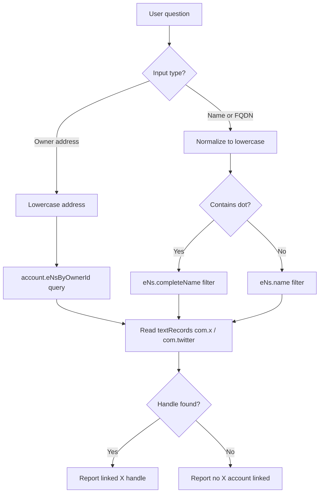

# Nodle name service lookup (AI agent runbook)

Use this guide to answer questions like:

- Does name `girlnext` have an X account linked?
- Who owns `girlnext.nodl.eth`?
- What names does `0x98f3f23798deaa759ad1d5334a1c1d6acb87b717` hold?
- What X handle is linked to a given owner address?

## Production contracts (ZkSync Era mainnet)

| Service | Parent domain | Contract |
|---------|---------------|----------|
| Nodle name service | `nodl.eth` | `0x9741565272C7B29574c88ed2eBDF15BFE9C04612` |
| Click name service | `clk.eth` | `0xF3271B61291C128F9dA5aB208311d8CF8E2Ba5A9` |

Indexer: `https://indexer.nodleprotocol.io`

Social handles are stored as ENS-style text records:

- `com.x` — primary X/Twitter handle key
- `com.twitter` — legacy alias (check both)

A linked handle means the name owner signed and set the text record on-chain. It is **not** OAuth-verified with X.

## Quick path: use the lookup script

```bash
chmod +x ops/lookup_nodle_name.sh

# By owner address
./ops/lookup_nodle_name.sh --address 0x98F3F23798deAa759AD1D5334A1c1D6ACb87b717

# By full name
./ops/lookup_nodle_name.sh --name girlnext.nodl.eth

# By bare subdomain (searches all matching names)
./ops/lookup_nodle_name.sh --name girlnext
```

## Lookup by owner address

**Important:** account ids in the indexer are **lowercase**. Checksummed addresses return `null`.

```graphql
{
  account(id: "0x98f3f23798deaa759ad1d5334a1c1d6acb87b717") {
    name
    primaryName
    eNsByOwnerId {
      nodes {
        name
        completeName
        contract
        textRecords {
          nodes {
            key
            value
          }
        }
      }
    }
  }
}
```

Example `curl`:

```bash
curl -s -X POST https://indexer.nodleprotocol.io \
  -H "Content-Type: application/json" \
  -d '{"query":"{ account(id: \"0x98f3f23798deaa759ad1d5334a1c1d6acb87b717\") { primaryName eNsByOwnerId { nodes { completeName contract textRecords { nodes { key value } } } } } }"}' \
  | jq .
```

Read `textRecords` for `com.x` or `com.twitter` to get the linked X handle.

## Lookup by name

### Full FQDN (`girlnext.nodl.eth`)

```graphql
{
  eNs(filter: { completeName: { equalTo: "girlnext.nodl.eth" } }, first: 1) {
    nodes {
      name
      completeName
      ownerId
      contract
      textRecords {
        nodes {
          key
          value
        }
      }
    }
  }
}
```

### Bare subdomain (`girlnext`)

Use when only the label is known. May return multiple names if the same label exists on different parent domains.

```graphql
{
  eNs(filter: { name: { equalTo: "girlnext" } }, first: 10) {
    nodes {
      name
      completeName
      ownerId
      contract
      textRecords {
        nodes {
          key
          value
        }
      }
    }
  }
}
```

To scope to production Nodle names only, add a contract filter:

```graphql
{
  eNs(
    filter: {
      name: { equalTo: "girlnext" }
      contract: { equalTo: "0x9741565272C7B29574c88ed2eBDF15BFE9C04612" }
    }
    first: 1
  ) {
    nodes {
      completeName
      ownerId
      textRecords {
        nodes {
          key
          value
        }
      }
    }
  }
}
```

## On-chain fallback (ZkSync Era)

If the indexer is stale or unavailable, read text records directly:

```bash
RPC=https://mainnet.era.zksync.io
NS=0x9741565272C7B29574c88ed2eBDF15BFE9C04612

cast call "$NS" "getTextRecord(string,string)(string)" "girlnext" "com.x" --rpc-url "$RPC"
cast call "$NS" "getTextRecord(string,string)(string)" "girlnext" "com.twitter" --rpc-url "$RPC"
```

Token id for `ownerOf` checks: `uint256(keccak256("girlnext"))`.

## Decision flow



## Verified example

| Field | Value |
|-------|-------|
| Name | `girlnext.nodl.eth` |
| Contract | `0x9741565272C7B29574c88ed2eBDF15BFE9C04612` |
| Owner | `0x98f3f23798deaa759ad1d5334a1c1d6acb87b717` |
| X handle (`com.x`) | `@_GirlNextDoo_R` |
| Twitter (`com.twitter`) | not set |
