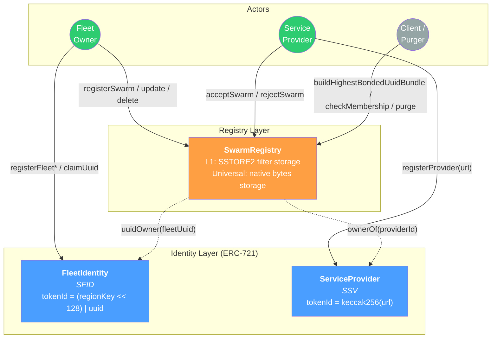
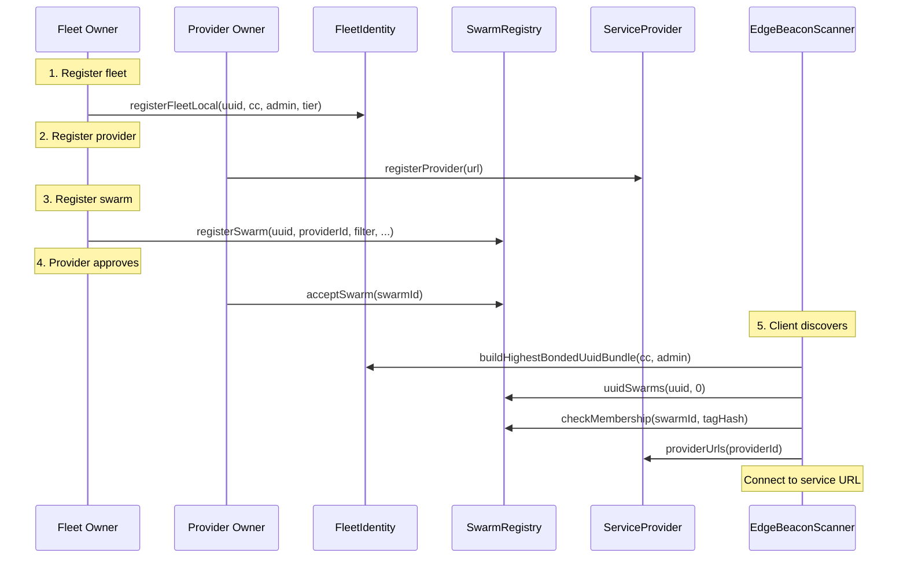

# Swarm System Technical Specification

BLE tag registry enabling decentralized device discovery using cryptographic membership proofs. Individual tags within a swarm are not enumerated on-chain.

## Architecture



## Core Components

| Contract                   | Role                           | Identity                                           | Token |
| :------------------------- | :----------------------------- | :------------------------------------------------- | :---- |
| **FleetIdentity**          | Fleet registry (ERC-721)       | `(regionKey << 128) \| uuid`                       | SFID  |
| **ServiceProvider**        | Backend URL registry (ERC-721) | `keccak256(url)`                                   | SSV   |
| **SwarmRegistryL1**        | Tag group registry (L1)        | `keccak256(fleetUuid, filter, fpSize, tagType)`    | —     |
| **SwarmRegistryUniversal** | Tag group registry (ZkSync+)   | `keccak256(fleetUuid, filter, fpSize, tagType)`    | —     |

All contracts are **permissionless**—access control via NFT ownership. FleetIdentity requires ERC-20 bond (anti-spam).

## Key Concepts

### Swarm

A group of ~10k-20k BLE tags represented by an XOR filter. Tags are never enumerated on-chain; membership is verified via cryptographic filter.

### UUID Ownership

UUIDs (iBeacon Proximity UUID) have ownership levels:

| Level   | Region Key | Bond                    | Description                 |
| :------ | :--------- | :---------------------- | :-------------------------- |
| Owned   | 0          | BASE_BOND               | Reserved, not in any region |
| Local   | ≥1024      | BASE_BOND × 2^tier      | Registered in admin area    |
| Country | 1-999      | BASE_BOND × 16 × 2^tier | Registered at country level |

### Geographic Tiers

Each region has independent tier competition:

- **Tier capacity**: 10 members per tier
- **Max tiers**: 24 per region
- **Bundle size**: Up to 20 UUIDs returned to clients

Country fleets pay 16× more but appear in all admin-area bundles within their country.

### Operator Delegation

UUID owners can delegate tier maintenance to an **operator**:

- **Default**: `operatorOf(uuid)` returns the UUID owner
- **Delegation**: Owner calls `claimUuid(uuid, operator)` or `setOperator(uuid, operator)`
- **Registration**: Only operator can register owned UUIDs to regions
- **Bond Split**: Owner pays BASE_BOND once; operator pays all tier bonds
- **Permissions**: Only operator can promote/demote/register; owner retains burn rights
- **Transfer**: `setOperator` transfers total tier bonds atomically (O(1) via `uuidTotalTierBonds`)

This enables cold-wallet ownership with hot-wallet tier management.

### Token ID Encoding

```
tokenId = (regionKey << 128) | uint256(uint128(uuid))
```

- Bits 0-127: UUID
- Bits 128-159: Region key

## Privacy Model

The system provides **non-enumerating** tag verification—individual tags aren't listed on-chain; membership is proven via XOR filter.

| Data        | Visibility       | Notes                                        |
| :---------- | :--------------- | :------------------------------------------- |
| UUID        | Public           | Required for iOS background beacon detection |
| Major/Minor | Filter-protected | Hashed, not enumerated                       |
| MAC address | Android-only     | iOS does not expose BLE MAC addresses        |

**Limitation**: UUID must be public for iOS `CLBeaconRegion` background monitoring. The system protects the specific Major/Minor combinations within that UUID's swarm.

## Documentation

| Document                                       | Description                                       |
| :--------------------------------------------- | :------------------------------------------------ |
| [data-model.md](data-model.md)                 | Contract interfaces, enums, storage layout        |
| [fleet-registration.md](fleet-registration.md) | Fleet & UUID registration, tier economics         |
| [swarm-operations.md](swarm-operations.md)     | Swarm registration, filters, provider approval    |
| [lifecycle.md](lifecycle.md)                   | State machines, updates, deletion, orphan cleanup |
| [discovery.md](discovery.md)                   | Client discovery flows, tag hash construction     |
| [maintenance.md](maintenance.md)               | Bundle inclusion monitoring, tier optimization    |
| [iso3166-reference.md](iso3166-reference.md)   | ISO 3166-1/2 codes and admin area mappings        |

## End-to-End Flow



## Storage Variants

| Variant                    | Chain               | Filter Storage              | Deletion Behavior                 |
| :------------------------- | :------------------ | :-------------------------- | :-------------------------------- |
| **SwarmRegistryL1**        | Ethereum L1         | SSTORE2 (contract bytecode) | Struct cleared; bytecode persists |
| **SwarmRegistryUniversal** | ZkSync Era, all EVM | `mapping(uint256 => bytes)` | Full deletion, gas refund         |

---

_For implementation details, see individual documentation pages._
