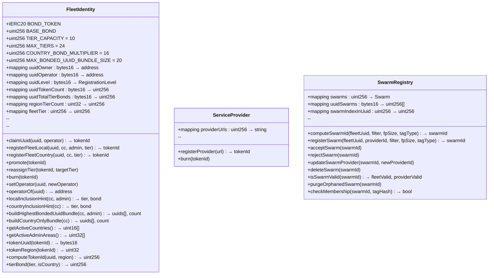

# Data Model & Contract Interfaces

## Interface Files

Public interfaces for external integrators and cross-contract calls:

| Interface                                       | Description                                    |
| :---------------------------------------------- | :--------------------------------------------- |
| `interfaces/IFleetIdentity.sol`                 | FleetIdentity public API (ERC721Enumerable)    |
| `interfaces/IServiceProvider.sol`               | ServiceProvider public API (ERC721)            |
| `interfaces/ISwarmRegistry.sol`                 | Common registry interface (L1 & Universal)    |
| `interfaces/SwarmTypes.sol`                     | Shared enums: `RegistrationLevel`, `SwarmStatus`, `TagType`, `FingerprintSize` |

These interfaces define the expected API surface for UUPS upgradeable contracts.

## Contract Classes



## Struct: Swarm

```solidity
struct Swarm {
    bytes16 fleetUuid;      // UUID that owns this swarm
    uint256 providerId;     // ServiceProvider token ID
    uint32 filterLength;    // XOR filter byte length
    uint8 fingerprintSize;  // Fingerprint bits (1-16)
    SwarmStatus status;     // Registration state
    TagType tagType;        // Tag identity scheme
}
```

## Enumerations

### SwarmStatus

| Value        | Description                |
| :----------- | :------------------------- |
| `REGISTERED` | Awaiting provider approval |
| `ACCEPTED`   | Provider approved; active  |
| `REJECTED`   | Provider rejected          |

### TagType

| Value                  | Format                           | Use Case         |
| :--------------------- | :------------------------------- | :--------------- |
| `IBEACON_PAYLOAD_ONLY` | UUID ∥ Major ∥ Minor (20B)       | Standard iBeacon |
| `IBEACON_INCLUDES_MAC` | UUID ∥ Major ∥ Minor ∥ MAC (26B) | Anti-spoofing    |
| `VENDOR_ID`            | companyID ∥ hash(vendorBytes)    | Non-iBeacon BLE  |
| `GENERIC`              | Custom                           | Extensible       |

### RegistrationLevel

| Value         | Region Key | Description        |
| :------------ | :--------- | :----------------- |
| `None` (0)    | —          | Not registered     |
| `Owned` (1)   | 0          | Claimed, no region |
| `Local` (2)   | ≥1024      | Admin area         |
| `Country` (3) | 1-999      | Country-wide       |

## Region Key Encoding

```
Country:    regionKey = countryCode                    (1-999)
Admin Area: regionKey = (countryCode << 10) | adminCode  (≥1024)
```

**Token ID:**

```
tokenId = (regionKey << 128) | uint256(uint128(uuid))
```

**Helper functions:**

```solidity
bytes16 uuid = fleetIdentity.tokenUuid(tokenId);
uint32 region = fleetIdentity.tokenRegion(tokenId);
uint256 tokenId = fleetIdentity.computeTokenId(uuid, regionKey);
uint32 adminRegion = fleetIdentity.makeAdminRegion(countryCode, adminCode);
```

## Swarm ID Derivation

Deterministic and collision-free:

```solidity
swarmId = uint256(keccak256(abi.encode(fleetUuid, filterData, fingerprintSize, tagType)))
```

Swarm identity is based on fleet, filter, fingerprintSize, and tagType. ProviderId is mutable and not part of identity. Duplicate registration reverts with `SwarmAlreadyExists()`.

## XOR Filter Membership

3-hash XOR verification:

```
Input: h = keccak256(tagId)
M = filterLength * 8 / fingerprintSize  // slots

h1 = uint32(h) % M
h2 = uint32(h >> 32) % M
h3 = uint32(h >> 64) % M
fp = (h >> 96) & ((1 << fingerprintSize) - 1)

Valid if: Filter[h1] ^ Filter[h2] ^ Filter[h3] == fp
```

## Storage Notes

### SwarmRegistryL1

- Filter stored as **contract bytecode** via SSTORE2
- Gas-efficient reads (EXTCODECOPY)
- Bytecode persists after deletion (immutable)

### SwarmRegistryUniversal

- Filter stored in `mapping(uint256 => bytes)`
- Full deletion reclaims storage
- `getFilterData(swarmId)` for off-chain retrieval

### Deletion Performance

O(1) swap-and-pop via `swarmIndexInUuid` mapping.
