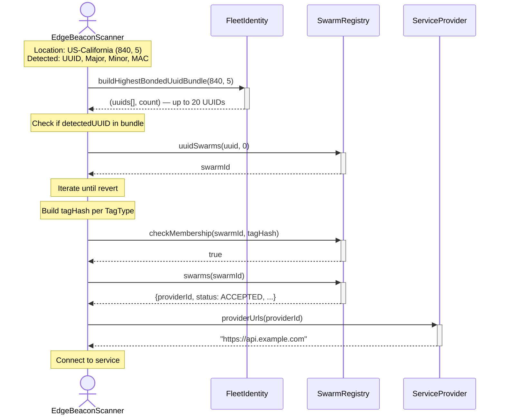
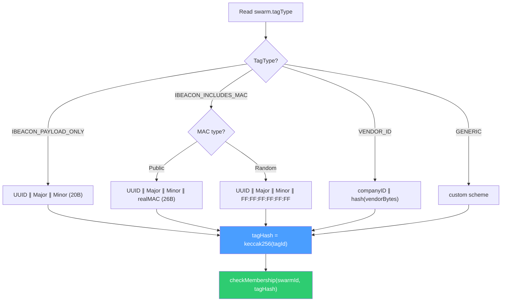

# Client Discovery

## Overview

Clients (mobile apps, gateways) discover BLE tags and resolve them to backend services entirely on-chain.

```
BLE Signal → UUID Match → Swarm Lookup → Membership Check → Service URL
```

## Geographic Bundle Discovery (Recommended)

Use location-based priority bundles for efficient discovery.



### Bundle Priority

1. **Tier**: Higher tier first
2. **Level**: Local before country (same tier)
3. **Time**: Earlier registration (same tier+level)

## Direct UUID Lookup

When UUID is known but location isn't:

```solidity
// Try regions
uint32 localRegion = (840 << 10) | 5;
uint256 tokenId = fleetIdentity.computeTokenId(uuid, localRegion);
try fleetIdentity.ownerOf(tokenId) { /* found */ }
catch { /* try country: computeTokenId(uuid, 840) */ }

// Enumerate swarms
for (uint i = 0; ; i++) {
    try swarmRegistry.uuidSwarms(uuid, i) returns (uint256 swarmId) {
        // process swarmId
    } catch { break; }
}
```

## Tag Hash Construction



### MAC Address Types

| Address Type Bits | MAC Type       | Action                  |
| :---------------- | :------------- | :---------------------- |
| `00`              | Public         | Use real MAC            |
| `01`, `11`        | Random/Private | Use `FF:FF:FF:FF:FF:FF` |

## Region Enumeration (Indexers)

```solidity
// Active countries
uint16[] memory countries = fleetIdentity.getActiveCountries();
// [840, 276, 392, ...]

// Active admin areas
uint32[] memory adminAreas = fleetIdentity.getActiveAdminAreas();
// [860165, 282629, ...] → (cc << 10) | admin

// Tier data
uint256 tierCount = fleetIdentity.regionTierCount(regionKey);
uint256[] memory tokenIds = fleetIdentity.getTierMembers(regionKey, tier);
bytes16[] memory uuids = fleetIdentity.getTierUuids(regionKey, tier);
```

## Complete Discovery Example

```solidity
function discoverService(
    bytes16 uuid,
    uint16 major,
    uint16 minor,
    bytes6 mac,
    uint16 countryCode,
    uint8 adminCode
) external view returns (string memory serviceUrl, bool found) {
    // 1. Check bundle
    (bytes16[] memory uuids, uint256 count) =
        fleetIdentity.buildHighestBondedUuidBundle(countryCode, adminCode);

    for (uint i = 0; i < count; i++) {
        if (uuids[i] != uuid) continue;

        // 2. Find swarms
        for (uint j = 0; ; j++) {
            uint256 swarmId;
            try swarmRegistry.uuidSwarms(uuid, j) returns (uint256 id) {
                swarmId = id;
            } catch { break; }

            // 3. Get swarm data
            (,uint256 providerId,,,SwarmStatus status, TagType tagType) =
                swarmRegistry.swarms(swarmId);

            if (status != SwarmStatus.ACCEPTED) continue;

            // 4. Build tagId
            bytes memory tagId;
            if (tagType == TagType.IBEACON_PAYLOAD_ONLY) {
                tagId = abi.encodePacked(uuid, major, minor);
            } else if (tagType == TagType.IBEACON_INCLUDES_MAC) {
                tagId = abi.encodePacked(uuid, major, minor, mac);
            }

            // 5. Check membership
            if (swarmRegistry.checkMembership(swarmId, keccak256(tagId))) {
                return (serviceProvider.providerUrls(providerId), true);
            }
        }
    }

    return ("", false);
}
```
