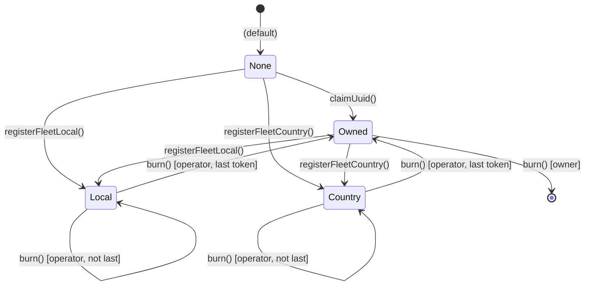
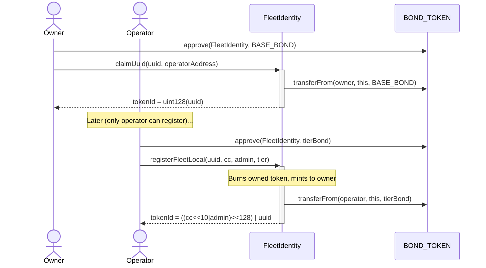
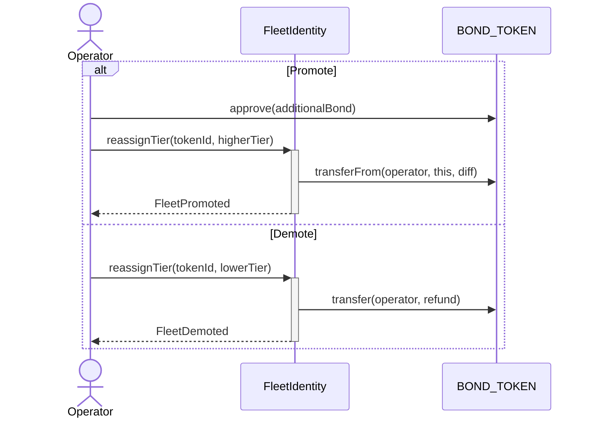
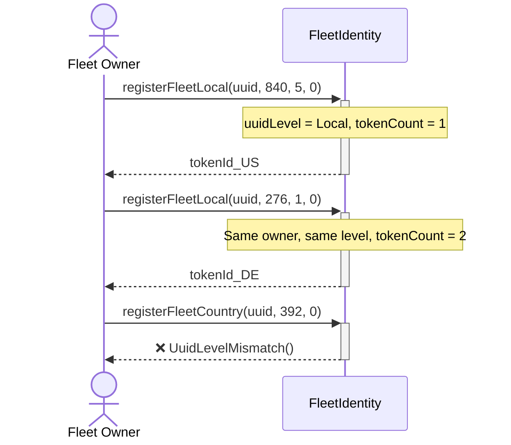

# Fleet Registration

## Registration Paths



## Direct Registration

### Local (Admin Area)

```solidity
// 1. Approve bond
NODL.approve(fleetIdentityAddress, requiredBond);

// 2. Get recommended tier (free off-chain call)
(uint256 tier, uint256 bond) = fleetIdentity.localInclusionHint(840, 5);

// 3. Register
uint256 tokenId = fleetIdentity.registerFleetLocal(uuid, 840, 5, tier);
// tokenId = ((840 << 10 | 5) << 128) | uint128(uuid)
```

### Country

```solidity
// 1. Approve bond
NODL.approve(fleetIdentityAddress, requiredBond);

// 2. Get recommended tier
(uint256 tier, uint256 bond) = fleetIdentity.countryInclusionHint(840);

// 3. Register
uint256 tokenId = fleetIdentity.registerFleetCountry(uuid, 840, tier);
// tokenId = (840 << 128) | uint128(uuid)
```

## Claim-First Flow (with Operator Delegation)

Reserve UUID with cold wallet, delegate to hot wallet operator:

```solidity
// 1. Owner claims UUID, designates operator (costs BASE_BOND)
NODL.approve(fleetIdentityAddress, BASE_BOND);
uint256 ownedTokenId = fleetIdentity.claimUuid(uuid, operatorAddress);
// tokenId = uint128(uuid), regionKey = 0

// 2. Operator registers later (pays full tier bond)
// Operator must call - owner cannot register for owned UUIDs
NODL.approve(fleetIdentityAddress, tierBond); // as operator
uint256 tokenId = fleetIdentity.registerFleetLocal(uuid, 840, 5, tier);
// Burns owned token, mints regional token to owner
```



## Operator Model

### Key Principles

- **Only operator can register** for owned UUIDs (owner cannot register directly)
- **Fresh registration**: caller becomes both owner + operator, pays `BASE_BOND + tierBond`
- **Owned → Registered**: operator pays full `tierBond` (BASE_BOND already paid via claimUuid)
- **Multi-region**: operator pays `tierBond` for each additional region

### Fresh Registration (Owner = Operator)

```solidity
// Caller becomes owner and operator
NODL.approve(fleetIdentityAddress, BASE_BOND + tierBond);
uint256 tokenId = fleetIdentity.registerFleetLocal(uuid, 840, 5, tier);
// msg.sender is now uuidOwner AND operatorOf(uuid)
```

### Set or Change Operator

```solidity
// Owner sets operator (transfers ALL tier bonds atomically)
fleetIdentity.setOperator(uuid, newOperator);
// - Pulls total tier bonds from new operator
// - Refunds total tier bonds to old operator
// - Uses O(1) storage lookup (uuidTotalTierBonds)
// - Emits OperatorSet(uuid, oldOperator, newOperator, tierBondsTransferred)
```

### Clear Operator

```solidity
// Owner clears operator (reverts to owner-managed)
fleetIdentity.setOperator(uuid, address(0));
// - Refunds all tier bonds to old operator
// - Pulls all tier bonds from owner
// - operatorOf(uuid) returns owner again
```

## Tier Economics

### Bond Formula

| Level   | Formula                   | Who Pays                        |
| :------ | :------------------------ | :------------------------------ | ------------------------------- |
| Owned   | `BASE_BOND`               | Owner                           |
| Local   | `BASE_BOND × 2^tier`      | Operator (owner paid BASE_BOND) | Operator (owner paid BASE_BOND) |
| Country | `BASE_BOND × 16 × 2^tier` | Operator (owner paid BASE_BOND) |

**Example (BASE_BOND = 100):**

| Tier | Local | Country |
| :--- | ----: | ------: |
| 0    |   100 |   1,600 |
| 1    |   200 |   3,200 |
| 2    |   400 |   6,400 |
| 3    |   800 |  12,800 |

### Economic Design

- **Tier capacity**: 10 members per tier
- **Max tiers**: 24 per region
- **Bundle limit**: 20 UUIDs per location

Country fleets pay 16× but appear in **all** admin-area bundles. Locals have cost advantage within their area.

## Tier Management

### Promote

Only the operator (or owner if no operator set) can promote:

```solidity
// Approve additional bond (as operator)
fleetIdentity.promote(tokenId);
// Moves to currentTier + 1
```

### Reassign

Only the operator (or owner if no operator set) can reassign:

```solidity
// Move to any tier
fleetIdentity.reassignTier(tokenId, targetTier);
// Promotion: pulls difference from operator
// Demotion: refunds difference to operator
```



## Multi-Region Registration

Same UUID can have multiple tokens at the **same level**:



**Constraints:**

- All tokens must be same level (Local or Country)
- Each region pays its own tier bond

## Burning

### Owned-Only Tokens (Owner Burns)

```solidity
// Only owner can burn owned-only tokens
fleetIdentity.burn(ownedTokenId);
// Refunds BASE_BOND to owner
// Clears uuidOwner - UUID can be claimed by anyone
```

### Registered Tokens (Operator Burns)

```solidity
// Only operator can burn registered tokens
fleetIdentity.burn(tokenId);
// Refunds tier bond to operator
// If last token: mints owned-only token to owner (preserves ownership)
// Owner must burn owned-only token separately to fully release UUID
```

**State Transitions:**

| State      | Who Burns | Last Token? | Result                                  |
| :--------- | :-------- | :---------- | :-------------------------------------- |
| Owned      | Owner     | -           | Refunds BASE_BOND, clears UUID          |
| Registered | Operator  | No          | Refunds tier bond, stays registered     |
| Registered | Operator  | Yes         | Refunds tier bond, transitions to Owned |

## Owned Token Transfer

Owned-only tokens transfer UUID ownership:

```solidity
// ERC-721 transfer
fleetIdentity.transferFrom(alice, bob, tokenId);
// uuidOwner[uuid] = bob
// Bob can now register to regions
```

Registered tokens can also transfer but do not change `uuidOwner`.

## Inclusion Hints

View functions that recommend cheapest tier guaranteeing bundle inclusion.

### Local Hint

```solidity
(uint256 tier, uint256 bond) = fleetIdentity.localInclusionHint(cc, admin);
// Simulates bundle for specific admin area
```

### Country Hint

```solidity
(uint256 tier, uint256 bond) = fleetIdentity.countryInclusionHint(cc);
// Scans ALL active admin areas (unbounded, free off-chain)
// Returns tier guaranteeing inclusion everywhere
```
