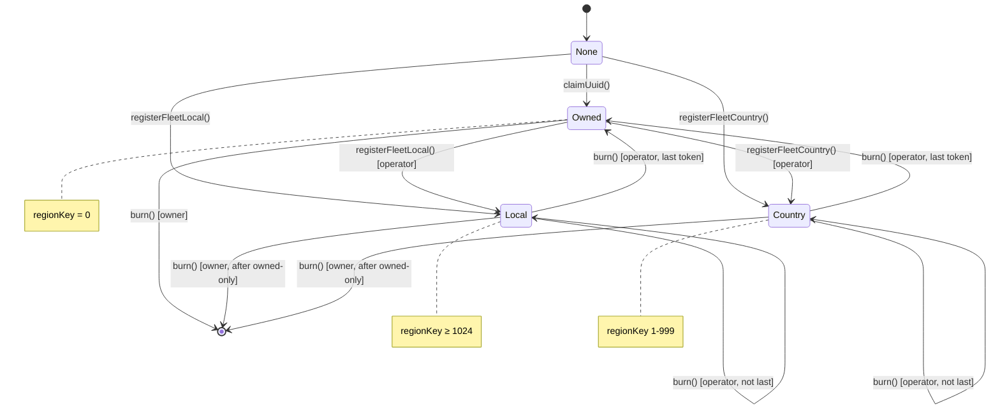
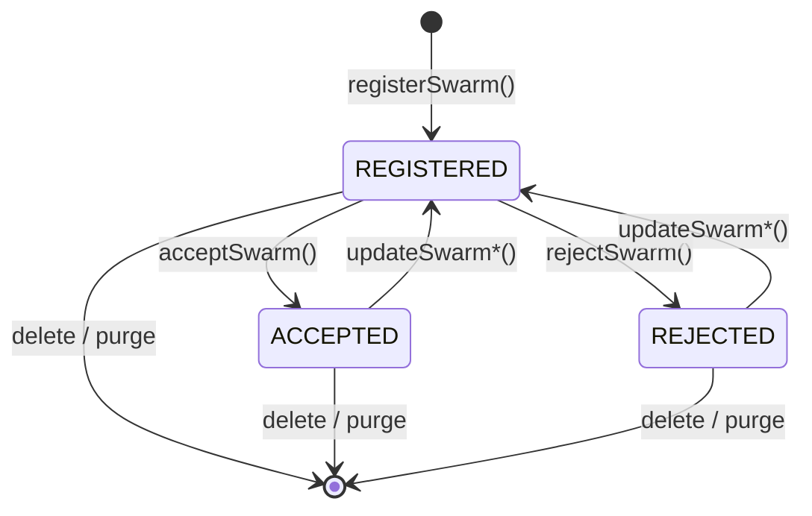
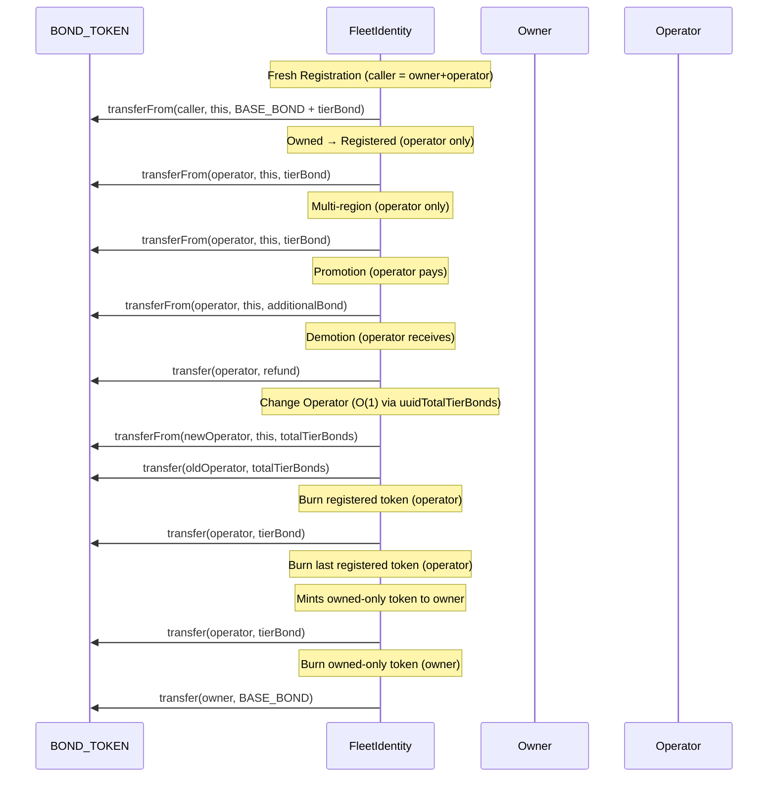
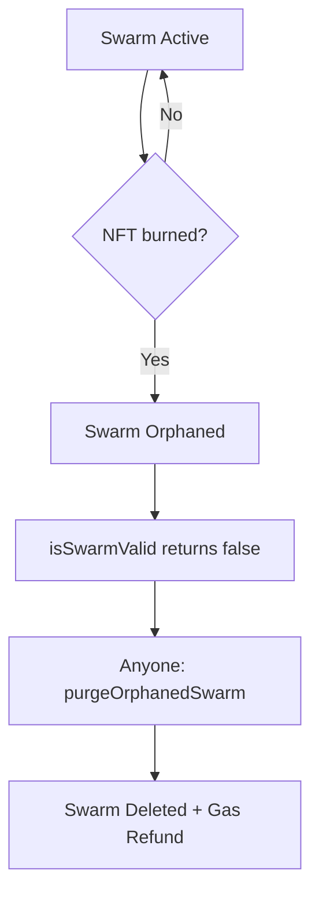
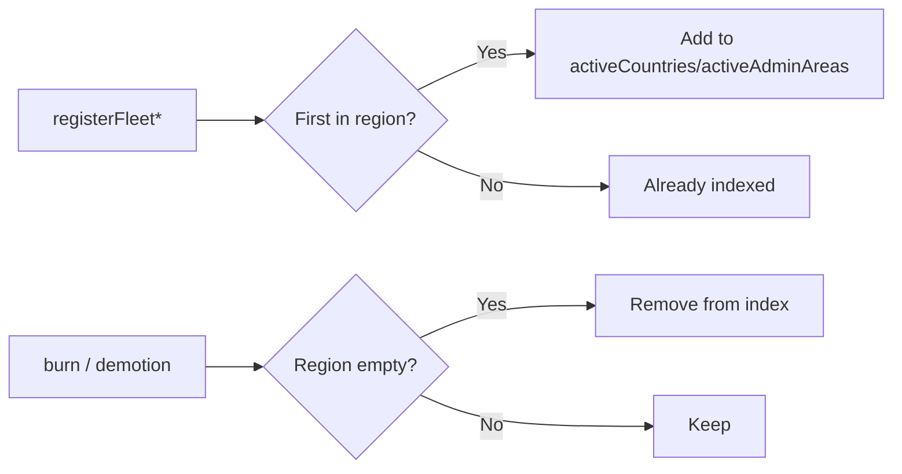

# Lifecycle & State Machines

## UUID Registration States



### State Transitions

| From          | To      | Function                   | Who Calls | Bond Effect                                                    |
| :------------ | :------ | :------------------------- | :-------- | :------------------------------------------------------------- |
| None          | Owned   | `claimUuid()`              | Anyone    | Pull BASE_BOND from caller (becomes owner)                     |
| None          | Local   | `registerFleetLocal()`     | Anyone    | Pull BASE_BOND + tierBond from caller (becomes owner+operator) |
| None          | Country | `registerFleetCountry()`   | Anyone    | Pull BASE_BOND + tierBond from caller (becomes owner+operator) |
| Owned         | Local   | `registerFleetLocal()`     | Operator  | Pull tierBond from operator                                    |
| Owned         | Country | `registerFleetCountry()`   | Operator  | Pull tierBond from operator                                    |
| Local/Country | Owned   | `burn()`                   | Operator  | Refund tierBond to operator (last token mints owned-only)      |
| Owned         | None    | `burn()`                   | Owner     | Refund BASE_BOND to owner                                      |
| Local/Country | -       | `burn()`                   | Operator  | Refund tierBond to operator (not last token, stays registered) |

## Swarm Status States



### Status Effects

| Status     | checkMembership | Provider Action Required         |
| :--------- | :-------------- | :------------------------------- |
| REGISTERED | Reverts         | Accept or reject                 |
| ACCEPTED   | Works           | None                             |
| REJECTED   | Reverts         | None (fleet can update to retry) |

## Fleet Token Lifecycle


```

## Orphan Lifecycle



### Orphan Guards

These operations revert with `SwarmOrphaned()` if either NFT invalid:

- `acceptSwarm(swarmId)`
- `rejectSwarm(swarmId)`
- `checkMembership(swarmId, tagHash)`

## Region Index Maintenance



Indexes are automatically maintained—no manual intervention needed.
