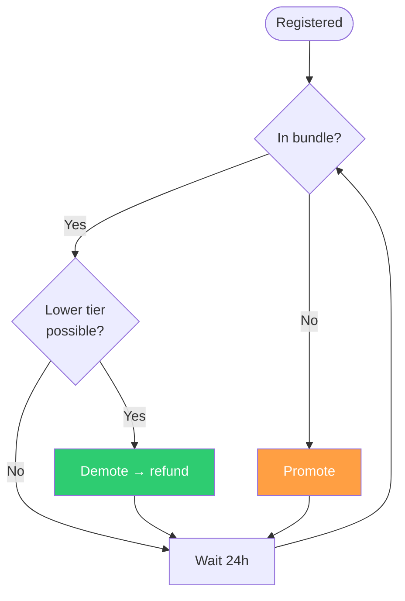
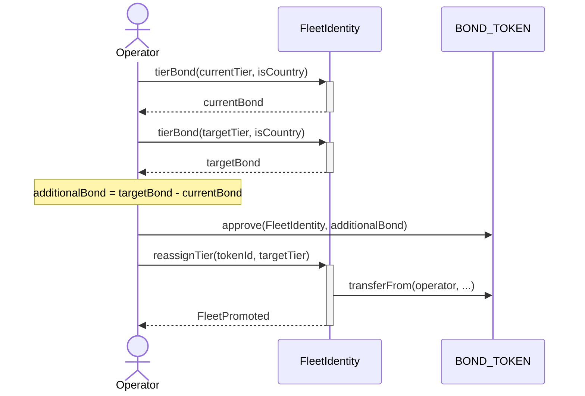

# Fleet Maintenance

## Overview

After registration, fleet owners (or their designated operators) must monitor bundle inclusion as market conditions change:

- New fleets registering at higher tiers
- Existing fleets promoting
- Bundle slots limited to 20 per location

## Operator Delegation

Fleet tier management can be delegated to an **operator**:

```solidity
// Owner delegates to operator (transfers total tier bonds)
fleetIdentity.setOperator(uuid, operatorAddress);

// Check who manages tiers
address manager = fleetIdentity.operatorOf(uuid); // returns operator or owner

// Check total tier bonds for a UUID (O(1) lookup)
uint256 totalBonds = fleetIdentity.uuidTotalTierBonds(uuid);
```

**Bond responsibilities:**

- **Owner**: Pays BASE_BOND once at initial registration/claim
- **Operator**: Pays/receives all tier bonds (promotion, demotion, registration)

**Permissions:**

- **Register**: Only operator can register owned UUIDs
- **Promote/Demote**: Only operator (or owner if no operator set)
- **Burn**: Only token holder (ERC-721 ownerOf)
- **SetOperator**: Only UUID owner

**setOperator Transfer:**
When changing operators, the new operator must pay the old operator for **all** accumulated tier bonds across all registered regions (tracked via `uuidTotalTierBonds` for O(1) lookup).

## Maintenance Cycle



## Check Inclusion

### Local Fleets

```typescript
const [uuids, count] = await fleetIdentity.buildHighestBondedUuidBundle(
  countryCode,
  adminCode,
);
const isIncluded = uuids
  .slice(0, count)
  .some((u) => u.toLowerCase() === myUuid.toLowerCase());
```

### Country Fleets

Must check **every** active admin area in their country:

```typescript
const adminAreas = await fleetIdentity.getActiveAdminAreas();
const myAdminAreas = adminAreas.filter(
  (rk) => Number(rk >> 10n) === myCountryCode,
);

const missingAreas = [];
for (const rk of myAdminAreas) {
  const adminCode = Number(rk & 0x3ffn);
  const [uuids, count] = await fleetIdentity.buildHighestBondedUuidBundle(
    myCountryCode,
    adminCode,
  );
  if (!uuids.slice(0, count).some((u) => u === myUuid)) {
    missingAreas.push(adminCode);
  }
}
```

### No Active Admin Areas

When no EdgeBeaconScanners deployed yet:

```typescript
const [uuids, count] = await fleetIdentity.buildCountryOnlyBundle(countryCode);
// Check position among country-level competitors only
```

## Get Required Tier

### Local

```solidity
(uint256 tier, uint256 bond) = fleetIdentity.localInclusionHint(cc, admin);
```

### Country

```solidity
(uint256 tier, uint256 bond) = fleetIdentity.countryInclusionHint(cc);
// Scans ALL active admin areas (unbounded view, free off-chain)
```

## Promote



### Quick Promote

```solidity
fleetIdentity.promote(tokenId);
// Moves to currentTier + 1
// Only operator (or owner if no operator set) can call
```

### Handle TierFull

```typescript
while (attempts < 3) {
  try {
    await fleetIdentity.reassignTier(tokenId, requiredTier);
    break;
  } catch (e) {
    if (e.message.includes("TierFull")) {
      const [newTier] = await fleetIdentity.localInclusionHint(cc, admin);
      requiredTier = newTier;
      // Re-approve if needed
    } else throw e;
  }
}
```

## Demote (Save Bond)

No approval needed—refunds automatically:

```typescript
const [suggestedTier] = await fleetIdentity.localInclusionHint(cc, admin);
const currentTier = await fleetIdentity.fleetTier(tokenId);

if (suggestedTier < currentTier) {
  await fleetIdentity.reassignTier(tokenId, suggestedTier);
  // Refund deposited to operator
}
```

## Propagation Timing

| Phase                    | Duration         |
| :----------------------- | :--------------- |
| Transaction confirmation | ~1-2s (ZkSync)   |
| Event indexing           | ~1-10s           |
| Edge network sync        | Minutes to hours |

**Recommendation**: 24-hour check interval.

## Summary

| Task                        | Method                                    |
| :-------------------------- | :---------------------------------------- |
| Check inclusion (local)     | `buildHighestBondedUuidBundle(cc, admin)` |
| Check inclusion (country)   | Loop all admin areas                      |
| Get required tier (local)   | `localInclusionHint(cc, admin)`           |
| Get required tier (country) | `countryInclusionHint(cc)`                |
| Calculate bond              | `tierBond(tier, isCountry)`               |
| Move tier                   | `reassignTier(tokenId, tier)`             |
| Quick promote               | `promote(tokenId)`                        |
