<div class="title-page">

# Nodle Swarm System

## Technical Specification

**Decentralized BLE Tag Registry with Cryptographic Membership Proofs**

Version 1.0 — March 2026

</div>

<div class="page-break"></div>

## Table of Contents

1. [Introduction & Architecture](#1-introduction--architecture)
2. [Data Model & Interfaces](#2-data-model--interfaces)
3. [BLE Tag Types & UUID Encoding](#3-ble-tag-types--uuid-encoding)
4. [Fleet Registration](#4-fleet-registration)
5. [Tier Economics & Bond System](#5-tier-economics--bond-system)
6. [Swarm Operations](#6-swarm-operations)
7. [Lifecycle & State Machines](#7-lifecycle--state-machines)
8. [Client Discovery](#8-client-discovery)
9. [Fleet Maintenance](#9-fleet-maintenance)
10. [Upgradeable Contract Architecture](#10-upgradeable-contract-architecture)
11. [BondTreasuryPaymaster](#11-bondtreasurypaymaster)
12. [Appendix A: ISO 3166 Geographic Reference](#appendix-a-iso-3166-geographic-reference)

<div class="page-break"></div>

## 1. Introduction & Architecture

### 1.1 System Overview

The Swarm System is a **non-enumerating** on-chain registry for **BLE (Bluetooth Low Energy)** tag swarms. It enables fleet owners to manage large groups of tags (approximately 10,000–20,000 per swarm) and link them to backend service providers using cryptographic membership proofs. Individual tags are never enumerated on-chain; membership is verified via XOR filter.

The system resolves the full path from a raw BLE signal to a verified service URL entirely on-chain, without a centralized indexer, while preserving the privacy of individual tags within each swarm.

### 1.2 Architecture

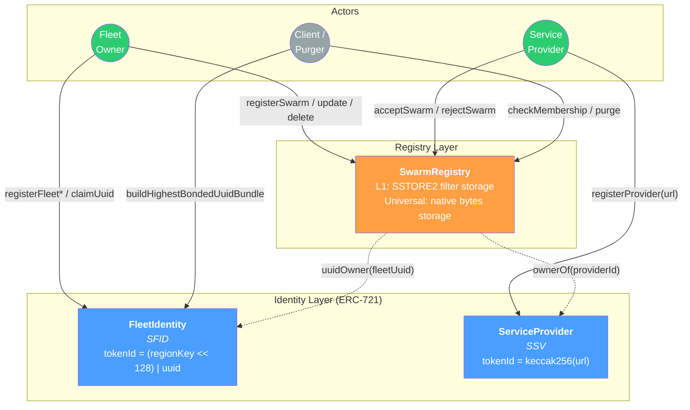

### 1.3 Core Components

| Contract                   | Role                                     | Identity                                        | Token |
| :------------------------- | :--------------------------------------- | :---------------------------------------------- | :---- |
| **FleetIdentity**          | Fleet registry (ERC-721 Enumerable)      | `(regionKey << 128) \| uint128(uuid)`           | SFID  |
| **ServiceProvider**        | Backend URL registry (ERC-721)           | `keccak256(url)`                                | SSV   |
| **SwarmRegistryL1**        | Tag group registry (Ethereum L1)         | `keccak256(fleetUuid, filter, fpSize, tagType)` | —     |
| **SwarmRegistryUniversal** | Tag group registry (ZkSync Era, all EVM) | `keccak256(fleetUuid, filter, fpSize, tagType)` | —     |
| **BondTreasuryPaymaster** | `WhitelistPaymaster` + `QuotaControl` + bond treasury | —                                               | —     |

All contracts are **DAO-owned** (UUPS upgradeable) during initial operation, allowing parameter tuning and bug fixes. Once mature and stable, an upgrade can renounce ownership to make them fully **permissionless**. Access control is via NFT ownership; FleetIdentity requires an ERC-20 bond (e.g., NODL) as an anti-spam mechanism.

### 1.4 Registry Variants

Two SwarmRegistry variants exist for different deployment targets:

| Variant                    | Chain               | Filter Storage                                | Deletion Behavior                 |
| :------------------------- | :------------------ | :-------------------------------------------- | :-------------------------------- |
| **SwarmRegistryL1**        | Ethereum L1         | SSTORE2 (contract bytecode via `EXTCODECOPY`) | Struct cleared; bytecode persists |
| **SwarmRegistryUniversal** | ZkSync Era, all EVM | `mapping(uint256 => bytes)`                   | Full deletion, gas refund         |

SwarmRegistryL1 uses `SSTORE2` for gas-efficient reads on L1 but relies on `EXTCODECOPY`, which is unsupported on ZkSync Era. SwarmRegistryUniversal uses native `bytes` storage with full deletion support and exposes `getFilterData(swarmId)` for off-chain filter retrieval. Both registries use **O(1) swap-and-pop** for removing swarms from the `uuidSwarms` array, tracked via the `swarmIndexInUuid` mapping.

### 1.5 Privacy Model

The system provides non-enumerating tag verification — individual tags are not listed on-chain; membership is proven via XOR filter.

| Data        | Visibility       | Notes                                        |
| :---------- | :--------------- | :------------------------------------------- |
| UUID        | Public           | Required for iOS background beacon detection |
| Major/Minor | Filter-protected | Hashed, not enumerated                       |
| MAC address | Android-only     | iOS does not expose BLE MAC addresses        |

**Limitation:** The UUID must be public for iOS `CLBeaconRegion` background monitoring. The system protects the specific Major/Minor combinations (and other tag-specific fields) within each swarm through hashing and XOR filtering, which introduces an intentional, tunable false-positive rate that further obscures individual tag membership.

<div class="page-break"></div>

## 2. Data Model & Interfaces

### 2.1 Public Interfaces

| Interface                         | Description                                                                    |
| :-------------------------------- | :----------------------------------------------------------------------------- |
| `interfaces/IFleetIdentity.sol`   | FleetIdentity public API (ERC721Enumerable)                                    |
| `interfaces/IServiceProvider.sol` | ServiceProvider public API (ERC721)                                            |
| `interfaces/ISwarmRegistry.sol`   | Common registry interface (L1 & Universal)                                     |
| `interfaces/SwarmTypes.sol`       | Shared enums: `RegistrationLevel`, `SwarmStatus`, `TagType`, `FingerprintSize` |
| `interfaces/IBondTreasury.sol`    | Bond treasury interface for sponsored UUID claims                              |

### 2.2 Contract Classes

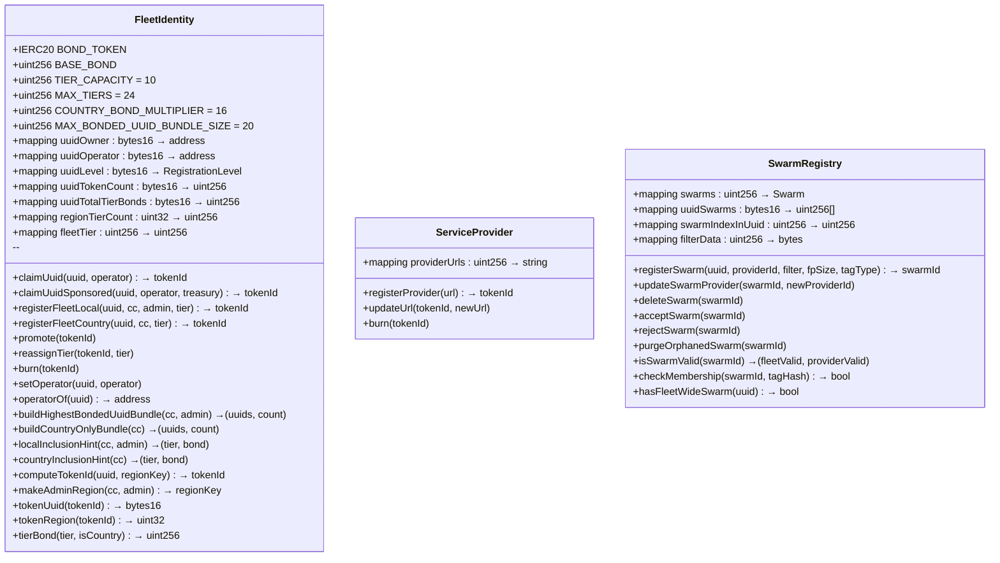

### 2.3 Swarm Struct

```solidity
struct Swarm {
    bytes16 fleetUuid;      // UUID that owns this swarm
    uint256 providerId;     // ServiceProvider token ID
    uint32 filterLength;    // XOR filter byte length
    FingerprintSize fpSize; // Fingerprint size (BITS_8 or BITS_16)
    SwarmStatus status;     // Registration state
    TagType tagType;        // Tag identity scheme
}
```

### 2.4 Enumerations

#### SwarmStatus

| Value        | Description                |
| :----------- | :------------------------- |
| `REGISTERED` | Awaiting provider approval |
| `ACCEPTED`   | Provider approved; active  |
| `REJECTED`   | Provider rejected          |

#### RegistrationLevel

| Value         | Region Key | Description        |
| :------------ | :--------- | :----------------- |
| `None` (0)    | —          | Not registered     |
| `Owned` (1)   | 0          | Claimed, no region |
| `Local` (2)   | ≥ 1024     | Admin area         |
| `Country` (3) | 1–999      | Country-wide       |

#### FingerprintSize

| Value     | Bits | fp mask  | False-positive rate |
| :-------- | ---: | :------- | :------------------ |
| `BITS_8`  |    8 | `0xFF`   | ~1 in 256           |
| `BITS_16` |   16 | `0xFFFF` | ~1 in 65,536        |

### 2.5 Region Key Encoding

Geographic regions are encoded into a single `uint32` value:

```
Country:    regionKey = countryCode                       (1–999)
Admin Area: regionKey = (countryCode << 10) | adminCode   (≥ 1024)
```

Country codes follow ISO 3166-1 numeric. Admin codes are 1-indexed integers mapping ISO 3166-2 subdivisions (see [Appendix A](#appendix-a-iso-3166-geographic-reference)).

**Examples:**

| Location      | Country Code | Admin Code | Region Key |
| :------------ | -----------: | ---------: | ---------: |
| United States |          840 |          — |        840 |
| US-California |          840 |          5 |    860,165 |
| Canada        |          124 |          — |        124 |
| CA-Alberta    |          124 |          1 |    127,001 |

### 2.6 Token ID Encoding

Fleet tokens encode both the region and UUID into a single `uint256`:

```
tokenId = (regionKey << 128) | uint256(uint128(uuid))
```

- **Bits 0–127:** UUID (Proximity UUID as `bytes16`)
- **Bits 128–159:** Region key

This allows the same UUID to be registered in multiple regions, each producing a distinct token. Helper functions:

```solidity
bytes16 uuid   = fleetIdentity.tokenUuid(tokenId);
uint32 region  = fleetIdentity.tokenRegion(tokenId);
uint256 tokenId = fleetIdentity.computeTokenId(uuid, regionKey);
uint32 adminRegion = fleetIdentity.makeAdminRegion(countryCode, adminCode);
```

<div class="page-break"></div>

## 3. BLE Tag Types & UUID Encoding

### 3.1 Overview

The `bytes16` UUID field stores the **fleet-level identifier** derived from BLE advertisement data. It serves two critical roles:

1. **Background scan registration:** Edge scanners (e.g., iOS, Android) must pre-register UUIDs with the OS to receive BLE advertisements while backgrounded. The UUID must be reconstructable from observed BLE data so scanners can build the correct OS-level filter.
2. **Swarm lookup scoping:** Each UUID maps to one or more swarms on-chain. Swarm resolution iterates all swarms under a UUID, so UUID specificity directly affects lookup performance.

The UUID deliberately excludes tag-specific fields (e.g., iBeacon Major/Minor, individual sensor IDs). Those fields appear only in the **tag hash** used for XOR filter membership verification.

### 3.2 UUID Design Trade-offs

Fleet owners should consider these trade-offs when encoding their UUID:

| Concern          | More specific UUID (uses more bytes)        | Less specific UUID (uses fewer bytes)                         |
| :--------------- | :------------------------------------------ | :------------------------------------------------------------ |
| **Lookup speed** | Fewer swarms per UUID → faster resolution   | Many swarms per UUID → linear search overhead                 |
| **Uniqueness**   | Low collision risk when claiming on-chain   | Higher collision risk — another owner may claim the same UUID |
| **Privacy**      | More fleet metadata publicly visible        | Less exposed, more private                                    |
| **Scan filter**  | Tighter OS-level filter → fewer false wakes | Broader filter → more false wakes                             |

**Recommendation:** Use as much of the 16-byte UUID capacity as is acceptable for public exposure.

### 3.3 TagType Enumeration

The `TagType` enum (defined in `interfaces/SwarmTypes.sol`) determines how tag identities are constructed:

| TagType                | Tag Hash Format                      | UUID Encoding                      | Use Case              |
| :--------------------- | :----------------------------------- | :--------------------------------- | :-------------------- |
| `IBEACON_PAYLOAD_ONLY` | UUID ∥ Major ∥ Minor (20B)           | Proximity UUID (16B)               | iBeacon / AltBeacon   |
| `IBEACON_INCLUDES_MAC` | UUID ∥ Major ∥ Minor ∥ MAC (26B)     | Proximity UUID (16B)               | Anti-spoofing iBeacon |
| `VENDOR_ID`            | CompanyID ∥ FullVendorData           | Len ∥ CompanyID ∥ FleetID (16B)    | Manufacturer-specific |
| `EDDYSTONE_UID`        | Namespace ∥ Instance (16B)           | Namespace ∥ Instance (16B)         | Eddystone-UID         |
| `SERVICE_DATA`         | ExpandedServiceUUID128 ∥ ServiceData | Bluetooth Base UUID expanded (16B) | GATT Service Data     |
| `UUID_ONLY`            | N/A — all tags match automatically   | Same UUID encoding as tag format   | All tags under a UUID |

### 3.4 iBeacon / AltBeacon

For iBeacon advertisements, the UUID stores the standard **16-byte Proximity UUID** defined by Apple's iBeacon specification. Major (2B) and Minor (2B) are excluded from the UUID and used only in tag hash construction.

AltBeacon uses a structurally identical 20-byte Beacon ID (16B ID + 2B major + 2B minor) and is categorized under `IBEACON_PAYLOAD_ONLY` or `IBEACON_INCLUDES_MAC`.

```
UUID = Proximity UUID (16B)
Tag Hash = keccak256(UUID ∥ Major ∥ Minor)                // IBEACON_PAYLOAD_ONLY
Tag Hash = keccak256(UUID ∥ Major ∥ Minor ∥ NormMAC)      // IBEACON_INCLUDES_MAC
```

#### MAC Address Normalization (IBEACON_INCLUDES_MAC)

| Address Type Bits | MAC Type         | Action                           |
| :---------------- | :--------------- | :------------------------------- |
| `00`              | Public / Static  | Use real MAC                     |
| `01`, `11`        | Random / Private | Replace with `FF:FF:FF:FF:FF:FF` |

This normalization supports rotating privacy MACs while still enabling validation that a tag is a privacy-address device.

### 3.5 Eddystone-UID

Eddystone-UID frames broadcast a **10-byte Namespace ID** and a **6-byte Instance ID**, totaling exactly 16 bytes. Both fields are static and map directly into the UUID:

```
UUID = Namespace (10B) ∥ Instance (6B)
Tag Hash = keccak256(Namespace ∥ Instance)
```

### 3.6 Eddystone-EID (Not Supported)

Eddystone-EID broadcasts a **rotating 8-byte ephemeral identifier** derived from a static 16-byte Identity Key and a time counter. Because the EID changes periodically and the Identity Key is never transmitted over the air, edge scanners cannot filter EID beacons by fleet. This makes EID incompatible with edge-filtered swarm membership and it is therefore not assigned a `TagType`.

### 3.7 VENDOR_ID (Manufacturer Specific Data, AD Type 0xFF)

BLE Manufacturer Specific Data contains a **2-byte Company ID** (assigned by Bluetooth SIG) followed by vendor-defined payload. Since Company ID alone typically identifies the manufacturer — not the fleet owner — additional fleet-identifying bytes from the vendor data should be included when possible.

**UUID encoding** — length-prefixed for unambiguous decoding by scanners:

```
UUID (16 bytes):
┌───────┬───────────┬───────────────────────────────────┐
│ Len   │ CompanyID │ FleetIdentifier + zero-padding    │
│ (1B)  │ (2B, BE)  │ (13B)                             │
└───────┴───────────┴───────────────────────────────────┘

Len = total meaningful bytes after the Len byte
    = 2 (CompanyID) + N (FleetIdentifier bytes)
    Range: 2 (company-only) to 15 (2 + 13B fleet ID)
```

**Scanner decode logic:**

```
CompanyID  = UUID[1:3]
FleetIdLen = UUID[0] - 2
FleetId    = UUID[3 : 3 + FleetIdLen]
→ Register BLE filter: AD Type 0xFF, CompanyID, data prefix = FleetId
```

**Tag hash** uses the full vendor data (not truncated):

```
Tag Hash = keccak256(CompanyID ∥ FullVendorData)
```

**Examples:**

| Company       | Company ID | Fleet Identifier        | Len | UUID (hex)                            |
| :------------ | :--------- | :---------------------- | --: | :------------------------------------ |
| Estimote      | `015D`     | OrgID `AABBCCDD` (4B)   |   6 | `06 015D AABBCCDD 000000000000000000` |
| Tile          | `0113`     | (company only)          |   2 | `02 0113 00000000000000000000000000`  |
| Custom vendor | `1234`     | `0102030405060708` (8B) |  10 | `0A 1234 0102030405060708 0000000000` |

### 3.8 SERVICE_DATA (GATT Service Data, AD Types 0x16 / 0x20 / 0x21)

BLE Service Data advertisements carry a Service UUID plus associated data. The AD type determines the UUID size:

| AD Type | Service UUID Size | Example             |
| :------ | :---------------- | :------------------ |
| `0x16`  | 16-bit            | Heart Rate (0x180D) |
| `0x20`  | 32-bit            | Custom (0x12345678) |
| `0x21`  | 128-bit           | Vendor-specific     |

**UUID encoding** — canonical expansion using the Bluetooth Base UUID:

```
Bluetooth Base UUID: 00000000-0000-1000-8000-00805F9B34FB

16-bit  → 0000XXXX-0000-1000-8000-00805F9B34FB
32-bit  → XXXXXXXX-0000-1000-8000-00805F9B34FB
128-bit → stored as-is
```

The expansion is lossless and reversible: the scanner determines the original UUID size from the AD type in the BLE advertisement.

```
UUID = Expand(ServiceUUID) → bytes16
Tag Hash = keccak256(ExpandedServiceUUID128 ∥ ServiceData)
```

### 3.9 Tag Hash Construction Summary

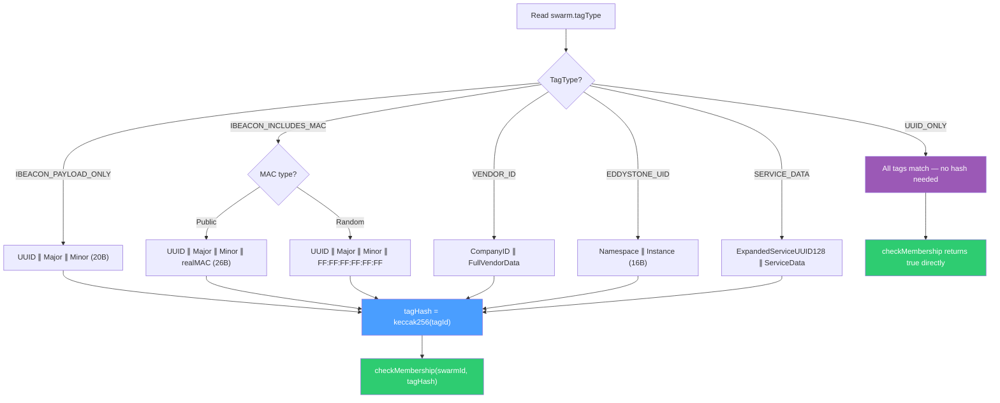

### 3.10 UUID_ONLY (Fleet-Wide Swarms)

`UUID_ONLY` is a special `TagType` for fleet owners who want **all tags broadcasting a given UUID** to be treated as members — no XOR filter, no per-tag hashing required. This covers the case: _"My swarm covers all tags under this UUID."_

#### Use Case

- The fleet owner does not need to enumerate or filter individual Major/Minor values, MAC addresses, or vendor-specific payloads.
- Any BLE device advertising the registered UUID is unconditionally accepted as a member.
- Useful for deployments where the UUID alone uniquely identifies the fleet (e.g., a dedicated UUID not shared with any third-party device).

#### Registration

UUID_ONLY swarms use the constant **sentinel filter** `FLEET_WIDE_SENTINEL = 0xff` (one byte). This satisfies the non-empty filter requirement and keeps the `swarmId` fully deterministic:

```solidity
import {FLEET_WIDE_SENTINEL} from "interfaces/SwarmTypes.sol";

// Register a fleet-wide swarm
swarmRegistry.registerSwarm(
    myUuid,
    providerId,
    FLEET_WIDE_SENTINEL,          // must be exactly bytes(hex"ff")
    FingerprintSize.BITS_8,       // fpSize ignored for UUID_ONLY
    TagType.UUID_ONLY
);
```

#### Mutual Exclusivity

A UUID may have **either** a fleet-wide swarm **or** one-or-more tag-specific swarms — never both:

| Scenario                                              | Result                               |
| :---------------------------------------------------- | :----------------------------------- |
| Register `UUID_ONLY` when tag-specific swarms exist   | Reverts `FleetHasSwarms()`           |
| Register a tag-specific swarm when `UUID_ONLY` exists | Reverts `FleetWideSwarmExists()`     |
| Pass wrong sentinel bytes for `UUID_ONLY`             | Reverts `InvalidFleetWideSentinel()` |

Use `hasFleetWideSwarm(uuid)` to check before registering:

```solidity
bool isFleetWide = swarmRegistry.hasFleetWideSwarm(myUuid);
```

#### Membership Check

`checkMembership()` short-circuits to `true` for `UUID_ONLY` swarms after the usual orphan guards:

```solidity
// For UUID_ONLY swarms: tagHash is irrelevant — always returns true
bool isMember = swarmRegistry.checkMembership(swarmId, bytes32(0)); // true
```

#### Deletion

Deleting a `UUID_ONLY` swarm clears the `hasFleetWideSwarm` flag, allowing tag-specific swarms to be registered for the same UUID afterwards:

```solidity
swarmRegistry.deleteSwarm(swarmId);
// hasFleetWideSwarm[uuid] is now false
```

<div class="page-break"></div>

## 4. Fleet Registration

### 4.1 Registration Paths

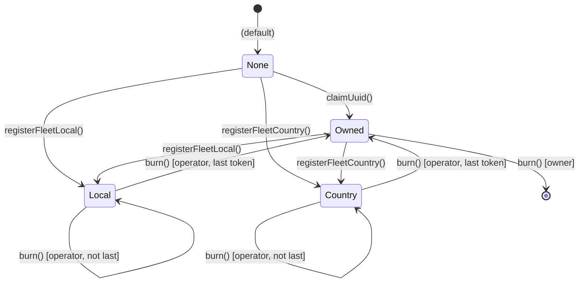

### 4.2 Direct Registration

#### Local (Admin Area)

```solidity
// 1. Approve bond
NODL.approve(fleetIdentityAddress, requiredBond);

// 2. Get recommended tier (free off-chain call)
(uint256 tier, uint256 bond) = fleetIdentity.localInclusionHint(840, 5);

// 3. Register
uint256 tokenId = fleetIdentity.registerFleetLocal(uuid, 840, 5, tier);
```

#### Country

```solidity
// 1. Approve bond
NODL.approve(fleetIdentityAddress, requiredBond);

// 2. Get recommended tier
(uint256 tier, uint256 bond) = fleetIdentity.countryInclusionHint(840);

// 3. Register
uint256 tokenId = fleetIdentity.registerFleetCountry(uuid, 840, tier);
```

When registering without a prior `claimUuid()`, the caller pays `BASE_BOND + tierBond` and becomes both owner and operator of the UUID.

### 4.3 Claim-First Flow (with Operator Delegation)

Reserve a UUID with a cold wallet, then delegate registration to a hot-wallet operator:

```solidity
// 1. Owner claims UUID, designates operator (costs BASE_BOND)
NODL.approve(fleetIdentityAddress, BASE_BOND);
uint256 ownedTokenId = fleetIdentity.claimUuid(uuid, operatorAddress);

// 2. Operator registers later (pays full tier bond)
NODL.approve(fleetIdentityAddress, tierBond); // as operator
uint256 tokenId = fleetIdentity.registerFleetLocal(uuid, 840, 5, tier);
// Burns owned token, mints regional token to owner
```

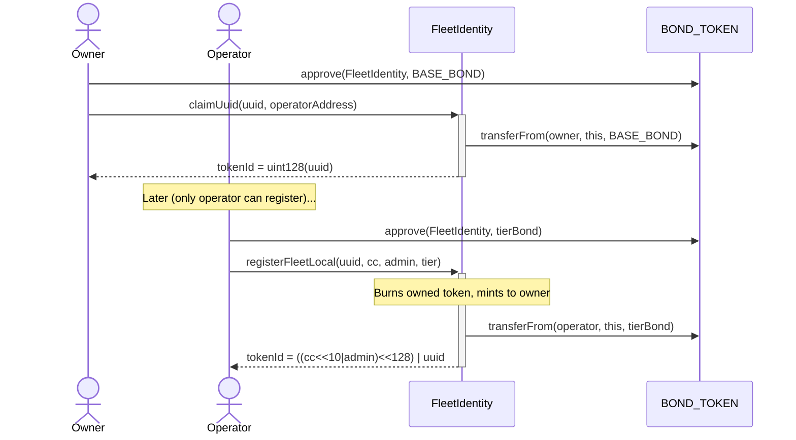

### 4.4 Sponsored Claim Flow (Treasury-Paid Bond)

A sponsor (such as Nodle) can pay **both the gas and the NODL bond** on behalf of a new user, enabling a completely frictionless Web2-style onboarding experience while preserving full on-chain ownership, auditability, and interoperability. The user's wallet can be a freshly created account-abstraction wallet — the user never needs to hold ETH or NODL.

#### How It Works

1. The sponsor deploys and funds a `BondTreasuryPaymaster` with ETH (for gas) and NODL (for bonds).
2. The sponsor whitelists the user's address.
3. The user calls `claimUuidSponsored()` on FleetIdentity, passing the treasury address.
4. The ZkSync paymaster covers the gas; the treasury covers the bond.

The paymaster can also sponsor gas to **other** on-chain contracts (for example `SwarmRegistryUniversal`) if the sponsor adds their proxy addresses via `addWhitelistedContracts` — same user whitelist as for `FleetIdentity`. See [Section 11](#11-bondtreasurypaymaster).

```solidity
// User calls (zero ETH / NODL needed in their wallet):
uint256 tokenId = fleetIdentity.claimUuidSponsored(
    uuid,
    operatorAddress,  // address(0) = self-operate
    treasuryAddress   // BondTreasuryPaymaster
);
// UUID is now owned by msg.sender — provably, permanently, on-chain
```

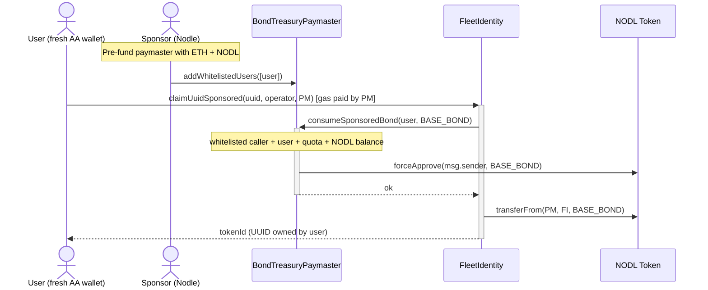

#### Security Properties

- **Bond enforced by the token contract:** `claimUuidSponsored` calls `transferFrom` on the immutable `_bondToken`. The treasury cannot fake a bond payment — it must actually hold and approve NODL.
- **Beneficiary is always `msg.sender`:** The UUID is always minted to the calling user. No third party can redirect ownership.
- **Reentrancy protected:** `nonReentrant` modifier prevents treasury callbacks from re-entering FleetIdentity.
- **Multiple treasuries supported:** Different sponsors with different policies (access lists, geographic restrictions, per-period quotas) can coexist. FleetIdentity only cares that the bond is paid.

#### Treasury Quota Control

`BondTreasuryPaymaster` extends `WhitelistPaymaster` (gas + user/contract whitelists) and `QuotaControl`, which limits total NODL disbursed per period:

```solidity
// Deployment example (Nodle onboarding treasury)
address[] memory initialContracts = new address[](1);
initialContracts[0] = fleetIdentityProxy;
new BondTreasuryPaymaster(
    admin,
    withdrawer,
    initialContracts,
    nodlTokenAddress,
    100_000e18,   // quota: 100,000 NODL per period
    7 days        // period length
);
```

See [Section 11](#11-bondtreasurypaymaster) for the full paymaster specification.

### 4.5 Operator Model

**Key principles:**

- **Only the operator can register** for owned UUIDs (the owner cannot register directly after claiming).
- **Fresh registration:** The caller becomes both owner and operator, paying `BASE_BOND + tierBond`.
- **Owned → Registered:** The operator pays the full `tierBond` (BASE_BOND already paid via `claimUuid`).
- **Multi-region:** The operator pays `tierBond` for each additional region.

**Setting or changing the operator:**

```solidity
// Owner sets operator (transfers ALL tier bonds atomically)
fleetIdentity.setOperator(uuid, newOperator);
// - Pulls total tier bonds from new operator
// - Refunds total tier bonds to old operator
// - Uses O(1) storage lookup (uuidTotalTierBonds)

// Owner clears operator (reverts to owner-managed)
fleetIdentity.setOperator(uuid, address(0));
// - Refunds all tier bonds to old operator
// - Pulls all tier bonds from owner

// Check current operator (returns owner if none set)
address manager = fleetIdentity.operatorOf(uuid);
```

**Permission summary:**

| Action                           | Who Can Call                           |
| :------------------------------- | :------------------------------------- |
| Register for owned UUID          | Operator only                          |
| Promote / demote / reassign tier | Operator (or owner if no operator set) |
| Burn registered token            | Operator only                          |
| Burn owned-only token            | Owner only                             |
| Set / change operator            | Owner only                             |
| Transfer owned-only token        | Owner (ERC-721 transfer)               |

### 4.6 Multi-Region Registration

The same UUID can hold multiple tokens at the **same level** (all Local or all Country):

```solidity
fleetIdentity.registerFleetLocal(uuid, 840, 5, 0);  // US-California ✓
fleetIdentity.registerFleetLocal(uuid, 276, 1, 0);   // DE-Baden-Württemberg ✓
fleetIdentity.registerFleetCountry(uuid, 392, 0);    // Japan ✗ UuidLevelMismatch()
```

Each region pays its own tier bond independently.

### 4.7 Burning

| State      | Who Burns | Last Token? | Result                                             |
| :--------- | :-------- | :---------- | :------------------------------------------------- |
| Owned      | Owner     | —           | Refunds BASE_BOND, clears UUID ownership           |
| Registered | Operator  | No          | Refunds tier bond, stays registered                |
| Registered | Operator  | Yes         | Refunds tier bond, mints owned-only token to owner |

After the operator burns the last registered token, the owner receives an owned-only token and must burn it separately to fully release the UUID.

### 4.8 Owned Token Transfer

Owned-only tokens transfer UUID ownership via standard ERC-721 transfer:

```solidity
fleetIdentity.transferFrom(alice, bob, tokenId);
// uuidOwner[uuid] = bob
```

Registered tokens can also transfer but do not change `uuidOwner`.

### 4.9 Inclusion Hints

View functions that recommend the cheapest tier guaranteeing bundle inclusion:

```solidity
// Local: simulates bundle for a specific admin area
(uint256 tier, uint256 bond) = fleetIdentity.localInclusionHint(cc, admin);

// Country: scans ALL active admin areas (unbounded, free off-chain)
(uint256 tier, uint256 bond) = fleetIdentity.countryInclusionHint(cc);
```

<div class="page-break"></div>

## 5. Tier Economics & Bond System

### 5.1 System Parameters

| Parameter                   | Value                        |
| :-------------------------- | :--------------------------- |
| **Tier Capacity**           | 10 members per tier          |
| **Max Tiers**               | 24 per region                |
| **Max Bundle Size**         | 20 UUIDs returned to clients |
| **Country Bond Multiplier** | 16× local bond               |

### 5.2 Bond Formula

| Level   | Formula                   | Who Pays                        |
| :------ | :------------------------ | :------------------------------ |
| Owned   | `BASE_BOND`               | Owner                           |
| Local   | `BASE_BOND × 2^tier`      | Operator (owner paid BASE_BOND) |
| Country | `BASE_BOND × 16 × 2^tier` | Operator (owner paid BASE_BOND) |

**Example (BASE_BOND = 100 NODL):**

| Tier | Local Bond | Country Bond |
| :--- | ---------: | -----------: |
| 0    |        100 |        1,600 |
| 1    |        200 |        3,200 |
| 2    |        400 |        6,400 |
| 3    |        800 |       12,800 |

### 5.3 Economic Design

Country fleets pay 16× more than local fleets but appear in **all** admin-area bundles within their country. This gives local fleets a significant cost advantage: a local fleet can reach tier 4 for the same cost a country fleet pays for tier 0.

### 5.4 Runtime Bond Parameter Configuration

The contract owner can adjust bond parameters at runtime for future registrations:

```solidity
fleetIdentity.setBaseBond(newBaseBond);
fleetIdentity.setCountryBondMultiplier(newMultiplier);
fleetIdentity.setBondParameters(newBaseBond, newMultiplier);
```

**Tier-0 bond tracking:** To ensure fair refunds when parameters change, each token stores its "tier-0 equivalent bond" at registration time:

- **Local tokens:** `tokenTier0Bond[tokenId] = baseBond`
- **Country tokens:** `tokenTier0Bond[tokenId] = baseBond * countryBondMultiplier`
- **Bond at tier K:** `tokenTier0Bond[tokenId] << K` (bitshift = multiply by 2^K)

This stores a single `uint256` per token and enables O(1) promote/demote/burn operations with accurate refunds regardless of parameter changes.

For UUID ownership bonds, `uuidOwnershipBondPaid[uuid]` tracks the amount paid at claim or first registration.

### 5.5 Tier Management

#### Promote

```solidity
// Quick promote to next tier
fleetIdentity.promote(tokenId);

// Reassign to any tier (promotes or demotes)
fleetIdentity.reassignTier(tokenId, targetTier);
// Promotion: pulls additional bond from operator
// Demotion: refunds bond difference to operator
```

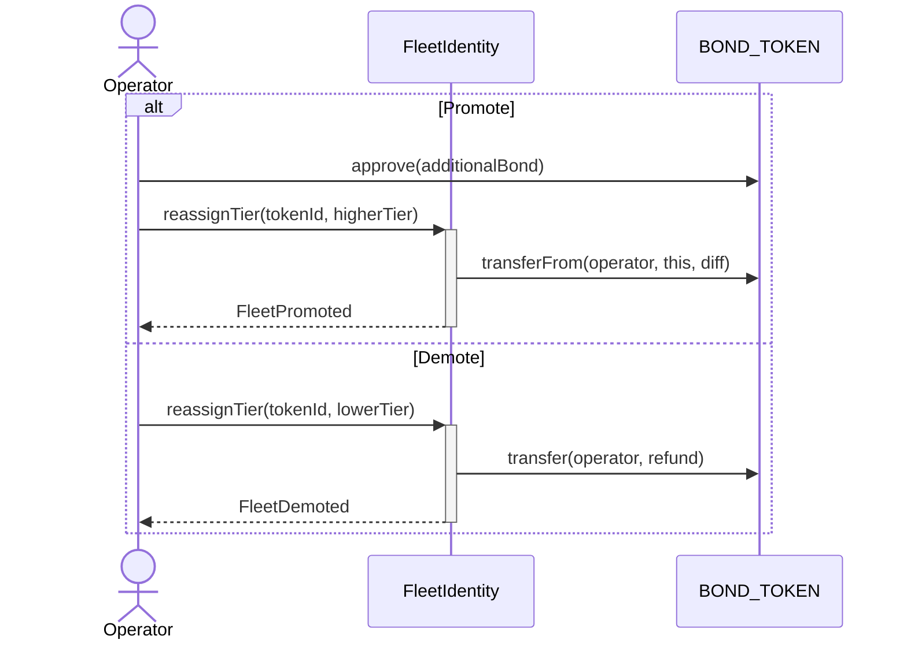

Only the operator (or owner if no operator is set) can promote, demote, or reassign tiers.

<div class="page-break"></div>

## 6. Swarm Operations

### 6.1 Registration Flow

A fleet owner groups tags into a swarm (approximately 10,000–20,000 tags) and registers the group on-chain with a pre-computed XOR filter.

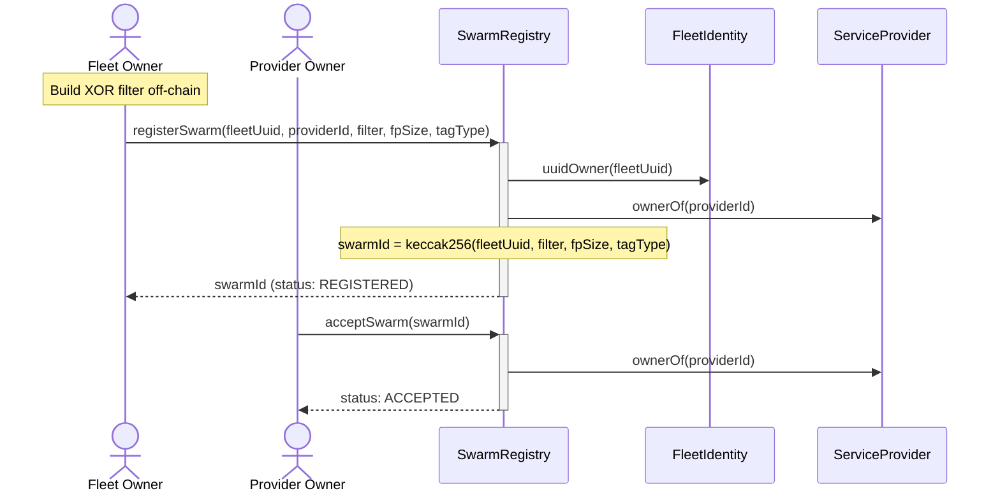

**Registration parameters:**

| Parameter    | Type              | Description                                                 |
| :----------- | :---------------- | :---------------------------------------------------------- |
| `fleetUuid`  | `bytes16`         | UUID that owns this swarm                                   |
| `providerId` | `uint256`         | ServiceProvider token ID                                    |
| `filter`     | `bytes`           | XOR filter data (use `FLEET_WIDE_SENTINEL` for `UUID_ONLY`) |
| `fpSize`     | `FingerprintSize` | `BITS_8` (8-bit) or `BITS_16` (16-bit) fingerprints         |
| `tagType`    | `TagType`         | Tag identity scheme (use `UUID_ONLY` for fleet-wide match)  |

### 6.2 Swarm ID Derivation

Swarm IDs are **deterministic** and collision-free:

```solidity
swarmId = uint256(keccak256(abi.encode(fleetUuid, filter, fpSize, tagType)))
```

Swarm identity is based on fleet, filter, fingerprint size, and tag type. The `providerId` is mutable and is not part of the identity. Duplicate registration of the same tuple reverts with `SwarmAlreadyExists()`. The `computeSwarmId` function is `public pure` and can be called off-chain at zero cost.

### 6.3 XOR Filter Construction

#### Off-Chain Steps

1. **Build TagIDs** for all tags per the TagType schema (Section 3).
2. **Hash each TagID:** `tagHash = keccak256(tagId)`.
3. **Construct XOR filter** using the Peeling Algorithm.
4. **Submit filter** via `registerSwarm()`.

#### Filter Membership Verification (On-Chain)

The contract uses **3-hash XOR logic**:

```
Input: h = keccak256(tagId)

// Slot count depends on FingerprintSize:
M = filterLength         // BITS_8:  each byte is one fingerprint slot
M = filterLength / 2     // BITS_16: each 2 bytes is one fingerprint slot

h1 = uint32(h) % M
h2 = uint32(h >> 32) % M
h3 = uint32(h >> 64) % M
fp = (h >> 96) & fpMask  // fpMask = 0xFF (BITS_8) or 0xFFFF (BITS_16)

Member if: Filter[h1] ⊕ Filter[h2] ⊕ Filter[h3] == fp
```

The `FingerprintSize` enum controls the false-positive rate: `BITS_8` gives ~1/256 false positives with compact storage; `BITS_16` gives ~1/65,536 but requires twice the bytes per tag. `UUID_ONLY` swarms bypass this check entirely — `checkMembership` short-circuits to `true` after the orphan guard.

### 6.4 Provider Approval

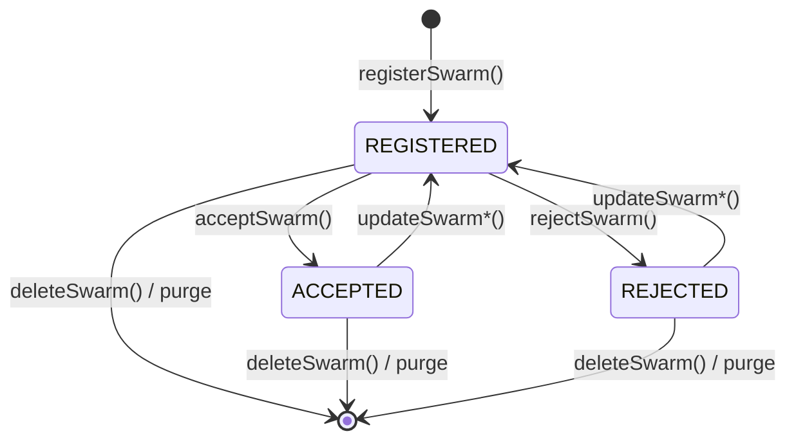

| Action                 | Caller         | Effect            |
| :--------------------- | :------------- | :---------------- |
| `acceptSwarm(swarmId)` | Provider owner | status → ACCEPTED |
| `rejectSwarm(swarmId)` | Provider owner | status → REJECTED |

Only `ACCEPTED` swarms pass `checkMembership()`.

### 6.5 Swarm Updates

The fleet owner can change the service provider, which resets status to `REGISTERED` and requires fresh provider approval:

```solidity
swarmRegistry.updateSwarmProvider(swarmId, newProviderId);
```

The XOR filter is immutable and part of swarm identity. To change the filter, delete the swarm and register a new one.

### 6.6 Deletion

```solidity
swarmRegistry.deleteSwarm(swarmId);
```

Removes the swarm from `uuidSwarms[]` (O(1) swap-and-pop), deletes `swarms[swarmId]`, and for the Universal variant also deletes `filterData[swarmId]`.

<div class="page-break"></div>

## 7. Lifecycle & State Machines

### 7.1 UUID Registration States

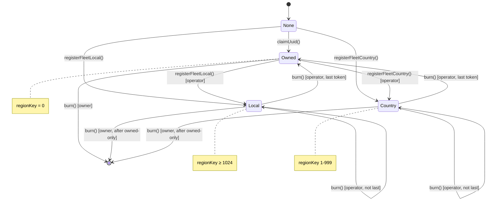

### 7.2 State Transition Table

| From          | To      | Function                 | Who Calls        | Bond Effect                                                    |
| :------------ | :------ | :----------------------- | :--------------- | :------------------------------------------------------------- |
| None          | Owned   | `claimUuid()`            | Anyone           | Pull BASE_BOND from caller (becomes owner)                     |
| None          | Owned   | `claimUuidSponsored()`   | Whitelisted user | Treasury pays BASE_BOND; sponsor covers bond + gas (see §4.4)  |
| None          | Local   | `registerFleetLocal()`   | Anyone           | Pull BASE_BOND + tierBond from caller (becomes owner+operator) |
| None          | Country | `registerFleetCountry()` | Anyone           | Pull BASE_BOND + tierBond from caller (becomes owner+operator) |
| Owned         | Local   | `registerFleetLocal()`   | Operator         | Pull tierBond from operator                                    |
| Owned         | Country | `registerFleetCountry()` | Operator         | Pull tierBond from operator                                    |
| Local/Country | Owned   | `burn()`                 | Operator         | Refund tierBond to operator (last token mints owned-only)      |
| Owned         | None    | `burn()`                 | Owner            | Refund BASE_BOND to owner                                      |
| Local/Country | —       | `burn()`                 | Operator         | Refund tierBond to operator (not last token, stays registered) |

### 7.3 Swarm Status Effects

| Status     | `checkMembership` | Provider Action Required               |
| :--------- | :---------------- | :------------------------------------- |
| REGISTERED | Reverts           | Accept or reject                       |
| ACCEPTED   | Works             | None                                   |
| REJECTED   | Reverts           | None (fleet owner can update to retry) |

### 7.4 Fleet Token Bond Flow

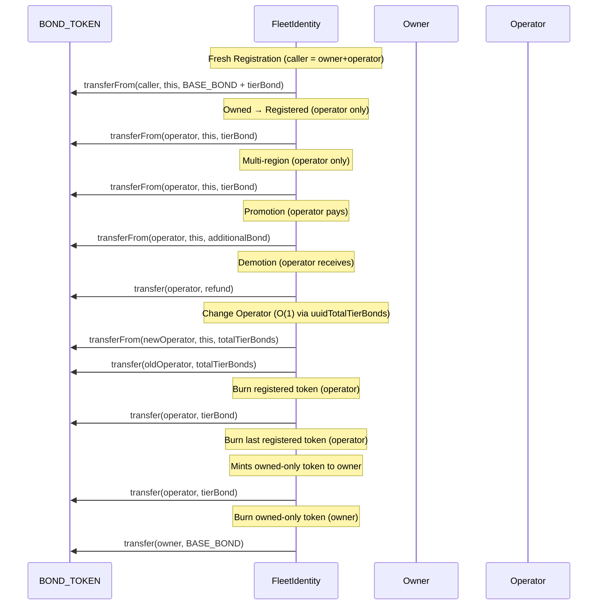

### 7.5 Orphan Lifecycle

When a fleet or provider NFT is burned, swarms referencing it become **orphaned**.

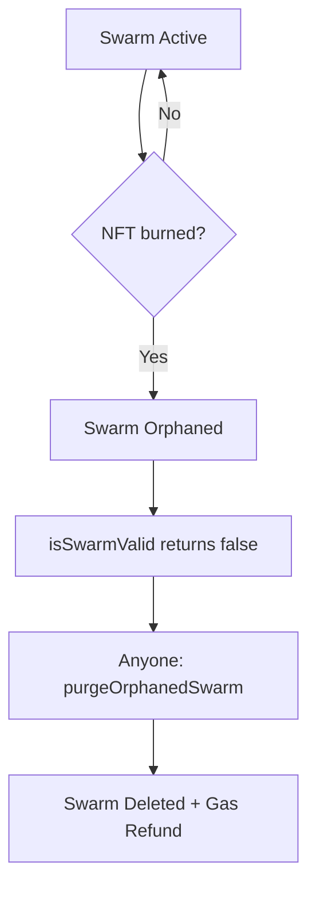

**Detection:**

```solidity
(bool fleetValid, bool providerValid) = swarmRegistry.isSwarmValid(swarmId);
```

**Cleanup:** Anyone can purge orphaned swarms. The caller receives the storage gas refund as an incentive:

```solidity
swarmRegistry.purgeOrphanedSwarm(swarmId);
```

**Orphan guards:** These operations revert with `SwarmOrphaned()` if either NFT is invalid:

- `acceptSwarm(swarmId)`
- `rejectSwarm(swarmId)`
- `checkMembership(swarmId, tagHash)`

### 7.6 Region Index Maintenance

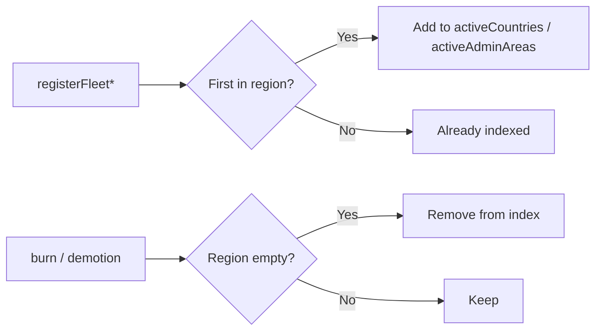

Region indexes are automatically maintained — no manual intervention is needed.

<div class="page-break"></div>

## 8. Client Discovery

### 8.1 Geographic Bundle Discovery (Recommended)

Use location-based priority bundles for efficient discovery. The bundle returns up to 20 UUIDs, priority-ordered:

1. **Tier:** Higher tier first
2. **Level:** Local before country (within same tier)
3. **Time:** Earlier registration (within same tier and level)

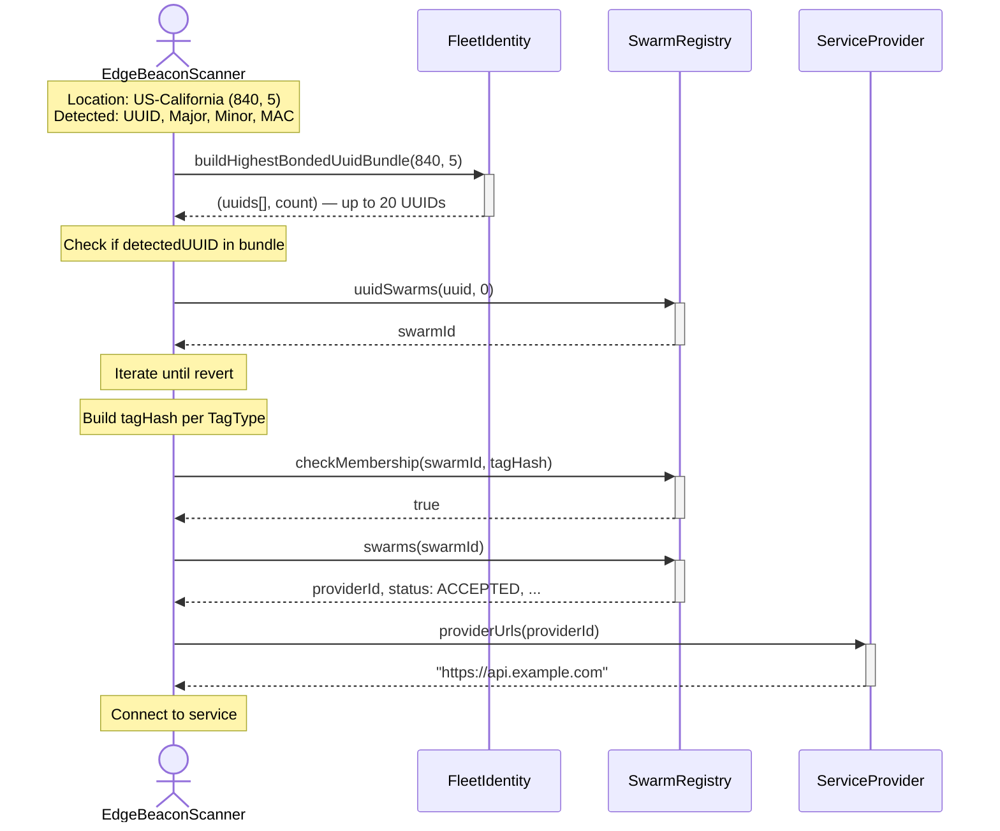

### 8.2 Direct UUID Lookup

When the UUID is known but location is not:

```solidity
// Try regions
uint32 localRegion = (840 << 10) | 5;
uint256 tokenId = fleetIdentity.computeTokenId(uuid, localRegion);
try fleetIdentity.ownerOf(tokenId) { /* found */ }
catch { /* try country: computeTokenId(uuid, 840) */ }

// Enumerate swarms
for (uint i = 0; ; i++) {
    try swarmRegistry.uuidSwarms(uuid, i) returns (uint256 swarmId) {
        // process swarmId
    } catch { break; }
}
```

### 8.3 Region Enumeration (for Indexers)

```solidity
// Active countries
uint16[] memory countries = fleetIdentity.getActiveCountries();

// Active admin areas
uint32[] memory adminAreas = fleetIdentity.getActiveAdminAreas();

// Tier data
uint256 tierCount = fleetIdentity.regionTierCount(regionKey);
uint256[] memory tokenIds = fleetIdentity.getTierMembers(regionKey, tier);
bytes16[] memory uuids = fleetIdentity.getTierUuids(regionKey, tier);
```

### 8.4 Complete Discovery Example

```solidity
function discoverService(
    bytes16 uuid,
    uint16 major,
    uint16 minor,
    bytes6 mac,
    uint16 countryCode,
    uint8 adminCode
) external view returns (string memory serviceUrl, bool found) {
    // 1. Get priority bundle for scanner's location
    (bytes16[] memory uuids, uint256 count) =
        fleetIdentity.buildHighestBondedUuidBundle(countryCode, adminCode);

    for (uint i = 0; i < count; i++) {
        if (uuids[i] != uuid) continue;

        // 2. Find swarms for this UUID
        for (uint j = 0; ; j++) {
            uint256 swarmId;
            try swarmRegistry.uuidSwarms(uuid, j) returns (uint256 id) {
                swarmId = id;
            } catch { break; }

            // 3. Get swarm details
            (,uint256 providerId,,uint8 fpSize,
             TagType tagType, SwarmStatus status) = swarmRegistry.swarms(swarmId);

            if (status != SwarmStatus.ACCEPTED) continue;

            // 4. Build tagId per TagType
            bytes memory tagId;
            if (tagType == TagType.IBEACON_PAYLOAD_ONLY) {
                tagId = abi.encodePacked(uuid, major, minor);
            } else if (tagType == TagType.IBEACON_INCLUDES_MAC) {
                tagId = abi.encodePacked(uuid, major, minor, mac);
            }

            // 5. Check membership and resolve service URL
            if (swarmRegistry.checkMembership(swarmId, keccak256(tagId))) {
                return (serviceProvider.providerUrls(providerId), true);
            }
        }
    }

    return ("", false);
}
```

<div class="page-break"></div>

## 9. Fleet Maintenance

### 9.1 Overview

After registration, fleet operators must monitor bundle inclusion as market conditions change — new fleets registering at higher tiers, existing fleets promoting, and bundle slots limited to 20 per location.

### 9.2 Maintenance Cycle

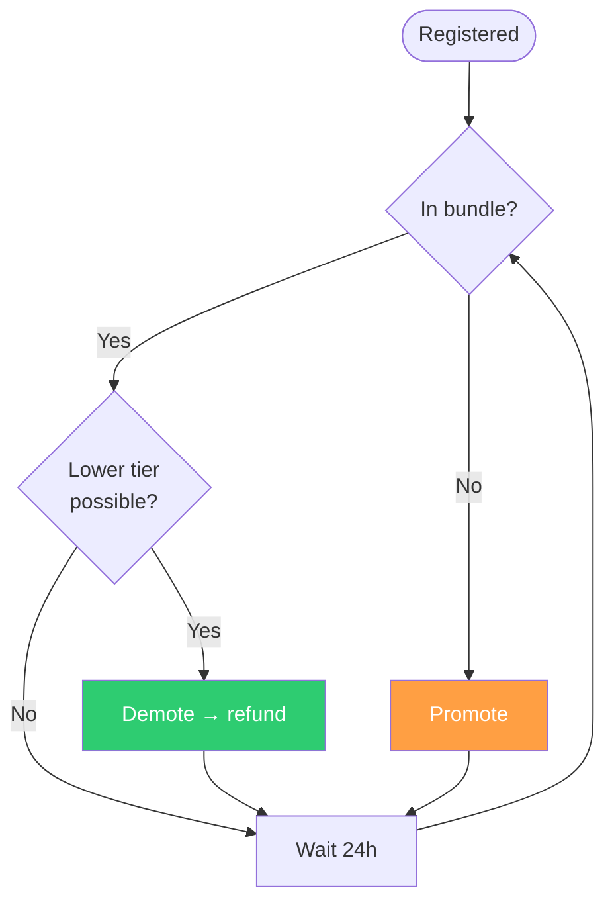

### 9.3 Checking Inclusion

**Local fleets** check their specific admin area:

```solidity
(bytes16[] memory uuids, uint256 count) =
    fleetIdentity.buildHighestBondedUuidBundle(countryCode, adminCode);
// Check if myUuid appears in uuids[0..count-1]
```

**Country fleets** must check every active admin area in their country, since they must appear in all of them:

```solidity
uint32[] memory adminAreas = fleetIdentity.getActiveAdminAreas();
// Filter to own country: adminAreas where (rk >> 10) == myCountryCode
// Check each area's bundle for inclusion
```

**When no admin areas are active** (no edge scanners deployed yet):

```solidity
(bytes16[] memory uuids, uint256 count) =
    fleetIdentity.buildCountryOnlyBundle(countryCode);
```

### 9.4 Getting the Required Tier

```solidity
// Local
(uint256 tier, uint256 bond) = fleetIdentity.localInclusionHint(cc, admin);

// Country (scans ALL active admin areas, free off-chain)
(uint256 tier, uint256 bond) = fleetIdentity.countryInclusionHint(cc);
```

### 9.5 Demotion (Saving Bond)

When the suggested tier is lower than the current tier, the operator can demote to reclaim bond:

```solidity
fleetIdentity.reassignTier(tokenId, lowerTier);
// Refund deposited automatically to operator
```

### 9.6 Propagation Timing

| Phase                    | Duration         |
| :----------------------- | :--------------- |
| Transaction confirmation | ~1–2 s (ZkSync)  |
| Event indexing           | ~1–10 s          |
| Edge network sync        | Minutes to hours |

**Recommendation:** 24-hour check interval for maintenance operations.

### 9.7 Maintenance Summary

| Task                        | Method                                    |
| :-------------------------- | :---------------------------------------- |
| Check inclusion (local)     | `buildHighestBondedUuidBundle(cc, admin)` |
| Check inclusion (country)   | Loop all admin areas                      |
| Get required tier (local)   | `localInclusionHint(cc, admin)`           |
| Get required tier (country) | `countryInclusionHint(cc)`                |
| Calculate bond              | `tierBond(tier, isCountry)`               |
| Move tier                   | `reassignTier(tokenId, tier)`             |
| Quick promote               | `promote(tokenId)`                        |

<div class="page-break"></div>

## 10. Upgradeable Contract Architecture

### 10.1 Overview

All swarm contracts are deployed as UUPS-upgradeable proxies:

| Contract                            | Description                                    |
| :---------------------------------- | :--------------------------------------------- |
| `ServiceProviderUpgradeable`        | ERC-721 for service endpoint URLs              |
| `FleetIdentityUpgradeable`          | ERC-721 Enumerable with tier-based bond system |
| `SwarmRegistryUniversalUpgradeable` | ZkSync-compatible swarm registry               |
| `SwarmRegistryL1Upgradeable`        | L1-only registry with SSTORE2                  |

### 10.2 Proxy Pattern

Each contract is deployed as a pair:

- **Proxy (ERC1967Proxy):** Immutable, stores all state, forwards calls via `delegatecall`.
- **Implementation:** Contains logic only, can be replaced by the owner.

```
┌──────────────────────────┐
│    ERC1967Proxy           │
│  ┌──────────────────┐    │
│  │ Implementation   │────┼──▶ FleetIdentityUpgradeable
│  │ Slot             │    │    (logic contract)
│  └──────────────────┘    │
│  ┌──────────────────┐    │
│  │ Storage          │    │    ← bondToken, baseBond,
│  │ (lives here)     │    │      fleets, bonds, etc.
│  └──────────────────┘    │
└──────────────────────────┘
```

All interactions must target the **proxy address**, never the implementation.

### 10.3 Storage Layout (ERC-7201)

All upgradeable contracts use namespaced storage with gaps for future expansion:

| Contract               | Gap Size |
| :--------------------- | :------- |
| FleetIdentity          | 40 slots |
| ServiceProvider        | 49 slots |
| SwarmRegistryUniversal | 44 slots |
| SwarmRegistryL1        | 45 slots |

The `__gap` costs **zero gas** at runtime — uninitialized storage slots are never written to chain. The gap is a compile-time placeholder that reserves slot numbers for safe future upgrades.

### 10.4 Safe Upgrade Rules

When upgrading, only the logic contract address changes. All storage remains in the proxy at the same slots.

| Rule                                                   | Allowed |
| :----------------------------------------------------- | :------ |
| Append new variables at the end (consume from `__gap`) | ✅      |
| Add new functions                                      | ✅      |
| Modify function logic                                  | ✅      |
| Delete existing variables                              | ❌      |
| Reorder existing variables                             | ❌      |
| Change variable types                                  | ❌      |
| Insert variables between existing ones                 | ❌      |

### 10.5 Reinitializer Pattern

When a V2+ upgrade adds new storage that needs initialization:

```solidity
function initializeV2(uint256 newParam) external reinitializer(2) {
    _newParamIntroducedInV2 = newParam;
}
```

The `reinitializer(N)` modifier ensures the function runs exactly once and `N` must exceed the previous version number.

### 10.6 Deployment Order

Deployment order is dictated by contract dependencies:

1. **ServiceProviderUpgradeable** — No dependencies
2. **FleetIdentityUpgradeable** — Requires bond token address
3. **SwarmRegistry (L1 or Universal)** — Requires both ServiceProvider and FleetIdentity
4. **BondTreasuryPaymaster** — Extends `WhitelistPaymaster` + `QuotaControl`; requires initial `isWhitelistedContract` list (often FleetIdentity proxy), bond token address, quota, and period

Each step deploys an implementation contract followed by an ERC1967Proxy pointing to it.

### 10.7 Security Considerations

- **Constructor disable:** All upgradeable contracts call `_disableInitializers()` in the constructor, preventing direct initialization of the implementation contract.
- **Upgrade authorization:** `_authorizeUpgrade()` requires `onlyOwner`.
- **Ownership transfer:** All contracts use `Ownable2Step` for safe two-step ownership transfers.
- **Storage collision prevention:** ERC-7201 namespaced storage plus storage gaps prevent slot collisions across upgrades.

### 10.8 ZkSync Compatibility

| Feature             | SwarmRegistryUniversal | SwarmRegistryL1         |
| :------------------ | :--------------------- | :---------------------- |
| ZkSync Era          | ✅ Compatible          | ❌ Not compatible       |
| Storage             | Native `bytes`         | SSTORE2 (`EXTCODECOPY`) |
| Gas efficiency (L1) | Medium                 | High                    |

`SwarmRegistryL1Upgradeable` relies on `EXTCODECOPY` (unsupported on ZkSync). Always deploy `SwarmRegistryUniversalUpgradeable` on ZkSync Era.

<div class="page-break"></div>

## 11. BondTreasuryPaymaster

### 11.1 Overview

`BondTreasuryPaymaster` is a **ZkSync paymaster combined with a bond treasury** (it extends `WhitelistPaymaster` for gas and access-list logic, and `QuotaControl` for per-period bond limits) that enables fully sponsored fleet UUID claims. A single contract holds:

- **ETH** — used to pay ZkSync gas fees on behalf of whitelisted users.
- **NODL** — used to pay the `BASE_BOND` required by `FleetIdentity.claimUuidSponsored()`.

This enables a **Web2-style onboarding experience with full Web3 ownership**: a new user can claim a UUID on-chain without holding any cryptocurrency, while retaining provable, auditable, and interoperable ownership from the very first interaction.

### 11.2 Key Properties

| Property             | Value                                                                                                |
| :------------------- | :--------------------------------------------------------------------------------------------------- |
| **Gas sponsorship**  | Pays ZkSync gas for calls to whitelisted destinations by whitelisted users; also sponsors admin calls to itself |
| **Bond sponsorship** | Pays `BASE_BOND` NODL from its own balance via `claimUuidSponsored`                                  |
| **Allowed targets**  | `isWhitelistedContract[to] && isWhitelistedUser[from]`. Constructor seeds `initialWhitelistedContracts` and always seeds `address(this)` for sponsored admin txs. Bond pullers use the same contract whitelist. |
| **Access control**   | `admin`, `WHITELIST_ADMIN_ROLE`, `WITHDRAWER_ROLE`                                                   |
| **Quota control**    | Inherits `QuotaControl` — configurable per-period NODL cap                                         |
| **Paymaster base**   | Inherits `WhitelistPaymaster` → `BasePaymaster` (shared whitelist paymaster implementation)         |
| **Paymaster flow**   | General flow only — approval-based flow not supported                                                |

### 11.3 Contract Interface

`BondTreasuryPaymaster` is `WhitelistPaymaster, QuotaControl`. Whitelist state, paymaster validation, and ETH withdrawal come from `WhitelistPaymaster` / `BasePaymaster`; quota state and admin functions come from `QuotaControl`. The bond layer adds `bondToken`, `consumeSponsoredBond`, and ERC-20 `withdrawTokens`.

```solidity
contract BondTreasuryPaymaster is WhitelistPaymaster, QuotaControl {

    IERC20 public immutable bondToken;

    /// @notice Validates whitelist + quota; approves exact bond amount for msg.sender.
    function consumeSponsoredBond(address user, uint256 amount) external;

    function withdrawTokens(address token, address to, uint256 amount) external; // WITHDRAWER_ROLE

    // From WhitelistPaymaster: WHITELIST_ADMIN_ROLE, isWhitelistedUser, isWhitelistedContract,
    // add/remove whitelist functions, _validateAndPayGeneralFlow (general flow only), withdraw (ETH)
    // From QuotaControl: quota, period, claimed, setQuota, setPeriod, etc.
}
```

### 11.4 Paymaster Validation (Gas Flow)

ZkSync calls `validateAndPayForPaymasterTransaction` before executing the user operation. The paymaster applies destination-based routing:

- **Rule:** `isWhitelistedContract[to]` and `isWhitelistedUser[from]`. The constructor always adds `address(this)` to `isWhitelistedContract` so calls to the paymaster (e.g. whitelist updates) can be sponsored once the caller is in `isWhitelistedUsers`. `initialWhitelistedContracts` seeds further destinations (e.g. FleetIdentity proxy); sponsors add or remove with `addWhitelistedContracts` / `removeWhitelistedContracts`.
- **Otherwise:** `DestIsNotWhitelisted()` or `UserIsNotWhitelisted()`; the sender pays their own gas unless using another paymaster.

In all cases the paymaster also verifies `address(this).balance >= requiredETH`. Using the paymaster is always opt-in — admins can submit ordinary transactions (without `paymasterParams`) and pay gas from their own wallet at any time. The approval-based paymaster flow is explicitly rejected (`PaymasterFlowNotSupported()`).

### 11.5 Bond Treasury Flow

Called by `FleetIdentity.claimUuidSponsored()` (or any whitelisted bond consumer) during execution:

```
1. Caller (e.g. FleetIdentity) → consumeSponsoredBond(user, BASE_BOND)
2. Paymaster checks: isWhitelistedContract[msg.sender] ✓, isWhitelistedUser[user] ✓, balance ≥ BASE_BOND ✓, quota not exhausted ✓
3. Paymaster calls: bondToken.forceApprove(msg.sender, BASE_BOND)
4. Caller calls: bondToken.transferFrom(paymaster, caller, BASE_BOND)
5. UUID minted to user — provably owned, zero friction
```

The approval is exact (not `type(uint256).max`) and is issued only after all checks pass, minimizing exposure.

### 11.6 IBondTreasury Interface

Any contract implementing `IBondTreasury` can act as a bond sponsor for `claimUuidSponsored`:

```solidity
interface IBondTreasury {
    /// @notice Validate user eligibility and consume quota.
    /// @dev Must revert if user is not eligible. The actual NODL transfer
    ///      happens separately via transferFrom by the caller.
    /// @param user  The beneficiary address (always msg.sender in FleetIdentity).
    /// @param amount The bond amount being consumed.
    function consumeSponsoredBond(address user, uint256 amount) external;
}
```

This allows different sponsors with different policies (access lists, geographic restrictions, per-period quotas, enterprise accounts) to coexist. `BondTreasuryPaymaster` is the reference implementation.

### 11.7 Events & Errors

| Event / Error                        | Type  | Description                                                                                                                              |
| :----------------------------------- | :---- | :--------------------------------------------------------------------------------------------------------------------------------------- |
| `WhitelistedUsersAdded(users)`       | Event | Emitted when users are added to the whitelist                                                                                            |
| `WhitelistedUsersRemoved(users)`     | Event | Emitted when users are removed from the whitelist                                                                                        |
| `WhitelistedContractsAdded(contracts)` | Event | Emitted when contract destinations are added (including non-empty constructor `initialWhitelistedContracts`)                    |
| `WhitelistedContractsRemoved(contracts)` | Event | Emitted when contract destinations are removed                                                                                           |
| `TokensWithdrawn(token, to, amount)` | Event | Emitted on ERC-20 withdrawal                                                                                                             |
| `UserIsNotWhitelisted()`             | Error | User not in whitelist (bond or gas validation); defined on `WhitelistPaymaster`                                                          |
| `DestIsNotWhitelisted()`             | Error | `to` not in `isWhitelistedContract`; defined on `WhitelistPaymaster`                                                                     |
| `PaymasterBalanceTooLow()`           | Error | Insufficient ETH to cover gas; defined on `WhitelistPaymaster`                                                                          |
| `CallerNotWhitelistedContract()`     | Error | `consumeSponsoredBond` caller not in `isWhitelistedContract`                                                                              |
| `InsufficientBondBalance()`          | Error | Paymaster NODL balance below requested bond amount                                                                                       |

### 11.8 Complete Sponsored Onboarding Flow

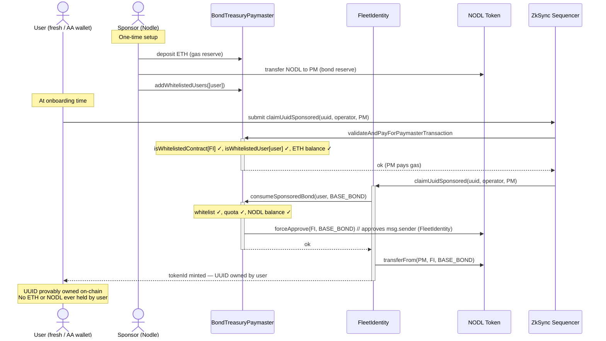

<div class="page-break"></div>

## Appendix A: ISO 3166 Geographic Reference

### Country Codes (ISO 3166-1 Numeric)

FleetIdentity uses ISO 3166-1 numeric codes (1–999) for country identification. Selected codes:

| Code | Country        |
| :--- | :------------- |
| 036  | Australia      |
| 076  | Brazil         |
| 124  | Canada         |
| 156  | China          |
| 250  | France         |
| 276  | Germany        |
| 356  | India          |
| 380  | Italy          |
| 392  | Japan          |
| 410  | South Korea    |
| 484  | Mexico         |
| 566  | Nigeria        |
| 643  | Russia         |
| 710  | South Africa   |
| 724  | Spain          |
| 756  | Switzerland    |
| 826  | United Kingdom |
| 840  | United States  |

### Admin Area Codes

Admin codes map ISO 3166-2 subdivisions to 1-indexed integers (range: 1–255). Code 0 is invalid and reverts with `InvalidAdminCode()`.

Per-country mapping files are maintained separately (e.g., `840-United_States.md` provides all US state mappings). Selected US examples:

| Admin Code | ISO 3166-2 | State      |
| ---------: | :--------- | :--------- |
|          1 | AL         | Alabama    |
|          5 | CA         | California |
|         32 | NY         | New York   |
|         43 | TX         | Texas      |

### Contract Functions

```solidity
// Build region key
uint32 region = fleetIdentity.makeAdminRegion(countryCode, adminCode);

// Active regions
uint16[] memory countries = fleetIdentity.getActiveCountries();
uint32[] memory adminAreas = fleetIdentity.getActiveAdminAreas();

// Extract from token
uint32 region = fleetIdentity.tokenRegion(tokenId);
// If region < 1024: country-level
// If region >= 1024: adminCode = region & 0x3FF, countryCode = region >> 10
```

### Data Source

All mappings are based on the ISO 3166-2 standard maintained by ISO and national statistical agencies.
