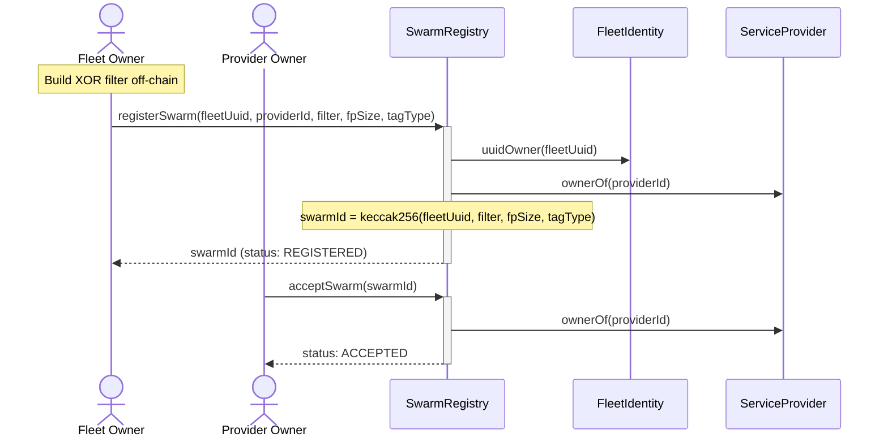
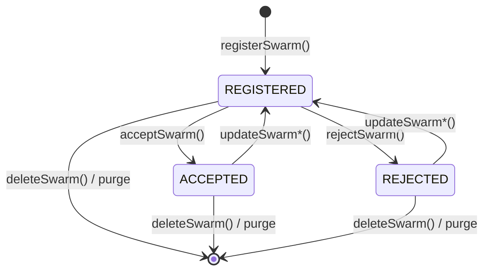
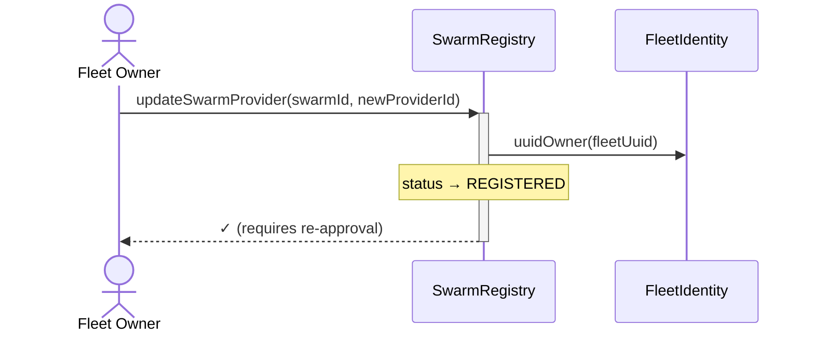
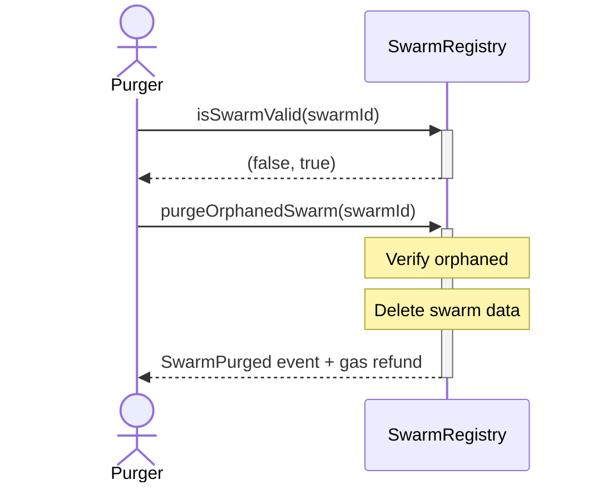

# Swarm Operations

## Overview

A **Swarm** is a cryptographic representation of ~10k-20k BLE tags. Individual tags are never enumerated on-chain—membership is verified via XOR filter.

## Registration Flow



### Parameters

| Parameter    | Type    | Description                  |
| :----------- | :------ | :--------------------------- |
| `fleetUuid`  | bytes16 | UUID that owns this swarm    |
| `providerId` | uint256 | ServiceProvider token ID     |
| `filter`     | bytes   | XOR filter data              |
| `fpSize`     | uint8   | Fingerprint size (1-16 bits) |
| `tagType`    | TagType | Tag identity scheme          |

### Swarm ID

Deterministic derivation:

```solidity
swarmId = uint256(keccak256(abi.encode(fleetUuid, filter, fingerprintSize, tagType)))
```

Swarm identity is based on fleet, filter, fingerprintSize, and tagType. ProviderId is mutable and not part of identity. Duplicate registration reverts with `SwarmAlreadyExists()`.

## XOR Filter Construction

### Off-Chain Steps

1. **Build TagIDs** for all tags per TagType schema
2. **Hash each TagID**: `tagHash = keccak256(tagId)`
3. **Construct XOR filter** using Peeling Algorithm
4. **Submit filter** in `registerSwarm()`

### TagType Schemas

| Type                   | Format                               |  Bytes |
| :--------------------- | :----------------------------------- | -----: |
| `IBEACON_PAYLOAD_ONLY` | UUID ∥ Major ∥ Minor                 |     20 |
| `IBEACON_INCLUDES_MAC` | UUID ∥ Major ∥ Minor ∥ MAC           |     26 |
| `VENDOR_ID`            | CompanyID ∥ FullVendorData           | varies |
| `EDDYSTONE_UID`        | Namespace ∥ Instance                 |     16 |
| `SERVICE_DATA`         | ExpandedServiceUUID128 ∥ ServiceData | varies |

### MAC Normalization (IBEACON_INCLUDES_MAC)

| MAC Type                | Action                           |
| :---------------------- | :------------------------------- |
| Public/Static (00)      | Use real MAC                     |
| Random/Private (01, 11) | Replace with `FF:FF:FF:FF:FF:FF` |

This supports rotating privacy MACs while validating "it's a privacy tag."

### Filter Membership Math

```
h = keccak256(tagId)
M = filterLength * 8 / fingerprintSize  // slot count

h1 = uint32(h) % M
h2 = uint32(h >> 32) % M
h3 = uint32(h >> 64) % M
fp = (h >> 96) & ((1 << fingerprintSize) - 1)

Member if: Filter[h1] ^ Filter[h2] ^ Filter[h3] == fp
```

## Provider Approval



| Action                 | Caller         | Effect            |
| :--------------------- | :------------- | :---------------- |
| `acceptSwarm(swarmId)` | Provider owner | status → ACCEPTED |
| `rejectSwarm(swarmId)` | Provider owner | status → REJECTED |

Only `ACCEPTED` swarms pass `checkMembership()`.

## Updates

The fleet owner can change the service provider. This resets status to `REGISTERED`:

```solidity
// Change provider (requires re-approval)
swarmRegistry.updateSwarmProvider(swarmId, newProviderId);
```



**Note:** The XOR filter is immutable and part of swarm identity. To change the filter, delete the swarm and create a new one.

## Deletion

```solidity
swarmRegistry.deleteSwarm(swarmId);
```

- Removes from `uuidSwarms[]` (O(1) swap-and-pop)
- Deletes `swarms[swarmId]`
- Universal variant: deletes `filterData[swarmId]`

## Orphan Handling

When fleet or provider NFT is burned, referencing swarms become **orphaned**.

### Detection

```solidity
(bool fleetValid, bool providerValid) = swarmRegistry.isSwarmValid(swarmId);
// Returns (false, _) if UUID has no owner
// Returns (_, false) if provider NFT burned
```

### Cleanup

Anyone can purge orphaned swarms:

```solidity
swarmRegistry.purgeOrphanedSwarm(swarmId);
// Gas refund incentive
```



### Guards

Operations revert with `SwarmOrphaned()` if either NFT is invalid:

- `acceptSwarm()`
- `rejectSwarm()`
- `checkMembership()`

## Storage Variants

| Variant       | Filter Storage              | Deletion                          |
| :------------ | :-------------------------- | :-------------------------------- |
| **L1**        | SSTORE2 (contract bytecode) | Struct cleared; bytecode persists |
| **Universal** | `mapping(uint256 => bytes)` | Full deletion                     |

Universal exposes `getFilterData(swarmId)` for off-chain retrieval.
